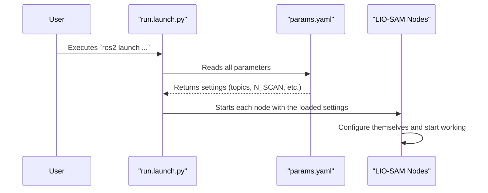

# Chapter 1: System Configuration

Welcome to the LIO-SAM tutorial! If you've ever wondered how a complex robotics algorithm can work on many different robots, this chapter is for you. We'll start with the most fundamental and user-friendly concept in LIO-SAM: its configuration system.

### The "Settings Menu" for Your Robot

Imagine you just bought a new video game. Before you start playing, you probably go to the "Settings" menu. You might change the graphics quality, adjust the controller sensitivity, or remap the buttons. You do all this to tailor the game to your specific computer and preferences, and you do it without ever changing the game's source code.

LIO-SAM has its own "Settings Menu," but instead of a graphical interface, it's a simple text file: `config/params.yaml`.

This file solves a huge problem: every robot is different. One robot might use a 16-channel Velodyne LiDAR, while another uses a 64-channel Ouster LiDAR. The sensors might be mounted in different positions. Without a configuration file, you would need to change the C++ source code and recompile the entire project every time you wanted to use a different robot. That's slow, difficult, and prone to errors.

The `params.yaml` file centralizes all these settings, separating the core algorithm logic from your specific hardware setup. This makes LIO-SAM incredibly flexible and easy to adapt.

Let's walk through a common use case: **"How do I set up LIO-SAM for my new robot, which has a 16-channel Velodyne LiDAR?"**

### Editing Your Robot's "Settings"

The `params.yaml` file is written in a human-readable format called YAML. It's just a list of `key: value` pairs. Let's look at the most important sections you'll need to change for your new robot.

#### 1. Topics and Frames: The "Addresses" for Your Sensors

In the world of ROS 2 (the framework LIO-SAM is built on), sensors don't just send data into the void. They "publish" their data on specific named channels called **topics**. Think of a topic like a TV channel—your LiDAR broadcasts its data on the "point cloud channel," and your IMU broadcasts on the "IMU channel." We need to tell LIO-SAM which channels to listen to.

```yaml
# In config/params.yaml
# Topics
pointCloudTopic: "/points"
imuTopic: "/imu/data"

# Frames
lidarFrame: "lidar_link"
baselinkFrame: "base_link"
```

In this snippet:
- `pointCloudTopic`: This is the channel where LIO-SAM expects to receive LiDAR data.
- `imuTopic`: This is the channel for IMU data.
- `lidarFrame` & `baselinkFrame`: These are coordinate systems. They tell LIO-SAM where your sensors are located on the robot.

For your new robot, you would check what topics your sensors are publishing on (using a tool like `ros2 topic list`) and update these values accordingly.

#### 2. Sensor Specifications: The "Specs" of Your Hardware

LIO-SAM needs to know the physical properties of your LiDAR to process its data correctly. For our use case, we have a 16-channel Velodyne. The default file is configured for a 64-channel Ouster, so we need to make some changes.

Here is the default configuration:
```yaml
# In config/params.yaml
# Sensor Settings
sensor: ouster
N_SCAN: 64
Horizon_SCAN: 512
```
And here is what we'll change it to for our Velodyne LiDAR:
```yaml
# In config/params.yaml
# Sensor Settings
sensor: velodyne      # Changed from 'ouster'
N_SCAN: 16          # For our 16-channel LiDAR
Horizon_SCAN: 1800  # A typical horizontal resolution for Velodyne
```
- `sensor`: We tell LIO-SAM the brand of our LiDAR. This helps it use the right logic for that sensor type.
- `N_SCAN`: This is the number of vertical channels, or lasers. We change it from `64` to `16`.
- `Horizon_SCAN`: This is the number of points in a single horizontal scan. `1800` is a common value for Velodyne.

Just by changing these three lines, you've told LIO-SAM the fundamental properties of its primary sensor!

#### 3. Extrinsics: The Relationship Between Your Sensors

It's not enough to know *what* the sensors are; LIO-SAM must know *where* they are relative to each other. The position and orientation of the IMU relative to the LiDAR is called the **extrinsic calibration**. This is one of the most critical settings for high accuracy.

```yaml
# In config/params.yaml
# IMU Settings
# ...
extrinsicTrans:  [ 0.0,  0.0,  0.0 ]
extrinsicRot:    [-1.0,  0.0,  0.0,
                   0.0,  1.0,  0.0,
                   0.0,  0.0, -1.0 ]
```
- `extrinsicTrans`: The `[x, y, z]` translation in meters from the LiDAR to the IMU.
- `extrinsicRot`: A 3x3 rotation matrix describing the orientation of the IMU relative to the LiDAR.

You will need to measure these values for your specific robot setup. Getting these right is essential for accurately combining motion data from the IMU with point cloud data from the LiDAR, a process we'll explore in the [IMU Preintegration](03_imu_preintegration_.md) chapter.

### Under the Hood: How Does It Work?

So how does LIO-SAM actually *use* this file? It happens right at the beginning, when you launch the program.

1.  You run the command to start LIO-SAM.
2.  This command executes a launch file, `launch/run.launch.py`.
3.  The launch file reads `config/params.yaml`.
4.  It then starts all the individual programs (called "nodes") that make up LIO-SAM.
5.  As it starts each node, it passes the relevant settings from the YAML file to it.

This process ensures that every part of LIO-SAM knows the exact configuration of your robot before it even begins processing data.

Here is a simplified diagram of that flow:



Let's peek into the launch file, `launch/run.launch.py`, to see how this is done.

First, the launch file defines an argument to locate our `params.yaml` file.

```python
# In launch/run.launch.py

# Find the lio_sam package directory
share_dir = get_package_share_directory('lio_sam')

# ...
# Declare a launch argument for the parameters file
params_declare = DeclareLaunchArgument(
    'params_file',
    default_value=os.path.join(
        share_dir, 'config', 'params.yaml'),
    # ...
)
```
This piece of code sets up a variable that points directly to `config/params.yaml`.

Next, when it starts one of the LIO-SAM nodes (like the one for [IMU Preintegration](03_imu_preintegration_.md)), it passes that file path in the `parameters` field.

```python
# In launch/run.launch.py

# Get the parameter file path from the launch configuration
parameter_file = LaunchConfiguration('params_file')

# ...
# Start the IMU preintegration node
Node(
    package='lio_sam',
    executable='lio_sam_imuPreintegration',
    # This is the magic line!
    parameters=[parameter_file],
    output='screen'
),
```
That `parameters=[parameter_file]` line is the key. It tells the ROS 2 framework to load all the settings from our YAML file and make them available to the `lio_sam_imuPreintegration` program. This same pattern is repeated for every LIO-SAM node, ensuring the entire system is configured consistently.

### Conclusion

You've just learned about the most important concept for making LIO-SAM work for you: the system configuration file. We saw that `config/params.yaml` acts as a central "Settings Menu," allowing you to adapt LIO-SAM to your specific robot hardware by changing sensor topics, specifications, and extrinsics without ever touching the core source code.

This powerful separation of configuration from logic is what makes LIO-SAM so adaptable. Now that you understand *how* to configure the system, we can begin to explore *what* we are configuring. In the next chapter, we will get a bird's-eye view of the entire system architecture in [ROS2 Node Pipeline](02_ros2_node_pipeline_.md).

---

Generated by [AI Codebase Knowledge Builder](https://github.com/The-Pocket/Tutorial-Codebase-Knowledge)