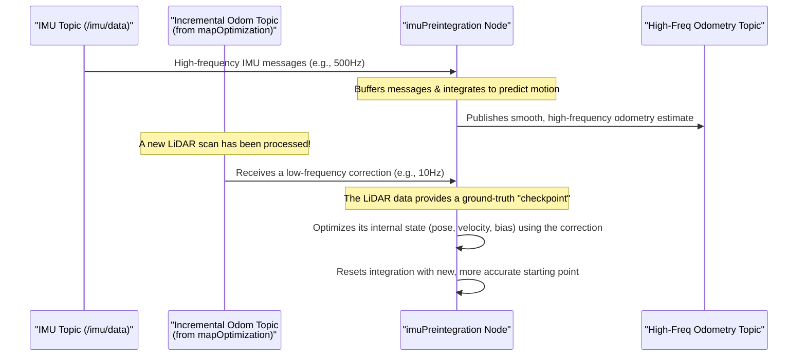

# Chapter 3: IMU Preintegration

In the [previous chapter](02_ros2_node_pipeline_.md), we saw that LIO-SAM is like a factory assembly line with specialized workers called nodes. We identified a unique worker, `imuPreintegration`, that runs on a parallel track, focusing exclusively on motion data.

Now, let's zoom in on this worker. Why does it need its own special process? What problem is it solving?

### The "Too Much Information" Problem

Imagine you're driving a car on a long road trip. To track your progress, you have two instruments:

1.  **The Odometer:** Every few minutes, you glance at it. It gives you a very accurate, but infrequent, update of the total distance traveled.
2.  **A High-Speed Video Camera:** Pointed at the road, this camera records every single bump, swerve, and vibration, thousands of times per second.

If you wanted to create a log of your trip, which data would you use? You wouldn't write down the information from every single frame of the video camera—that would be millions of data points and take forever! Instead, you'd use the odometer readings as your main checkpoints.

This is the exact challenge LIO-SAM faces:
-   **LiDAR is the Odometer:** It gives us an accurate "snapshot" of the world (a point cloud), but relatively infrequently (e.g., 10 times per second).
-   **IMU is the High-Speed Camera:** The Inertial Measurement Unit (IMU) gives us incredibly fast updates on motion (acceleration and rotation speed), often 200 to 500 times per second.

If we tried to add every single one of those 500 IMU measurements into our main map optimization problem every second, the computer would be overwhelmed. The problem isn't that the data is bad; it's that there's just too much of it.

### The Solution: A Smart Summary

IMU Preintegration is the clever solution to this problem. Instead of throwing away the valuable high-frequency IMU data, we **summarize** it.

The `imuPreintegration` node collects all the IMU measurements that occur *between* two LiDAR scans. It then "integrates" them to produce a single, compact summary of motion. It's like saying:

> "Okay, I received 50 IMU messages in the last 0.1 seconds. Instead of giving you all 50, I'll just tell you that, based on them, the robot probably rotated 5 degrees to the right and moved forward 10 centimeters."

This summary, called a **preintegrated measurement**, is incredibly useful. It provides a strong prediction of where the robot has moved, which helps the main [Mapping & Factor Graph Optimization](06_mapping___factor_graph_optimization_.md) node match the next LiDAR scan to the map much more quickly and reliably.

This process "tightly couples" the two sensors. We're not just using the LiDAR *or* the IMU; we're using the IMU to help make sense of the LiDAR data in real-time.

### Under the Hood: The Preintegration Process

Let's follow the data flow to see how this works. The `imuPreintegration` node is constantly doing two things: predicting motion and getting corrected.



1.  **Receive and Predict:** The `imuHandler` function in `src/imuPreintegration.cpp` receives a raw IMU message. It immediately integrates this measurement to predict the robot's newest state and publishes a smooth, high-frequency odometry estimate. This is great for real-time control tasks.

2.  **Receive Correction:** Every time the `mapOptimization` node successfully processes a LiDAR scan, it publishes a very accurate "incremental odometry" message. The `odometryHandler` function in `imuPreintegration` receives this. This message acts as a high-quality "checkpoint," like looking at the odometer.

3.  **Optimize and Reset:** When this checkpoint arrives, the node knows the *true* motion that occurred since the last checkpoint. It compares this to what the IMU *thought* happened. This comparison allows it to build a small optimization problem (using a library called GTSAM) to not only correct the robot's path but also to estimate the IMU's errors, known as **biases**. Once optimized, it uses this new, highly accurate state as the starting point for the next round of predictions.

### A Peek at the Code

This might sound complex, but the core ideas are made much simpler by using the GTSAM library.

First, in the constructor of `IMUPreintegration` in `src/imuPreintegration.cpp`, we set up the "integrator" object. We tell it about our IMU's characteristics, like how "noisy" its measurements are, which we get from our `params.yaml` file.

```cpp
// In src/imuPreintegration.cpp, inside the constructor

// Define IMU properties like gravity and noise from params.yaml
auto p = gtsam::PreintegrationParams::MakeSharedU(imuGravity);
p->accelerometerCovariance  = gtsam::Matrix33::Identity(3,3) * pow(imuAccNoise, 2);
p->gyroscopeCovariance      = gtsam::Matrix33::Identity(3,3) * pow(imuGyrNoise, 2);
// ... more settings ...

// Create the object that will do all the heavy lifting!
imuIntegratorOpt_ = new gtsam::PreintegratedImuMeasurements(p, prior_imu_bias);
```
This `imuIntegratorOpt_` object is our smart summarizer.

Next, when a LiDAR checkpoint arrives in `odometryHandler`, we loop through all the IMU messages we've collected since the last checkpoint and feed them to our integrator.

```cpp
// In src/imuPreintegration.cpp, inside odometryHandler()

// Loop through all IMU messages between two LiDAR scans
while (!imuQueOpt.empty())
{
    // ... logic to check time stamps ...
    sensor_msgs::msg::Imu *thisImu = &imuQueOpt.front();
    double dt = ... // calculate time difference

    // The core integration step! Add this measurement to our summary.
    imuIntegratorOpt_->integrateMeasurement(
            gtsam::Vector3(thisImu->linear_acceleration.x, ...),
            gtsam::Vector3(thisImu->angular_velocity.x, ...), dt);
    
    imuQueOpt.pop_front();
}
```

Finally, we take the resulting summary (`preint_imu`) and add it as a constraint (an `ImuFactor`) to our mini optimization problem. This factor connects the robot's previous state to its current state, ensuring a physically plausible motion between LiDAR scans.

```cpp
// In src/imuPreintegration.cpp, also in odometryHandler()

// Get the summarized motion from our integrator
const gtsam::PreintegratedImuMeasurements& preint_imu = *imuIntegratorOpt_;

// Create a "constraint" that connects the previous state to the current one
gtsam::ImuFactor imu_factor(X(key - 1), V(key - 1), X(key), V(key), B(key-1), preint_imu);
graphFactors.add(imu_factor);
```
This `imu_factor` is the powerful, compact summary that allows LIO-SAM to be both fast and accurate.

### Conclusion

You've just learned one of the most important concepts in modern sensor fusion: **IMU Preintegration**. It's the elegant technique LIO-SAM uses to leverage high-frequency IMU data without getting bogged down. By creating smart summaries of motion between LiDAR scans, it provides a powerful motion prediction that is critical for the system's overall performance.

We've now seen how the IMU data is processed on its parallel track. Next, we'll return to the main assembly line and see the very first thing that happens to the raw LiDAR data in [Sensor Data Preprocessing & Deskewing](04_sensor_data_preprocessing___deskewing_.md).

---

Generated by [AI Codebase Knowledge Builder](https://github.com/The-Pocket/Tutorial-Codebase-Knowledge)