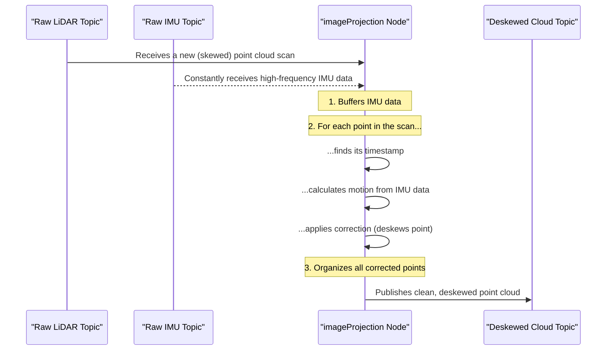

# Chapter 4: Sensor Data Preprocessing & Deskewing

In the [previous chapter](03_imu_preintegration_.md), we explored how LIO-SAM cleverly summarizes high-frequency IMU data. We saw that the `imuPreintegration` node works on a parallel track to create motion predictions. Now, let's switch back to the main assembly line and see the very first thing that happens to the raw data coming from the LiDAR sensor.

### The Wobbly Panorama Problem

Imagine you're trying to take a panoramic photo with your phone. You have to sweep your phone across the scene slowly and steadily. What happens if you wobble your hand or move forward while taking the picture? The final image comes out warped and distorted. Straight lines might look curved, and objects might appear stretched or compressed.

<p align='center'>
    
    <br/>
    <i>A moving LiDAR experiences motion distortion, much like a camera taking a wobbly panorama.</i>
</p>

A LiDAR sensor faces the exact same problem, but in 3D. A single 360-degree scan doesn't happen instantly. It takes a fraction of a second (for example, 0.1 seconds) for the laser to sweep across the entire scene. If your robot is moving during that 0.1 seconds, the laser points captured at the *end* of the scan are measured from a slightly different position and orientation than the points captured at the *beginning*.

This effect is called **motion distortion** or **skew**. If we ignore it, a straight wall will look curved in our point cloud. This is a huge problem because our algorithm relies on finding flat surfaces and sharp edges to figure out where it is. A warped wall is no longer flat!

### The Solution: "Image Stabilization" for LiDAR

So, how do we fix this wobbly panorama? We need to "stabilize" it. To do that, we need to know exactly how the robot was moving *during* the scan.

This is where our high-frequency IMU data comes to the rescue. The `imageProjection` node performs a critical two-step process:

1.  **For every single point in the LiDAR scan**, it looks at the point's precise timestamp.
2.  It then uses the history of IMU measurements (which we learned about in [IMU Preintegration](03_imu_preintegration_.md)) to calculate exactly how the robot had moved and rotated between the start of the scan and that point's specific timestamp.
3.  Finally, it applies a transformation to "move" the point back to where it *would have been* if the entire scan had been captured instantly at the start time.

This process is called **deskewing**. It's like having perfect video stabilization for our 3D point cloud. The result is a crisp, internally consistent point cloud that represents the world at a single moment in time, ready for the next stage of processing.

### Under the Hood: The Deskewing Workflow

The `imageProjection` node is the first worker on our LiDAR data assembly line. Let's follow its process from receiving a raw, skewed point cloud to publishing a clean, deskewed one.



This process happens for every single scan that comes from the LiDAR.

### A Peek at the Code in `imageProjection.cpp`

Let's look at the C++ code in `src/imageProjection.cpp` to see how this magic happens.

#### Step 1: Gather Motion Information

Before it can deskew anything, the node needs to collect all the IMU data that corresponds to the timeframe of the LiDAR scan. The `deskewInfo()` function handles this.

```cpp
// In src/imageProjection.cpp, inside deskewInfo()

// Make sure we have IMU data that covers the entire scan time
if (imuQueue.empty() ||
    stamp2Sec(imuQueue.front().header.stamp) > timeScanCur ||
    stamp2Sec(imuQueue.back().header.stamp) < timeScanEnd)
{
    RCLCPP_INFO(get_logger(), "Waiting for IMU data ...");
    return false; // Can't deskew without IMU data
}
```
This check ensures that we have a complete motion history for the current scan before we proceed.

#### Step 2: Calculate Rotation for a Specific Point in Time

The core of the deskewing logic is in `findRotation()`. Given the exact timestamp of a single LiDAR point, this function interpolates between the two closest IMU measurements to get a super-precise estimate of the sensor's orientation at that moment.

```cpp
// In src/imageProjection.cpp, inside findRotation()

// Find the IMU measurements that bracket our point's time
int imuPointerBack = imuPointerFront - 1;

// Calculate how far our point's time is between the two IMU readings
double ratioFront = (pointTime - imuTime[imuPointerBack]) / (imuTime[imuPointerFront] - imuTime[imuPointerBack]);
double ratioBack = (imuTime[imuPointerFront] - pointTime) / (imuTime[imuPointerFront] - imuTime[imuPointerBack]);

// Perform linear interpolation to get the rotation at pointTime
*rotXCur = imuRotX[imuPointerFront] * ratioFront + imuRotX[imuPointerBack] * ratioBack;
// ... same for rotYCur and rotZCur ...
```
This interpolation is what allows us to use the relatively "slow" IMU data (e.g. 500Hz) to correct every single point from the much faster LiDAR (~100,000 points per scan).

#### Step 3: Transform the Point

Finally, the `deskewPoint()` function puts it all together. It calls `findRotation()` to get the motion, then applies the corrective transformation.

```cpp
// In src/imageProjection.cpp, inside deskewPoint()

// 1. Get the exact rotation at the point's timestamp
float rotXCur, rotYCur, rotZCur;
findRotation(pointTime, &rotXCur, &rotYCur, &rotZCur);

// 2. Create the transformation from the point's frame to the scan's start frame
Eigen::Affine3f transFinal = pcl::getTransformation(posXCur, posYCur, posZCur, rotXCur, rotYCur, rotZCur);
Eigen::Affine3f transBt = transStartInverse * transFinal;

// 3. Apply the transformation to the point's coordinates
PointType newPoint;
newPoint.x = transBt(0,0) * point->x + ...;
newPoint.y = transBt(1,0) * point->x + ...;
newPoint.z = transBt(2,0) * point->x + ...;

return newPoint;
```
This function is called inside a loop for every single point in the LiDAR scan, effectively rebuilding the entire point cloud in a new, corrected coordinate frame.

### Conclusion

You've just learned about the first and one of the most critical steps in the LIO-SAM pipeline: **Sensor Data Preprocessing & Deskewing**. We saw how motion distortion can corrupt raw LiDAR data, making straight walls appear curved. We then learned how LIO-SAM brilliantly solves this by using high-frequency IMU data to "stabilize" the point cloud, correcting the position of every single point based on its unique timestamp.

The output of this node is a clean, sharp, and internally consistent point cloud. This deskewed cloud is now ready for the next worker on the assembly line, which will analyze it to find important landmarks. We'll explore this in the next chapter: [LiDAR Feature Extraction](05_lidar_feature_extraction_.md).

---

Generated by [AI Codebase Knowledge Builder](https://github.com/The-Pocket/Tutorial-Codebase-Knowledge)