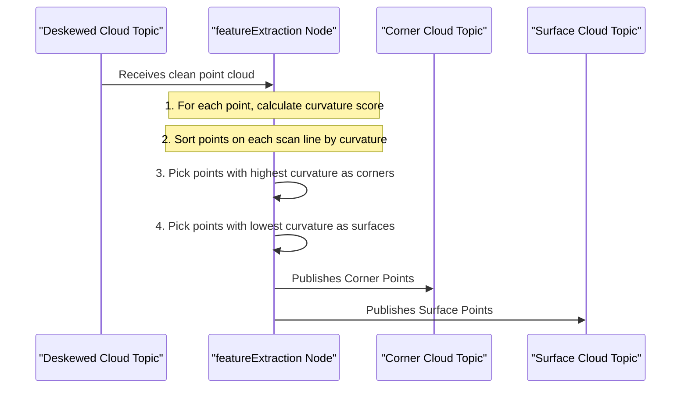

# Chapter 5: LiDAR Feature Extraction

In the [previous chapter](04_sensor_data_preprocessing___deskewing_.md), we saw how the `imageProjection` node acts like a photo editor, taking a raw, wobbly LiDAR scan and turning it into a crisp, clean, and deskewed point cloud. Now, this corrected point cloud is passed to the next worker on our SLAM assembly line: the `featureExtraction` node.

### The "Coloring Book" Problem

Imagine you have a highly detailed photograph with millions of pixels. If you were asked to describe this photo to a friend over the phone so they could sketch it, you wouldn't describe the color of every single pixel. That would take forever and be impossible to follow.

Instead, you would describe the important outlines. You'd say, "There's a straight line for the top of the table, a sharp corner on the box, and a big, flat area for the wall." You would instinctively extract the most meaningful **features**.

A dense point cloud, with hundreds of thousands of points, is just like that detailed photograph. Trying to match every single one of those points to the map in the next step would be incredibly slow. Most of the points are redundant—a point in the middle of a flat wall doesn't give us much unique information.

The `featureExtraction` node solves this by turning our detailed "photograph" into a simple "line drawing" or "coloring book outline." It throws away the redundant points and keeps only the most geometrically interesting ones: sharp **corners** and flat **surfaces**.

<p align='center'>
    
    <br/>
    <i>Feature extraction simplifies the dense point cloud into a sparse set of easy-to-track corner and surface points.</i>
</p>

These feature points are far fewer in number, making the final step of matching them to the map much, much faster and more reliable.

### The Key Idea: Measuring "Smoothness"

How does the algorithm decide if a point is a "corner" or a "surface"? It calculates a **curvature** or **smoothness** score for each point.

The process is simple:
1.  Take a point.
2.  Look at its immediate neighbors on the same laser scan line (a few points before it and a few points after it).
3.  Calculate how much the point's distance from the LiDAR differs from the average distance of its neighbors.
    -   If there's a **large difference**, it means the surface is changing abruptly. This point has high curvature—it's likely a **corner**.
    -   If there's a **very small difference**, it means the point lies on a smooth, continuous surface. This point has low curvature—it's likely part of a **surface** or plane.
    -   If the difference is somewhere in the middle, it's not distinct enough, so we ignore it.

By calculating this score for every point, we can rank them from most "corner-like" to most "surface-like" and pick the best candidates.

### Under the Hood: The Feature Extraction Workflow

Let's follow the data as it's processed by our feature extraction "worker".



This process transforms one dense cloud into two sparse, meaningful clouds, which are then published for the final mapping node to use.

### A Peek at the Code in `featureExtraction.cpp`

The logic for this entire process lives in `src/featureExtraction.cpp`. Let's look at the key steps.

#### 1. Calculating Smoothness

The `calculateSmoothness()` function loops through every point and computes its curvature score. The formula looks a bit intimidating, but the idea is just as we described.

```cpp
// In src/featureExtraction.cpp, inside calculateSmoothness()

// For each point (i) in the cloud...
float diffRange = cloudInfo.point_range[i-5] + ... // Sum of 5 neighbors before
                - cloudInfo.point_range[i] * 10 // Minus 10x the point's own range
                + cloudInfo.point_range[i+1] + ...;// Sum of 5 neighbors after

// The curvature is the squared difference
cloudCurvature[i] = diffRange * diffRange;
```
This code calculates the difference between a point's range and the range of its 10 neighbors. A large `diffRange` value means the point sticks out from its surroundings, indicating a sharp edge.

#### 2. Sorting by Smoothness

Once every point has a curvature score, the `extractFeatures()` function sorts them. To ensure features are evenly distributed across the entire field of view, it divides each laser ring into six sub-sections and performs the sorting and selection within each sub-section.

```cpp
// In src/featureExtraction.cpp, inside extractFeatures()

// For each of the 6 sub-sections of a scan line...
// Sort the points in this section based on their curvature score
std::sort(cloudSmoothness.begin()+sp, cloudSmoothness.begin()+ep, by_value());
```
After this line, `cloudSmoothness` is an array where the points with the lowest curvature (flattest) are at the beginning, and points with the highest curvature (sharpest) are at the end.

#### 3. Picking the Corners

Now that the points are sorted, picking the features is easy. The code loops from the end of the sorted array (the points with the highest curvature).

```cpp
// In src/featureExtraction.cpp, inside extractFeatures()

// Loop backwards from the sharpest points
for (int k = ep; k >= sp; k--)
{
    int ind = cloudSmoothness[k].ind;
    // Is the curvature above our threshold?
    if (cloudNeighborPicked[ind] == 0 && cloudCurvature[ind] > edgeThreshold)
    {
        // ... pick a max of 20 corner points per section ...
        cloudLabel[ind] = 1; // Label as a corner
        cornerCloud->push_back(extractedCloud->points[ind]);
        // ... mark neighbors so we don't pick them too ...
    }
}
```
It checks if a point's curvature is greater than `edgeThreshold`. This important value comes from our `config/params.yaml` file and lets you control how "sharp" a point must be to be considered a corner.

#### 4. Picking the Surfaces

It does the same thing for surfaces but loops from the beginning of the sorted array (the points with the lowest curvature).

```cpp
// In src/featureExtraction.cpp, inside extractFeatures()

// Loop forwards from the flattest points
for (int k = sp; k <= ep; k++)
{
    int ind = cloudSmoothness[k].ind;
    // Is the curvature below our threshold?
    if (cloudNeighborPicked[ind] == 0 && cloudCurvature[ind] < surfThreshold)
    {
        cloudLabel[ind] = -1; // Label as a surface
        // ... mark neighbors ...
    }
}
```
Here, it checks if the curvature is less than `surfThreshold`, another value you can tune in `config/params.yaml` to control how "flat" a surface must be. All points labeled as surfaces are then collected and downsampled to keep their numbers manageable.

### Your "Settings Menu" for Features

You can easily tune the feature extraction process by editing `config/params.yaml`.

```yaml
# In config/params.yaml

# LOAM feature threshold
edgeThreshold: 1.0
surfThreshold: 0.1

# voxel filter paprams
odometrySurfLeafSize: 0.4
```
-   `edgeThreshold`: **Increase** this value if you are getting too many false corners. **Decrease** it if the algorithm is missing obvious edges.
-   `surfThreshold`: **Decrease** this value if you are getting too many noisy surface points. **Increase** it if flat ground or walls are being missed.
-   `odometrySurfLeafSize`: This controls the spacing of the final surface points. **Increase** it to get fewer, more spread-out surface points, which can speed up processing.

### Conclusion

You've just learned how LIO-SAM performs one of its most clever optimizations: **LiDAR Feature Extraction**. By analyzing the local geometry of the point cloud, it intelligently discards up to 90% of the raw data, keeping only a sparse but powerful set of corner and surface features. This is the key that allows the algorithm to run quickly and efficiently.

We now have all the ingredients ready for the main event. We have a motion prediction from the [IMU Preintegration](03_imu_preintegration_.md) and a set of distinctive landmarks from this chapter. In the next chapter, we'll see how the "master assembler" node puts it all together in [Mapping & Factor Graph Optimization](06_mapping___factor_graph_optimization_.md).

---

Generated by [AI Codebase Knowledge Builder](https://github.com/The-Pocket/Tutorial-Codebase-Knowledge)