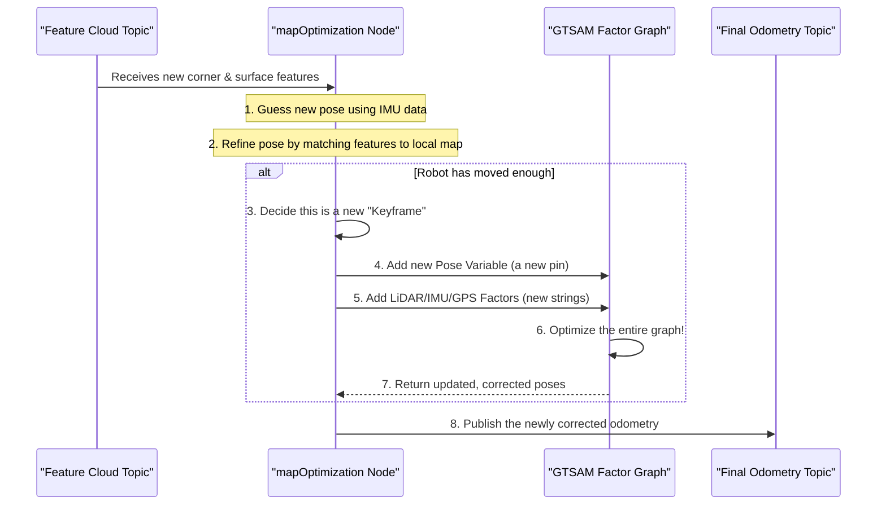

# Chapter 6: Mapping & Factor Graph Optimization

In the [previous chapter](05_lidar_feature_extraction_.md), we learned how LIO-SAM acts like a sketch artist, simplifying a dense point cloud into a clean outline of corner and surface features. We now have all the ingredients ready for the grand finale:

1.  A short-term motion prediction from [IMU Preintegration](03_imu_preintegration_.md).
2.  A set of distinctive, easy-to-track LiDAR features.

Now, we need to put them all together. How do we combine these pieces of information—along with other clues like GPS—to build one globally consistent map and find the robot's precise path through it? This is the job of the `mapOptimization` node, the true "brain" of LIO-SAM.

### The Detective's Corkboard

Imagine a detective trying to solve a complex case. They have a giant corkboard on the wall.

-   They pin up photos of locations, representing where the suspect might have been at different times. These are the **variables**—the unknown robot poses we want to solve for.
-   They connect these photos with pieces of string, representing clues. These are the **factors** or constraints.
    -   A red string might say, "These two locations are 100 meters apart." (This is like a LiDAR odometry measurement).
    -   A blue string might say, "The suspect was moving north between these two times." (This is like an IMU measurement).
    -   A yellow pin might have a note, "This photo was taken at exactly 123 Main Street." (This is like a GPS measurement).

The detective's job is to shift the photos around on the board until all the strings are as relaxed as possible. The final arrangement of photos that best satisfies all the clues is the most likely sequence of events.

LIO-SAM's `mapOptimization` node is this detective. Its "corkboard" is a powerful mathematical structure called a **factor graph**.

<p align='center'>
    
    <br/>
    <i>A factor graph connects unknown variables (poses) with known measurements (factors) to find the most likely solution.</i>
</p>

This approach is incredibly powerful because it considers *all* information simultaneously. A new GPS measurement doesn't just correct the current pose; it can ripple backwards through the graph and adjust the entire past trajectory to be more consistent.

### The "Clues" or Factors in LIO-SAM

Our graph has several types of "clues" that it uses to tie poses together:

1.  **LiDAR Odometry Factor:** This is the most common factor. It's created by matching the corner and surface features from the current LiDAR scan to the map built from previous scans. It's a very precise, short-range clue that says, "The robot moved exactly *this* much since the last keyframe."
2.  **IMU Factor:** This factor comes from our [IMU Preintegration](03_imu_preintegration_.md) summary. It connects two consecutive poses and provides a great initial guess for the robot's motion, especially its rotation.
3.  **GPS Factor:** When a good GPS signal is available, this factor acts like an "anchor." It connects a single pose to an absolute coordinate in the world, preventing long-term drift.
4.  **Loop Closure Factor:** This is a special, high-impact clue. It's created when the robot revisits a place it's been to before. It creates a powerful link between two distant poses in the graph, drastically improving the map's overall consistency. We'll explore this in detail in the [next chapter](07_loop_closure_.md).

### Under the Hood: The Optimization Workflow

The `mapOptimization` node continuously runs a loop where it gathers new data, adds it to the graph, and re-optimizes. The process is managed by a fantastic library called **GTSAM** (Georgia Tech Smoothing and Mapping), which does all the heavy mathematical lifting for us.

Here's a simplified look at the steps for each new LiDAR scan:



### A Peek at the Code in `mapOptimization.cpp`

The core logic for building this graph lives in `src/mapOptimization.cpp`. Let's look at how the different "clues" are added.

#### 1. Adding the LiDAR Odometry Factor

The `addOdomFactor()` function is called for every new keyframe. It creates a `BetweenFactor`, which is the GTSAM equivalent of a string connecting two poses.

```cpp
// In src/mapOptimization.cpp, inside addOdomFactor()

// Define how certain we are about this measurement
noiseModel::Diagonal::shared_ptr odometryNoise = ...;
// Get the previous pose and the new pose
gtsam::Pose3 poseFrom = pclPointTogtsamPose3(cloudKeyPoses6D->points.back());
gtsam::Pose3 poseTo   = trans2gtsamPose(transformTobeMapped);

// Add a "constraint" between the last pose and the new one
gtSAMgraph.add(BetweenFactor<Pose3>(
    cloudKeyPoses3D->size()-1, // Previous keyframe ID
    cloudKeyPoses3D->size(),   // New keyframe ID
    poseFrom.between(poseTo),  // The measured motion
    odometryNoise));
```

This code tells the graph: "The transformation from the previous pose to the current pose is `poseFrom.between(poseTo)`, and I'm `odometryNoise` sure about it."

#### 2. Adding the GPS Factor

When a valid GPS measurement arrives, `addGPSFactor()` adds a `GPSFactor`. This is like putting a special pin on the corkboard that's tied to a fixed point on the wall.

```cpp
// In src/mapOptimization.cpp, inside addGPSFactor()

// ... get GPS data ...
// Define how certain we are about this GPS measurement
noiseModel::Diagonal::shared_ptr gps_noise = ...;
gtsam::Point3 gps_point(gps_x, gps_y, gps_z);

// Add a constraint pinning the current pose to a global coordinate
gtsam::GPSFactor gps_factor(
    cloudKeyPoses3D->size(), // The current keyframe ID
    gps_point,               // The GPS coordinate
    gps_noise);              // GPS uncertainty
gtSAMgraph.add(gps_factor);
```

This tells the graph: "The position of the current pose should be very close to this absolute `gps_point`."

#### 3. Solving the Puzzle

After adding all the new factors for the current time step, we ask GTSAM to solve the puzzle. LIO-SAM uses an efficient version of GTSAM called iSAM2 (incremental Smoothing and Mapping), which is smart enough to only re-optimize the parts of the graph affected by the new information.

```cpp
// In src/mapOptimization.cpp, inside saveKeyFramesAndFactor()

// Update iSAM with the new factors and our initial guess
isam->update(gtSAMgraph, initialEstimate);
isam->update(); // Re-linearize and solve

// After optimization, clear the graph object for the next iteration
gtSAMgraph.resize(0);
initialEstimate.clear();
```

The call to `isam->update()` is where the magic happens. GTSAM adjusts all the pose variables in the graph to find the configuration that best minimizes the errors from all the factors combined.

Finally, we retrieve the solved poses from GTSAM and update our official trajectory.

```cpp
// In src/mapOptimization.cpp, inside saveKeyFramesAndFactor()

// Get the latest optimized poses from GTSAM
isamCurrentEstimate = isam->calculateEstimate();
Pose3 latestEstimate = isamCurrentEstimate.at<Pose3>(
    isamCurrentEstimate.size()-1);

// Update the robot's current pose with the optimized result
transformTobeMapped[3] = latestEstimate.translation().x();
// ... and so on for y, z, roll, pitch, yaw
```

This updated pose is then published as the final, highly accurate odometry of the system.

### Conclusion

You have now seen the heart of LIO-SAM: the **Factor Graph Optimization** backend. It's an elegant and robust way to solve the SLAM problem by treating it as a large-scale optimization. By representing robot poses as variables and sensor measurements as constraints (factors), it can fuse all available information—LiDAR, IMU, and GPS—to produce a single, globally consistent solution for the robot's trajectory and the surrounding map.

This framework is especially powerful when we can add "long-range" constraints. In the next chapter, we'll dive into one of the most exciting parts of SLAM, [Loop Closure](07_loop_closure_.md), and see how telling the robot "you've been here before" can dramatically improve the final map.

---

Generated by [AI Codebase Knowledge Builder](https://github.com/The-Pocket/Tutorial-Codebase-Knowledge)