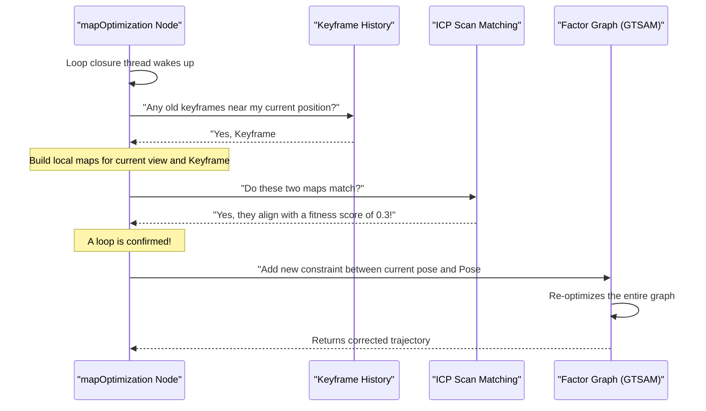

# Chapter 7: Loop Closure

In the [previous chapter](06_mapping___factor_graph_optimization_.md), we saw how LIO-SAM acts like a detective, using a factor graph "corkboard" to piece together clues from LiDAR, IMU, and GPS. This process works incredibly well for building a map step-by-step. However, over a long journey, tiny errors from each step can add up, causing a problem known as **drift**.

### The "Slightly Lost on a Long Hike" Problem

Imagine you're on a long hike through a forest, following a trail that eventually loops back to your starting point. You use a compass and count your steps to draw a map as you go. For each step, you're pretty accurate, but not perfect. Maybe you misjudge a turn by half a degree or your step count is off by a centimeter.

After an hour of walking, these tiny errors accumulate. When you finally arrive back at what you *think* is the starting point, you look at your hand-drawn map. To your surprise, your map shows your current position is 50 meters away from the start! The two ends of your path don't connect. This accumulated error is **drift**.

<p align='center'>
    
    <br/>
    <i>Without loop closure, the map has drift. With loop closure, the robot recognizes a familiar place and corrects the entire map.</i>
</p>

But then, you look up and recognize the familiar big oak tree where you parked your car. You have an "Aha!" moment. You *know* for a fact that your current location is the *exact same place* as your starting point. With this powerful new piece of information, you can go back over your hand-drawn map, stretching and squeezing it until the start and end points meet perfectly at the oak tree.

This "Aha!" moment is exactly what **loop closure** does for LIO-SAM. It detects when the robot has returned to a previously visited area and uses that knowledge to correct the entire map, eliminating the accumulated drift.

### The Loop Closure Process: Detect, Verify, Correct

Loop closure is a three-step process, handled within the `mapOptimization` node.

1.  **Detect a Potential Loop:** The system is constantly asking a simple question: "Is my current location close to any of the places I've been before?" It does this by checking if the robot's current position is within a certain radius (e.g., 15 meters) of any previous keyframes in its history. This first check gives us a *candidate* for a loop.

2.  **Verify the Loop with Scan Matching:** Just being physically close isn't enough. The robot could be on a different floor of a parking garage or on an overpass above a road it drove on earlier. To be sure, LIO-SAM must verify that it's seeing the same thing.
    -   It takes the current LiDAR scan.
    -   It takes the old LiDAR scans from the candidate location.
    -   It then tries to align them using a technique called **Iterative Closest Point (ICP)**. ICP is like trying to solve a 3D puzzle by nudging one point cloud around until it fits perfectly on top of the other.
    -   If the clouds align very well (meaning they have a low "fitness score"), the system is confident it's a real loop. This is the "Aha!" moment.

3.  **Correct the Map via the Factor Graph:** Once a loop is verified, the ICP alignment gives us a precise measurement of the transformation between the current pose and the old pose. This measurement is added to our [factor graph](06_mapping___factor_graph_optimization_.md) as a new, powerful "string" on the corkboard. This string connects two poses that are very far apart in time, pulling the entire trajectory together and making the map globally consistent.

### Under the Hood: The Loop Closure Workflow

The `mapOptimization` node runs a separate thread specifically for this task. It periodically wakes up, checks for loops, and adds constraints if it finds them.



### A Peek at the Code in `mapOptimization.cpp`

Let's look at the key functions in `src/mapOptimization.cpp` that make this happen.

#### 1. Detecting a Candidate Loop

The function `detectLoopClosureDistance()` performs the initial search. It uses a fast search structure (a k-d tree) to find any old keyframes within `historyKeyframeSearchRadius`.

```cpp
// In src/mapOptimization.cpp, inside detectLoopClosureDistance()

// Find the closest history key frame
std::vector<int> pointSearchIndLoop;
std::vector<float> pointSearchSqDisLoop;
kdtreeHistoryKeyPoses->setInputCloud(copy_cloudKeyPoses3D);
kdtreeHistoryKeyPoses->radiusSearch(
    copy_cloudKeyPoses3D->back(), // The current pose
    historyKeyframeSearchRadius,  // How far to look (e.g., 15 meters)
    pointSearchIndLoop, pointSearchSqDisLoop, 0);
```
This quickly gives us a list of potential matches. The code then picks the best candidate that is also old enough in time (to avoid matching with very recent frames).

#### 2. Verifying with ICP

Once a candidate is found, `performLoopClosure()` uses the PCL library's ICP implementation to align the point clouds.

```cpp
// In src/mapOptimization.cpp, inside performLoopClosure()

// ICP Settings
static pcl::IterativeClosestPoint<PointType, PointType> icp;
icp.setMaxCorrespondenceDistance(historyKeyframeSearchRadius*2);
icp.setMaximumIterations(100);
// ... more settings ...

// Align clouds
icp.setInputSource(cureKeyframeCloud); // Current point cloud
icp.setInputTarget(prevKeyframeCloud); // Old point cloud
icp.align(*unused_result);
```
After alignment, the most important check happens:

```cpp
// In src/mapOptimization.cpp, inside performLoopClosure()

// If the match is bad, just return and do nothing.
if (icp.hasConverged() == false || 
    icp.getFitnessScore() > historyKeyframeFitnessScore)
    return;
```
The `getFitnessScore()` tells us the average distance between the aligned points. A low score means a great match!

#### 3. Adding the Loop Factor

If the match is good, we create a new `BetweenFactor` and add it to our queue to be processed by the main optimization loop.

```cpp
// In src/mapOptimization.cpp, inside performLoopClosure()

// ... calculate the transformation 'poseFrom' and 'poseTo' ...
float noiseScore = icp.getFitnessScore();
// The noise is based on how good the match was
Vector6 << noiseScore, noiseScore, noiseScore, noiseScore, noiseScore, noiseScore;
noiseModel::Diagonal::shared_ptr constraintNoise = noiseModel::Diagonal::Variances(Vector6);

// Add the new constraint to the queue
mtx.lock();
loopIndexQueue.push_back(make_pair(loopKeyCur, loopKeyPre));
loopPoseQueue.push_back(poseFrom.between(poseTo));
loopNoiseQueue.push_back(constraintNoise);
mtx.unlock();
```
This new factor is the "Aha!" moment, mathematically encoded and ready to correct our map. When `isam->update()` is called next, this powerful constraint will pull the entire graph into a more accurate configuration.

The visual results are often dramatic:

<p align='center'>
    
    
</p>

### Your "Settings Menu" for Loop Closure

You can control this behavior in `config/params.yaml`.

```yaml
# In config/params.yaml

# Loop Closure
loopClosureEnableFlag: true
loopClosureFrequency: 1.0
surroundingKeyframeSearchRadius: 15.0
historyKeyframeSearchRadius: 15.0
historyKeyframeSearchTimeDiff: 30.0
historyKeyframeFitnessScore: 0.3
```
- `loopClosureEnableFlag`: The main switch to turn the feature on or off.
- `historyKeyframeSearchRadius`: How close (in meters) the robot needs to be to an old position to trigger a potential loop detection.
- `historyKeyframeFitnessScore`: The ICP score threshold. **Decrease** this value to be more strict about what counts as a loop. **Increase** it if the system is failing to detect obvious loops in environments with few features.

### Conclusion

You've now reached the end of the core LIO-SAM pipeline and learned about one of its most powerful features: **Loop Closure**. We've seen that it's the key to correcting long-term drift by finding those "Aha!" moments when the robot recognizes a familiar place. By detecting, verifying, and adding these powerful loop constraints to the factor graph, LIO-SAM can build large-scale, globally consistent maps.

Congratulations! You have journeyed through the entire LIO-SAM system, from configuring the sensors, through preprocessing and feature extraction, all the way to the final factor graph optimization and map correction. You now have a solid conceptual understanding of how LIO-SAM turns raw sensor data into a beautiful and accurate 3D map.

---

Generated by [AI Codebase Knowledge Builder](https://github.com/The-Pocket/Tutorial-Codebase-Knowledge)