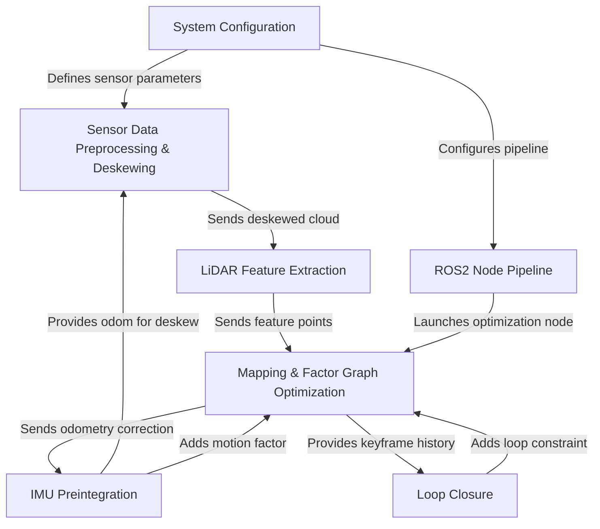

# Tutorial: LIO-SAM

LIO-SAM is a SLAM (Simultaneous Localization and Mapping) system that creates a **detailed 3D map** of an environment while simultaneously tracking the sensor's position within it.
It achieves high accuracy by *tightly-coupling* information from a spinning **LiDAR** sensor with a high-frequency **IMU** (Inertial Measurement Unit). The entire system is built as a pipeline of specialized nodes and uses a powerful optimization technique called a *factor graph* to continuously refine the map and trajectory, correcting for drift over time.

**Source Repository:** [None](None)

## Chapters

1. [System Configuration
](01_system_configuration_.md)
2. [ROS2 Node Pipeline
](02_ros2_node_pipeline_.md)
3. [IMU Preintegration
](03_imu_preintegration_.md)
4. [Sensor Data Preprocessing & Deskewing
](04_sensor_data_preprocessing___deskewing_.md)
5. [LiDAR Feature Extraction
](05_lidar_feature_extraction_.md)
6. [Mapping & Factor Graph Optimization
](06_mapping___factor_graph_optimization_.md)
7. [Loop Closure
](07_loop_closure_.md)

---

Generated by [AI Codebase Knowledge Builder](https://github.com/The-Pocket/Tutorial-Codebase-Knowledge)