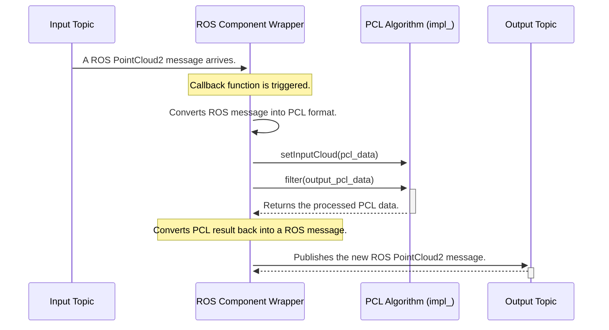

# Chapter 4: PCL Algorithm as a ROS Component

In the [previous chapter](03_feature_extraction_.md), we explored how to extract rich geometric features like surface normals from a point cloud. We used command-line tools like `normal_3d_node` to perform these tasks. This is great for testing and one-off processing, but how do we build a complete, robust perception system for a real robot?

Running a dozen separate commands in different terminals isn't practical. We need a way to organize, launch, and connect these processing steps into a cohesive pipeline. This is where the concept of treating each PCL algorithm as a modular ROS "Component" shines.

### What Problem Does This Solve?

Imagine building a perception system is like setting up a factory assembly line. You have several specialized stations: one for cleaning raw materials (filtering), one for sorting them into parts (segmentation), and one for inspecting their quality (feature extraction).

You wouldn't build a whole new factory from scratch just to add one more inspection step. Instead, you'd use pre-built, standard machines and connect them with conveyor belts. The "PCL Algorithm as a ROS Component" abstraction provides exactly this.

**Use Case:** We want to build the full perception pipeline we've been discussing: take raw sensor data, clean it, find the table, isolate the soda can, and then analyze the can's shape.

This abstraction allows us to:
1.  **Define the entire pipeline in one place:** Instead of running separate commands, we can define the full sequence of operations in a single configuration file (a ROS Launch file).
2.  **Easily reconfigure the pipeline:** Want to swap out one filter for another? Just change one line in the launch file. No C++ code changes needed!
3.  **Reuse components:** The same `VoxelGrid` component used for finding a can could be reused in a completely different project for robot navigation.

By the end of this chapter, you'll understand the powerful design pattern behind all the nodes in `perception_pcl` and how they are designed to be connected together.

### The Workbench Analogy

Think of `perception_pcl` as providing a workbench full of specialized power tools. Each tool is a ROS Component that wraps a powerful PCL algorithm.

*   **VoxelGrid Filter:** This is your power sander. It smooths out the data and reduces its size.
*   **SACSegmentation:** This is your table saw. It makes a clean, straight cut to separate large planes like tables and walls.
*   **EuclideanClusterExtraction:** These are your sorting bins. They group all the leftover parts into distinct piles.
*   **NormalEstimation:** This is your magnifying glass with a protractor. It lets you inspect the fine details of each part's surface.

A ROS 2 Launch file is the blueprint that tells you which tools to take from the bench, in what order to use them, and what settings to dial in for each one. The "conveyor belt" that moves the object from one tool to the next is a ROS topic.

Here is what our perception pipeline looks like from this component-based view:

```mermaid
graph TD
    A[Camera Sensor] -->|Publishes on /raw_points| B(VoxelGrid Component);
    B -->|Publishes on /filtered_points| C(SACSegmentation Component);
    C -->|Publishes on /object_points| D(NormalEstimation Component);
    D -->|Publishes on /object_with_features| E[Robot's Brain (Application)];
```

Each box in this diagram is a reusable, standalone component that we can link together to create a powerful perception system.

### Under the Hood: The Anatomy of a Component

So, what does one of these "tools" look like on the inside? Let's take apart our trusty `VoxelGrid` filter to see its internal structure.

Almost every node in `perception_pcl` follows the same elegant design pattern: **a ROS 2 wrapper around a core PCL algorithm.**

*   **The ROS Wrapper:** This part is like the plastic casing of a power tool. It handles all the ROS-specific tasks:
    *   Declaring parameters (the speed dial, e.g., `leaf_size`).
    *   Subscribing to an input topic (the power cord).
    *   Publishing the output (the work leaving the tool).
    *   Handling data type conversions.

*   **The PCL Algorithm:** This is the motor and gears inside the tool. It's a pure C++ object from the Point Cloud Library that knows nothing about ROS. It just takes PCL data, does the heavy math, and produces PCL data as output.

This separation is fantastic because the PCL library can focus on creating powerful, efficient algorithms, while the `perception_pcl` package focuses on making them easy to use within the ROS ecosystem.

Let's trace the data flow inside a component:



This sequence happens every single time a point cloud is processed by any filter, segmentation, or feature node in `perception_pcl`.

### A Peek at the Code Blueprint

Let's see how this pattern looks in simplified C++ code. We'll examine the `VoxelGrid` component.

#### 1. The Class Definition: Wrapper and Engine

The component is defined as a C++ class. Notice it has two key parts: the ROS-related functions and a member variable `impl_`, which stands for "implementation." This `impl_` object is the pure PCL algorithm.

(Simplified from `pcl_ros/src/pcl_ros/filters/voxel_grid.hpp`)
```cpp
// This class IS the ROS Component
class VoxelGrid : public Filter // 'Filter' is a base class for filter nodes
{
public:
  // Constructor: This is where parameters and topics are set up.
  VoxelGrid(const rclcpp::NodeOptions & options);

private:
  // This is the PCL algorithm doing the heavy lifting!
  pcl::VoxelGrid<pcl::PCLPointCloud2> impl_;

  // The main function that gets called with new data.
  void filter(const PointCloud2::ConstSharedPtr & input, ..., PointCloud2 & output);
};
```
This structure clearly separates the ROS "wrapper" logic from the core PCL "engine."

#### 2. The Constructor: Setting the Dials

When the component starts up, its constructor is called. This is where it declares its parameters, allowing us to configure it from the outside.

(Simplified from `pcl_ros/src/pcl_ros/filters/voxel_grid.cpp`)
```cpp
VoxelGrid::VoxelGrid(const rclcpp::NodeOptions & options)
: Filter("VoxelGridNode", options)
{
  // This line makes 'leaf_size' available as a ROS parameter.
  // We can now set it from the command line or a launch file.
  declare_parameter("leaf_size", rclcpp::ParameterValue(0.01));

  // ... other setup ...

  // Start listening for input point clouds.
  subscribe();
}
```
This setup code is what allows us to run `ros2 run ... -p leaf_size:=0.05` to control the behavior of the component without ever touching its code.

#### 3. The `filter` Method: The Assembly Line in Action

This is the workhorse function. It executes the sequence we saw in the diagram: convert data, run the algorithm, and convert the result back.

(Simplified from `pcl_ros/src/pcl_ros/filters/voxel_grid.cpp`)
```cpp
void pcl_ros::VoxelGrid::filter(
  const PointCloud2::ConstSharedPtr & input, ..., PointCloud2 & output)
{
  // Step 1: Convert incoming ROS message to PCL format.
  pcl::PCLPointCloud2::Ptr pcl_input(new pcl::PCLPointCloud2);
  pcl_conversions::toPCL(*(input), *(pcl_input));

  // Step 2: Pass data to the PCL algorithm and run it.
  impl_.setInputCloud(pcl_input);
  pcl::PCLPointCloud2 pcl_output;
  impl_.filter(pcl_output); // The PCL magic happens here!

  // Step 3: Convert the PCL result back into a ROS message.
  pcl_conversions::moveFromPCL(pcl_output, output);
}
```
This three-step pattern (ROS-to-PCL, process, PCL-to-ROS) is the heart of the `perception_pcl` package. We'll learn more about those `toPCL` and `moveFromPCL` functions in the [PCL-ROS Data Type Conversion](06_pcl_ros_data_type_conversion_.md) chapter.

### Conclusion

You've now learned the most important architectural concept in `perception_pcl`: **every algorithm is packaged as a modular, reusable, and configurable ROS component.**

We learned that:
-   This component-based design allows us to build complex pipelines by connecting nodes together, just like machines on an assembly line.
-   Each component is a ROS "wrapper" around a core PCL algorithm "engine."
-   This design separates the ROS communication logic from the heavy-lifting math, making the system clean and maintainable.
-   The standard internal process is: receive ROS data, convert it to PCL format, run the algorithm, convert the result back to ROS format, and publish it.

We have a solid understanding of how these components work individually and how they connect. However, up until now, we've assumed all our point clouds exist in the same perfect world. What happens when our camera is tilted, or when we need to relate the points it sees to the robot's base or gripper? We need to talk about coordinate systems, which is the job of TF2, the ROS transformation library.

[Next: Coordinate Frame Transformation](05_coordinate_frame_transformation_.md)

---

Generated by [AI Codebase Knowledge Builder](https://github.com/The-Pocket/Tutorial-Codebase-Knowledge)