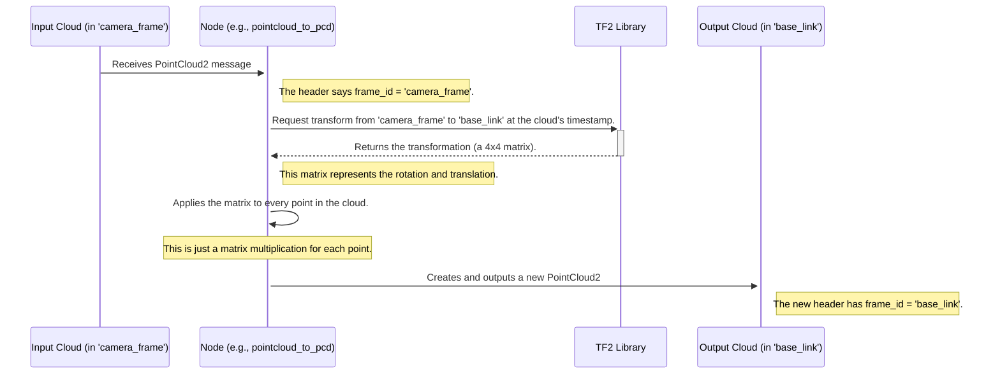

# Chapter 5: Coordinate Frame Transformation

In the [previous chapter](04_pcl_algorithm_as_a_ros_component_.md), we saw how all the algorithms in `perception_pcl` are designed as modular, reusable ROS Components. We learned how to chain them together to build a full perception pipeline. So far, we've been operating under a simple assumption: all our 3D data exists in one, single coordinate system.

In the real world, this is almost never the case. A robot is made of many parts, and each has its own point of view. The camera has its own coordinate system, the robot's base has another, and its gripper has yet another. How do we make sense of it all?

### What Problem Does Transformation Solve?

Imagine you are a tourist in a new city. You have a small, detailed map of the museum you're in, and your friend has a large map of the entire city. You point to a spot on your museum map and say, "The exit is right here." Your friend, looking at their city map, has no idea where "here" is. To communicate, you need to first figure out where the museum is located *on the city map*. Only then can you translate the exit's location from your map to theirs.

This is the exact problem robots face. A 3D camera gives a point cloud of a soda can, but the coordinates of those points are relative to the *camera*. If the robot wants to move its arm to pick up the can, it needs to know where the can is relative to its *base* or the *world*.

**Use Case:** A robot's camera is mounted on its head, tilted downwards. It sees a can on a table. The camera reports the can's location as `(x=0.1, y=0.05, z=0.8)` in the `camera_link` coordinate frame. The robot's navigation and arm planning software, however, operates in the `base_link` coordinate frame. We need to "translate the address" of the can from the camera's map to the robot's base map.


*A robot's different parts (base, camera, gripper) each have their own coordinate frame. TF2 knows how they all relate to each other.*

Coordinate frame transformation is the process of converting coordinates from one frame of reference to another. It ensures that all data can be understood in a single, consistent frame, which is essential for the robot to interact with its environment.

### What is TF2?

In ROS, the system that manages all these different coordinate frames and the relationships between them is called **TF2** (which stands for "Transformations, 2nd Generation").

*   **Analogy:** TF2 is like a universal GPS for the robot. It maintains a live, dynamic "tree" of all the coordinate frames on the robot. If you ask TF2, "How do I get from the `camera_link` frame to the `base_link` frame?", it will give you the precise translation and rotation needed to convert coordinates between them.

Every point cloud message in ROS has a `header` which contains a `frame_id`. This `frame_id` tells you which coordinate system the points in that cloud belong to. The `perception_pcl` library uses TF2 to handle all transformation tasks.

### Using Transformations in `perception_pcl`

While most filter and segmentation nodes in `perception_pcl` assume the data is already in the correct frame, some utilities are specifically designed to use TF. A great example is the `pointcloud_to_pcd` tool, which can save a point cloud to a file. It has an optional parameter to first transform the cloud into a desired "fixed frame."

Let's imagine our camera is publishing points in the `camera_depth_optical_frame`. We want to save this data, but from the perspective of the robot's `base_link`. We can use the `pointcloud_to_pcd` tool to do this.

```bash
# This is a conceptual ROS 1 command from the provided code.
# In ROS 2, you would use a similar launch file or parameters.
rosrun pcl_ros pointcloud_to_pcd input:=/camera/depth/points _fixed_frame:="base_link"
```
Let's break down what's happening here:
*   `rosrun pcl_ros pointcloud_to_pcd`: We run the tool that saves point clouds.
*   `input:=/camera/depth/points`: We tell it to listen to the point cloud coming from our camera.
*   `_fixed_frame:="base_link"`: This is the magic parameter. We are telling the node: "Before you save the data, please use TF to transform it from whatever frame it's in (`camera_depth_optical_frame`) into the `base_link` frame."

The node will automatically listen to TF2, find the correct transformation, apply it to every point in the cloud, and then save the resulting new point cloud to a file. The saved file will contain points as if they were measured directly from the robot's base.

### Under the Hood: How a Transformation Works

The process of transforming a point cloud involves a close collaboration between your ROS node and the TF2 library.

Here is a high-level overview:



The node does not need to know where the camera is physically mounted. It just asks TF2 for the relationship, and TF2 provides the necessary mathematical tool (the transformation matrix) to get the job done.

Let's peek at some simplified code from the `pcl_ros` library to see this in action.

#### 1. Looking Up the Transform

The core function `transformPointCloud` first needs to get the transformation from TF2. It does this by calling `lookupTransform` on a `tf_buffer` object.

(from `pcl_ros/src/transforms.cpp`)
```cpp
// This function takes an input cloud and a target frame.
bool transformPointCloud(
  const std::string & target_frame, const sensor_msgs::msg::PointCloud2 & in,
  sensor_msgs::msg::PointCloud2 & out, const tf2_ros::Buffer & tf_buffer)
{
  // Get the TF transform from the TF2 library.
  geometry_msgs::msg::TransformStamped transform;
  try {
    transform =
      tf_buffer.lookupTransform(target_frame, in.header.frame_id, ...);
  } catch (tf2::LookupException & e) {
    RCLCPP_ERROR( ... , "Transform lookup failed!");
    return false;
  }
  // ... continue to apply the transform ...
}
```
This is the "asking the GPS for directions" step. The node provides the destination (`target_frame`), the starting point (`in.header.frame_id`), and the time, and TF2 either returns the transform or throws an error if it doesn't know the relationship.

#### 2. Applying the Transform

Once the node has the transform, it's converted into a 4x4 matrix. This matrix can then be used to calculate the new coordinates for every point in the cloud.

(from `pcl_ros/src/transforms.cpp`)
```cpp
// Convert the transform message into a mathematical matrix.
Eigen::Matrix4f eigen_transform;
transformAsMatrix(transform, eigen_transform);

// Apply this matrix to all points in the input cloud to get the output cloud.
transformPointCloud(eigen_transform, in, out);

// Finally, update the header of the output cloud to the new frame.
out.header.frame_id = target_frame;
```
The lower-level `transformPointCloud` function (not shown here) simply loops through every point, multiplies its coordinates by `eigen_transform`, and stores the result. This is a highly optimized operation.

### Conclusion

You've now learned about one of the most fundamental and critical concepts in robotics: coordinate frames. Without transformations, a robot is just a collection of disconnected parts that can't relate their individual perceptions to a coherent whole.

We learned that:
-   **Why transformations are necessary:** To unify data from different sensors and robot parts into a single, consistent coordinate system.
-   **What TF2 is:** ROS's "universal GPS" that keeps track of all coordinate frames.
-   **How `perception_pcl` uses TF2:** By providing functions and tools that can look up and apply transformations to point clouds.
-   **The internal process:** A node asks TF2 for a transformation matrix and then applies it to every point in the cloud.

In many of our "Under the Hood" sections, we've seen code that converts data between ROS message formats (like `sensor_msgs::msg::PointCloud2`) and PCL's internal formats. This conversion is a crucial piece of the puzzle that makes the `perception_pcl` library work. How is this done? We'll explore that in the next chapter.

[Next: PCL-ROS Data Type Conversion](06_pcl_ros_data_type_conversion_.md)

---

Generated by [AI Codebase Knowledge Builder](https://github.com/The-Pocket/Tutorial-Codebase-Knowledge)