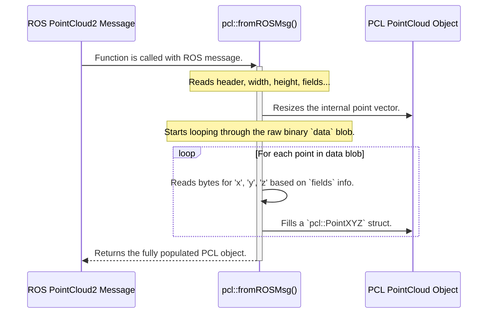

# Chapter 6: PCL-ROS Data Type Conversion

In all the previous chapters, especially when looking "Under the Hood" at how filters or segmentation nodes work, we've seen a recurring three-step pattern:
1.  Receive a ROS message.
2.  **Convert the ROS message to a PCL data type.**
3.  Run a PCL algorithm.
4.  **Convert the PCL result back into a ROS message.**
5.  Publish the new ROS message.

We've explored filters, segmentation, and even [Coordinate Frame Transformation](05_coordinate_frame_transformation_.md), but we've always glossed over the magical conversion steps. How exactly does data get from a ROS message into a format that the Point Cloud Library can understand? This chapter pulls back the curtain on this crucial process.

### What Problem Does This Solve?

Imagine you have two experts you need to consult. The first expert, "Mr. ROS," is a world-class communicator. He can talk to anyone (any ROS node, written in Python or C++) using a standardized language. The second expert, "Dr. PCL," is a brilliant but highly specialized mathematician. She only speaks a very specific, technical dialect of C++ that is optimized for incredibly fast 3D geometry calculations.

You can't just put them in a room together and expect them to collaborate. You need a translator.

This is exactly the role of PCL-ROS data type conversion.
*   **ROS (`sensor_msgs/msg/PointCloud2`):** This is the universal communication language. It's designed to be generic and flexible, so it can be sent over the network between different programs.
*   **PCL (e.g., `pcl::PointCloud<pcl::PointXYZ>`):** This is the specialized, high-performance C++ structure. It's designed for direct memory access and lightning-fast math.

The conversion process is the **bilingual translator** that allows the ROS ecosystem to leverage the power of the PCL algorithms. It's the fundamental bridge that makes everything else in `perception_pcl` possible.

### The Two "Languages" Explained

Let's take a closer look at how these two data structures represent the same information differently.

#### 1. The ROS `sensor_msgs/msg/PointCloud2`

Think of the ROS message as a shipping container. It's a standardized box that can hold anything. Inside, you have a manifest (`fields`) that describes the contents, but the main cargo is just one big, continuous block of binary data (`data`).

*   **Analogy:** It's like a text file where all the letters of a book are run together without spaces. You're given separate instructions on how to read it: "the first 4 bytes are the `x` coordinate, the next 4 are `y`, the next 4 are `z`, skip 4 bytes, then repeat." It's efficient for shipping, but terrible for reading.

#### 2. The PCL `pcl::PointCloud<T>`

The PCL format is like a well-formatted C++ object. It's essentially a `std::vector` of point `structs`. You can easily access the data for any point in a structured way.

*   **Analogy:** This is like the printed book itself. It's organized into chapters, paragraphs, words, and letters. If you want the third word of the fifth sentence, you can find it directly. In code, this looks like `my_cloud.points[i].x`, which is clean and intuitive.

### Using the Translator: The `pcl_conversions` Library

The ROS package that provides all the translation functions is called `pcl_conversions`. Its main job is to provide a header file, `pcl_conversions/pcl_conversions.h`, full of helpful functions.

Let's write a very simple ROS node callback that receives a ROS message, converts it to PCL, and then converts it back.

#### 1. Converting from ROS to PCL

When a `PointCloud2` message arrives, we use the `pcl::fromROSMsg` function to unpack it into a structured PCL object.

```cpp
#include <pcl_conversions/pcl_conversions.h>
#include <pcl/point_cloud.h>
#include <pcl/point_types.h>

void cloudCallback(const sensor_msgs::msg::PointCloud2::SharedPtr ros_msg)
{
  // Create a PCL point cloud object to store the converted data.
  pcl::PointCloud<pcl::PointXYZ> pcl_cloud;

  // The magic happens here!
  pcl::fromROSMsg(*ros_msg, pcl_cloud);

  // Now you can work with the data easily, for example:
  // float first_point_x = pcl_cloud.points[0].x;
}
```
This single line, `pcl::fromROSMsg`, does all the hard work of reading the ROS message's "manifest" (`fields`) and unpacking the binary `data` blob into a clean `pcl::PointCloud`.

#### 2. Converting from PCL to ROS

After our algorithm has finished processing the `pcl_cloud`, we need to package it back up into a ROS message to publish it. For this, we use `pcl::toROSMsg`.

```cpp
void processAndPublish(const pcl::PointCloud<pcl::PointXYZ>& pcl_cloud)
{
  // Create an empty ROS message object.
  sensor_msgs::msg::PointCloud2 ros_output;

  // The magic happens here!
  pcl::toROSMsg(pcl_cloud, ros_output);

  // Now the ros_output message is ready to be published.
  // publisher_->publish(ros_output);
}
```
This function takes the structured PCL object and serializes it back into the generic `data` blob and `fields` format of a `PointCloud2` message.

### Under the Hood: How the Translation Works

Let's trace the journey of data during the `pcl::fromROSMsg` call.



The function acts like an intelligent parser. It reads the message's metadata to understand the data layout, then carefully iterates through the binary buffer, copying bytes into the appropriate fields of the structured PCL point type.

Let's look at the header file that makes this possible.

(from `pcl_conversions/include/pcl_conversions/pcl_conversions.h`)
```cpp
namespace pcl_conversions {
  // Converts a ROS PointCloud2 message to a PCL PCLPointCloud2
  inline
  void toPCL(const sensor_msgs::msg::PointCloud2 &pc2, pcl::PCLPointCloud2 &pcl_pc2)
  {
    copyPointCloud2MetaData(pc2, pcl_pc2);
    pcl_pc2.data = pc2.data;
  }
} // namespace pcl_conversions

namespace pcl {
  // Converts a ROS PointCloud2 message to a templated PCL PointCloud
  template<typename T>
  void fromROSMsg(const sensor_msgs::msg::PointCloud2 &cloud, pcl::PointCloud<T> &pcl_cloud)
  {
    pcl::PCLPointCloud2 pcl_pc2;
    pcl_conversions::toPCL(cloud, pcl_pc2); // First, a shallow conversion
    pcl::fromPCLPointCloud2(pcl_pc2, pcl_cloud); // Then, unpack the data
  }
} // namespace pcl
```
This snippet shows the two-step process inside `fromROSMsg`:
1.  It first calls `pcl_conversions::toPCL`. This is a "shallow" conversion that mostly just copies the metadata and the raw binary data blob into a PCL-equivalent container (`pcl::PCLPointCloud2`).
2.  It then calls `pcl::fromPCLPointCloud2`. This is a function from PCL itself that performs the actual "deep" conversion—unpacking the binary data into the nicely structured `pcl::PointCloud<T>` object.

**A Note on Performance:** You may have seen `moveFromPCL` or `moveToPCL` used in the `perception_pcl` source code. These are optimized versions of the conversion functions that avoid making a copy of the potentially massive point data buffer. Instead, they efficiently swap the data from one object to the other, which is much faster.

### Conclusion

You've now uncovered the secret ingredient that connects the entire ROS and PCL ecosystem. This data type conversion is the unsung hero of 3D perception in ROS.

We learned that:
-   **ROS and PCL use different data structures** for point clouds, one optimized for communication (`sensor_msgs/msg/PointCloud2`) and the other for performance (`pcl::PointCloud<T>`).
-   The `pcl_conversions` package provides the **"translator" functions** to bridge this gap.
-   Key functions like `pcl::fromROSMsg` and `pcl::toROSMsg` handle the complex work of packing and unpacking point cloud data.
-   This translation enables the modular design pattern we saw in the [PCL Algorithm as a ROS Component](04_pcl_algorithm_as_a_ros_component_.md) chapter, where ROS wrappers handle communication and PCL objects handle processing.

Now that we have a complete picture of the perception pipeline—from filtering and segmentation to the very mechanics of data conversion—let's look at some practical tools for working with our data. How do we record point clouds to a file for later analysis, or play back a saved file as if it were a live sensor?

[Next: Data Management Tools](07_data_management_tools_.md)

---

Generated by [AI Codebase Knowledge Builder](https://github.com/The-Pocket/Tutorial-Codebase-Knowledge)