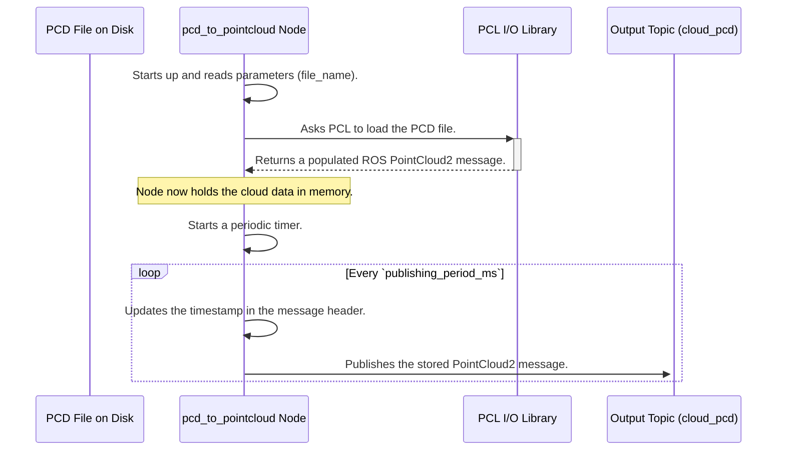

# Chapter 7: Data Management Tools

In the [previous chapter](06_pcl_ros_data_type_conversion_.md), we uncovered the "secret ingredient" of `perception_pcl`: the data conversion functions that allow the ROS ecosystem to communicate with the powerful PCL library. We now have a complete top-to-bottom understanding of how a perception pipeline works, from filtering raw data to the nuts and bolts of data structures.

But what happens when things go wrong? Or when you want to develop a new perception algorithm without having a robot running next to you? You need a way to save, replay, and inspect your data. This is where `perception_pcl`'s data management tools come in.

### What Problem Do These Tools Solve?

Think of these tools as a Swiss Army knife for handling 3D data. They are a collection of simple, powerful command-line utilities that help you with common tasks outside of your main perception pipeline. They are essential for debugging, analysis, and setting up experiments.

**Use Case:** Your robot's complex perception pipeline is failing to detect a soda can, but you're not sure which step is the problem. Is the filter too aggressive? Is the segmentation failing? Instead of trying to debug on the live robot, you want to:
1.  **Record** the raw sensor data to a file.
2.  **Take that file** back to your development computer.
3.  **Replay** the data over and over again to test each node in your pipeline one by one.

These data management tools make this workflow possible. They help you bridge the gap between the real world and your development environment.

### The Blades of the Swiss Army Knife

Let's look at the most useful "blades" in this toolkit. Each one is a standalone program you can run from your terminal.

#### 1. Saving Point Clouds (`pointcloud_to_pcd` and `bag_to_pcd`)

Sometimes you need to save a point cloud from a ROS topic to a file on your computer. The standard file format used by PCL is the `.pcd` (Point Cloud Data) file.

*   `pointcloud_to_pcd`: This tool is like a camera's shutter button. It subscribes to a point cloud topic, waits for a single message, saves it to a `.pcd` file, and then exits. It's perfect for capturing a single "snapshot" of a scene.
*   `bag_to_pcd`: A ROS bag is a recording of everything that happens on a set of ROS topics. This tool is like a video editor that can go through a recorded video and extract every single frame as a separate image. It processes an entire bag file and saves every point cloud message it finds into a sequence of `.pcd` files.

#### 2. Publishing Point Clouds (`pcd_to_pointcloud`)

This tool does the exact opposite of the previous one. It loads a `.pcd` file from your disk and repeatedly publishes it on a ROS topic, pretending to be a 3D camera.

*   **Analogy:** This is like putting a photo into a digital picture frame that cycles through it continuously.

This is incredibly useful for debugging. You can publish a known, saved point cloud and feed it into your filter or segmentation nodes to see how they behave in a perfectly repeatable way.

#### 3. Converting to an Image (`convert_pointcloud_to_image`)

Some 3D cameras produce "organized" point clouds, which have a grid-like structure just like a regular image (e.g., 640x480 points). For these specific clouds, this tool can perform a very fast conversion into a standard ROS `Image` message.

This is useful for quick visualizations. You can view the output with a simple image viewer and see a depth image, where brightness corresponds to distance.

### A Practical Debugging Workflow

Let's use these tools to solve our use case of debugging the can-detection pipeline.

#### Step 1: Save Live Data to a File

First, we listen to the live point cloud topic from our robot and save a snapshot when we have the can in view. (Note: The following commands are conceptual for ROS 2).

```bash
# In one terminal, run the tool
ros2 run pcl_ros pointcloud_to_pcd input:=/my_robot/raw_points _prefix:=can_scene_

# The tool will wait for one message and save a file like `can_scene_1678886400.pcd`
```
We now have a perfect, high-fidelity copy of the raw sensor data on our disk.

#### Step 2: Replay the File for Testing

Now, back at our development machine, we can use `pcd_to_pointcloud` to publish this file as if it were a live sensor.

```bash
ros2 run pcl_ros pcd_to_pointcloud --ros-args \
   -p file_name:="/path/to/can_scene_1678886400.pcd" \
   -p publishing_period_ms:=1000 \
   -r cloud_pcd:=/my_robot/raw_points
```
This command will:
*   Load the specified `.pcd` file.
*   Publish it on the `/my_robot/raw_points` topic once every second (1000 ms).

Now, you can run your filter node from [Chapter 1](01_point_cloud_filtering_.md) in another terminal, and it will receive this replayed data. You have created a stable, repeatable test environment to debug your system!

### Under the Hood: How `pcd_to_pointcloud` Works

The `pcd_to_pointcloud` node is a great example of a simple, useful utility. It combines file I/O with the PCL-ROS conversions we've learned about.



The node does the heavy lifting of loading the file only once at the beginning. Then, it simply sits in a loop, updating the timestamp and publishing the same data repeatedly.

Let's look at the simplified code to see how this is achieved.

#### 1. The Constructor: Loading the Data

When the node is created, its constructor is responsible for getting the parameters and loading the file.

(from `pcl_ros/tools/pcd_to_pointcloud.cpp`)
```cpp
PCDPublisher::PCDPublisher(const rclcpp::NodeOptions & options)
  : rclcpp::Node("pcd_publisher", options)
{
  // Get parameters like file_name and publishing period.
  file_name_ = this->declare_parameter<std::string>("file_name");
  period_ms_ = this->declare_parameter("publishing_period_ms", 3000);

  // Use PCL's I/O library to load the file directly into a ROS message!
  if (file_name_ == "" || pcl::io::loadPCDFile(file_name_, cloud_) == -1) {
    RCLCPP_ERROR(this->get_logger(), "failed to open PCD file");
    return;
  }

  // Create the publisher and a timer to call the publish() function.
  pub_ = this->create_publisher<sensor_msgs::msg::PointCloud2>(...);
  timer_ = this->create_wall_timer(std::chrono::milliseconds(period_ms_), ...);
}
```
This code shows the power of PCL's file I/O. The `pcl::io::loadPCDFile` function is smart enough to read the `.pcd` file and populate a `sensor_msgs::msg::PointCloud2` (`cloud_`) directly.

#### 2. The Publish Method: The Beating Heart

The timer created in the constructor calls this `publish` function periodically. Its job is very simple.

(from `pcl_ros/tools/pcd_to_pointcloud.cpp`)
```cpp
void PCDPublisher::publish()
{
  // Get the current time and update the message header.
  cloud_.header.stamp = this->get_clock()->now();

  // Publish the message.
  pub_->publish(cloud_);
}
```
That's it! The node simply updates the timestamp to make it look like fresh data and sends it out. This elegant simplicity is what makes these tools so effective.

### Conclusion

Congratulations! You have completed the `perception_pcl` tutorial series. You've journeyed all the way from the basics of cleaning up noisy data to understanding the sophisticated architecture that makes this powerful library work.

In this final chapter, we learned about the essential data management tools that act as your Swiss Army knife for everyday perception tasks. These utilities for saving, loading, and converting point clouds are invaluable for creating robust, testable, and debuggable robotics applications.

You now have the knowledge to:
-   **Filter** raw point clouds to focus on what's important.
-   **Segment** scenes to isolate objects from their surroundings.
-   **Extract Features** to understand the shape of those objects.
-   Appreciate the **Component-based design** that makes the system modular.
-   Understand how **Coordinate Transformations** and **Data Type Conversions** work under the hood.

The world of 3D perception is vast and exciting. With the foundations you've built here, you are now well-equipped to start building your own amazing robotic perception systems. Go forth and help robots see the world

---

Generated by [AI Codebase Knowledge Builder](https://github.com/The-Pocket/Tutorial-Codebase-Knowledge)