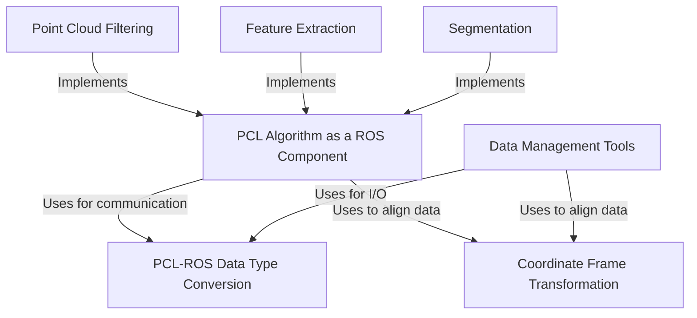

# Tutorial: perception_pcl

The `perception_pcl` project acts as a crucial bridge, allowing the powerful *Point Cloud Library (PCL)* to be used seamlessly within the **Robot Operating System (ROS)**. It provides a collection of ready-to-use ROS components for building complex 3D perception pipelines. With this project, developers can easily **filter**, **segment**, and extract **features** from point cloud data, as well as manage and transform it for various robotics tasks.

**Source Repository:** [None](None)

## Chapters

1. [Point Cloud Filtering
](01_point_cloud_filtering_.md)
2. [Segmentation
](02_segmentation_.md)
3. [Feature Extraction
](03_feature_extraction_.md)
4. [PCL Algorithm as a ROS Component
](04_pcl_algorithm_as_a_ros_component_.md)
5. [Coordinate Frame Transformation
](05_coordinate_frame_transformation_.md)
6. [PCL-ROS Data Type Conversion
](06_pcl_ros_data_type_conversion_.md)
7. [Data Management Tools
](07_data_management_tools_.md)

---

Generated by [AI Codebase Knowledge Builder](https://github.com/The-Pocket/Tutorial-Codebase-Knowledge)