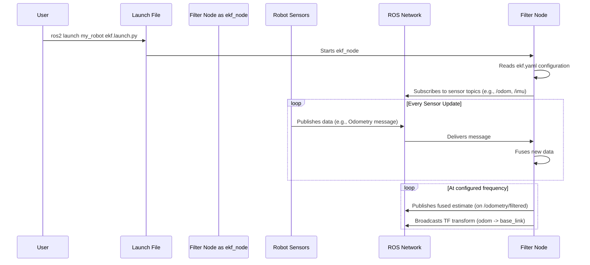

# Chapter 1: ROS Filter Nodes (`ekf_node`, `ukf_node`)

Welcome to the `robot_localization` package! If you have a robot with multiple sensors and want to get a single, clean, and reliable estimate of its position and velocity, you've come to the right place.

Let's start with a simple scenario. Imagine your robot has:
1.  **Wheel Encoders:** These are good at measuring how far the robot has traveled, but they can slip and accumulate errors over time.
2.  **An IMU (Inertial Measurement Unit):** This is great at measuring rotation and acceleration, but its position estimate drifts quickly.

Each sensor tells a part of the story, but neither is perfect. How can we combine them to get the *best* possible story of where our robot is? This is where `robot_localization` comes in, and your journey starts with its two main programs: `ekf_node` and `ukf_node`.

### The Main Programs: Your Filter's Dashboard

Think of `ekf_node` and `ukf_node` as the dashboard and controls for a powerful estimation engine. You don't need to build the engine yourself, but you do need to tell it which gauges to watch (your sensors) and how to behave.

These two "nodes" (a ROS term for a program) are the core executables you will run. Their job is to act as a bridge between the complex C++ filtering algorithms and the ROS ecosystem your robot uses.

Here’s what they do:

1.  **Load Your Settings:** They read a configuration file (a `.yaml` file) where you specify all your settings.
2.  **Listen to Sensors:** They subscribe to the ROS "topics" that your sensors are publishing data on.
3.  **Process Data:** They take that sensor data and feed it to the internal C++ filtering logic for processing.
4.  **Publish the Result:** They broadcast the final, fused state estimate on a new ROS topic, typically `odometry/filtered`.
5.  **Broadcast a Transform:** They also publish this estimate as a TF transform, which is essential for many other ROS tools, like the RViz visualizer.

In short, they are your primary interface to the whole system!

### How to Use a Filter Node

Using `robot_localization` typically involves just two steps from your side: creating a configuration file and creating a launch file to run the node with that configuration.

#### Step 1: Choose Your Filter

The package provides two types of filters, wrapped in two different nodes:
*   `ekf_node`: Uses an **Extended Kalman Filter (EKF)**.
*   `ukf_node`: Uses an **Unscented Kalman Filter (UKF)**.

For now, don't worry too much about the deep mathematical differences. As a beginner, think of it like this: the EKF is faster and works great for many common robot systems. The UKF can be more accurate for robots with very complex or unusual movement, but it requires more computational power.

We will cover the details of these algorithms in the [State Estimation Filters (EKF & UKF)](03_state_estimation_filters__ekf___ukf__.md) chapter. Let's start with the `ekf_node`.

#### Step 2: Create a Configuration File

You need to tell the `ekf_node` how to behave. You do this in a YAML file (e.g., `ekf.yaml`). This file contains all the settings, from which sensors to use to how fast the filter should run.

Here is a tiny piece of what that file looks like:

```yaml
### ekf.yaml --- A minimal example ###
ekf_filter_node:
    ros__parameters:
        frequency: 30.0

        odom_frame: odom
        base_link_frame: base_link

        odom0: example/odom
        odom0_config: [true,  true,  false,
                       false, false, false,
                       # ... and so on
                      ]
```

Let's quickly break this down:
*   `frequency`: This tells the filter to publish its estimate 30 times per second (30 Hz).
*   `odom_frame` / `base_link_frame`: These define the coordinate frames. `base_link` is attached to your robot, and `odom` is the world frame where it starts.
*   `odom0`: This is the ROS topic for our first sensor (e.g., wheel encoders).
*   `odom0_config`: This is a crucial setting. It's a matrix of `true`/`false` values that tells the filter *which parts* of the `odom0` message to use. In this case, we are only using the X and Y position.

We will explore all these settings in great detail in the [Sensor Fusion Configuration](02_sensor_fusion_configuration_.md) chapter.

#### Step 3: Launch the Node

Finally, you run the node using a ROS 2 launch file. This file tells ROS which program to execute and which configuration file to use.

Here is a simplified `ekf.launch.py`:

```python
# ekf.launch.py
from launch import LaunchDescription
import launch_ros.actions

def generate_launch_description():
    return LaunchDescription([
        launch_ros.actions.Node(
            package='robot_localization',
            executable='ekf_node',
            name='ekf_filter_node',
            parameters=['path/to/your/ekf.yaml']
        ),
    ])
```

This file is quite simple:
*   `package='robot_localization'`: We are using a node from this package.
*   `executable='ekf_node'`: This is the specific program we want to run.
*   `parameters=[...]`: This is the most important part! It tells the node where to find your `ekf.yaml` settings file.

When you run this launch file, the `ekf_node` starts, reads your configuration, and begins its work of fusing sensor data.

### What Happens When You Run It?

Let's visualize the flow of information from start to finish.



As you can see, the filter node is the central hub that orchestrates everything. It listens for inputs and produces a continuous, smooth output.

### A Peek Under the Hood

You will likely never need to change the C++ code for these nodes, but understanding their structure can be helpful. Both `ekf_node.cpp` and `ukf_node.cpp` are surprisingly simple. They are "main" files that create a ROS-wrapper object and let it run.

Here is a heavily simplified look at `ekf_node.cpp`:

```cpp
// A simplified view of src/ekf_node.cpp
#include <robot_localization/ros_filter_types.hpp>
#include <rclcpp/rclcpp.hpp>

int main(int argc, char ** argv)
{
  // 1. Initialize ROS 2
  rclcpp::init(argc, argv);

  // 2. Create the filter object that will also be our ROS node
  auto filter = std::make_shared<robot_localization::RosEkf>();

  // 3. Load parameters, set up subscribers/publishers
  filter->initialize();

  // 4. Run the node, waiting for messages
  rclcpp::spin(filter->get_node_base_interface());

  rclcpp::shutdown();
  return 0;
}
```

The key takeaway is that the `main` function creates an instance of a C++ class (`RosEkf`) which handles all the ROS-specific interactions. This class is a child of a more general [FilterBase](06_filterbase_.md) class, which contains the shared logic for both the EKF and UKF. The `ukf_node.cpp` file looks almost identical, but it creates a `RosUkf` object instead.

### Conclusion

You've just met the two most important actors in the `robot_localization` package: `ekf_node` and `ukf_node`. They are the user-facing programs that you will configure and run. Think of them as the bridge connecting your robot's raw sensor data to a clean, reliable estimate of its state.

You now know that to use them, you must:
1.  Choose between EKF and UKF.
2.  Create a YAML configuration file to tell the node how to behave.
3.  Create a launch file to run the node with your configuration.

Now that we understand the role of these nodes, our next logical step is to learn how to properly configure them.

In the next chapter, we will dive deep into the heart of the YAML file and learn how to tell the filter exactly which sensors to use and how to interpret their data.

Next: [Chapter 2: Sensor Fusion Configuration](02_sensor_fusion_configuration_.md)

---

Generated by [AI Codebase Knowledge Builder](https://github.com/The-Pocket/Tutorial-Codebase-Knowledge)