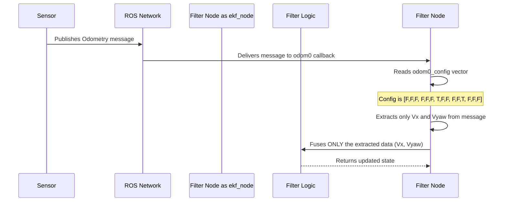

# Chapter 2: Sensor Fusion Configuration

In [Chapter 1: ROS Filter Nodes (`ekf_node`, `ukf_node`)](01_ros_filter_nodes__ekf_node__ukf_node__.md), we introduced the `ekf_node` and saw a mysterious parameter called `odom0_config`. It was a list of `true` and `false` values that we promised to explain later. Well, that time is now! This chapter dives into what is arguably the most important configuration concept in `robot_localization`: telling the filter exactly which pieces of sensor data to trust.

### The Problem: Not All Sensor Data is Created Equal

Let's imagine our robot again. It has:
*   **Wheel Encoders:** They are great at measuring forward speed. If the wheels turn, the robot is moving forward. But if the robot hits a slippery patch, the wheels might spin while the robot doesn't move, or the robot might slide sideways. So, forward velocity is reliable, but sideways velocity and absolute position are not.
*   **IMU:** An IMU is fantastic at telling you which way is up (orientation) and how fast it's turning. But if you try to calculate position by adding up its acceleration measurements over time, tiny errors will accumulate into a massive drift very quickly.

So, for each sensor, some of its data is gold, and some is... well, not. We need a way to tell the filter: "Hey, for the wheel encoders, please use the forward velocity, but ignore everything else. And for the IMU, please use the orientation, but for the love of robotics, ignore the position!"

This is precisely what the sensor fusion configuration allows you to do.

### Your Control Panel: The `_config` Vector

Think of the filter as having a big control panel or switchboard. For every sensor you connect, there's a row of switches. Each switch corresponds to a specific variable that the sensor might measure (like X position, Y velocity, or yaw orientation).


The `_config` parameter for each sensor is that row of switches. You provide a list of `true` or `false` values.
*   `true`: Flip the switch **ON**. The filter will use this variable from the sensor.
*   `false`: Flip the switch **OFF**. The filter will completely ignore this variable from the sensor.

This gives you fine-grained control to fuse only the most reliable data from each source.

### Anatomy of the State Vector

The filter tracks the robot's state using 15 variables. Your `_config` vector will always have 15 boolean values, one for each of these variables in a specific order.

Here is the complete list in the order they appear in the configuration vector:

|         | Position / Pose    | Velocity           | Acceleration       |
|:--------|:-------------------|:-------------------|:-------------------|
| **X**   | `X` (Index 0)      | `Vx` (Index 6)     | `Ax` (Index 12)    |
| **Y**   | `Y` (Index 1)      | `Vy` (Index 7)     | `Ay` (Index 13)    |
| **Z**   | `Z` (Index 2)      | `Vz` (Index 8)     | `Az` (Index 14)    |
| **Roll**| `Roll` (Index 3)   | `Vroll` (Index 9)  |                    |
| **Pitch**| `Pitch` (Index 4)  | `Vpitch` (Index 10) |                    |
| **Yaw** | `Yaw` (Index 5)    | `Vyaw` (Index 11)  |                    |

Let's break this down into a single list of 15 switches:
`(X, Y, Z, Roll, Pitch, Yaw, Vx, Vy, Vz, Vroll, Vpitch, Vyaw, Ax, Ay, Az)`

Now, let's apply this to build a configuration file for our robot.

### Example: Configuring Wheel Odometry and an IMU

Let's write the configuration for our simple robot. We have two sensors, which we will call `odom0` (for wheel odometry) and `imu0` (for the IMU).

#### 1. Configuring Wheel Odometry (`odom0`)

Our wheel encoders are good at measuring forward velocity (`Vx`) and turning velocity (`Vyaw`). We don't trust their absolute position due to drift, and they can't measure sideways or vertical movement.

So, in our `ekf.yaml`, we turn `Vx` and `Vyaw` ON and everything else OFF.

```yaml
# ekf.yaml
ekf_filter_node:
    ros__parameters:
        # ... other parameters like frequency, frames, etc. ...

        odom0: /wheel_odometry_topic
        odom0_config: [false, false, false, # X, Y, Z
                       false, false, false, # Roll, Pitch, Yaw
                       true,  false, false, # Vx, Vy, Vz
                       false, false, true,  # Vroll, Vpitch, Vyaw
                       false, false, false] # Ax, Ay, Az
```
Look at the `odom0_config` vector. We set the 7th element (`Vx`) and the 12th element (`Vyaw`) to `true`. All other switches are `false`. The filter will now only listen to the forward and rotational speeds from this sensor.

#### 2. Configuring the IMU (`imu0`)

Our IMU provides excellent orientation (`Roll`, `Pitch`, `Yaw`) and angular velocity (`Vroll`, `Vpitch`, `Vyaw`). It doesn't provide any position information, so we don't have to worry about that.

```yaml
# ekf.yaml (continued)
        imu0: /imu/data
        imu0_config: [false, false, false, # X, Y, Z
                      true,  true,  true,  # Roll, Pitch, Yaw
                      false, false, false, # Vx, Vy, Vz
                      true,  true,  true,  # Vroll, Vpitch, Vyaw
                      false, false, false] # Ax, Ay, Az
```
Here, we flipped the switches ON for `Roll`, `Pitch`, and `Yaw` (indices 3, 4, 5) and their corresponding velocities (indices 9, 10, 11).

> **Note:** What if a sensor message doesn't contain a certain variable? For example, an IMU message doesn't have an `X` position. If you set the `X` switch to `true` for an IMU, the filter is smart enough to just ignore it. You don't have to worry about matching the configuration to the message type perfectly.

By combining these two configurations, we are telling the filter:
*   "Get your sense of forward and turning speed from the wheel encoders."
*   "Get your sense of direction and orientation from the IMU."

The filter will then fuse these trusted pieces of information to produce a single, much more reliable estimate of the robot's state!

### Under the Hood: How the Filter Uses the `_config`

When a sensor message arrives, what does the filter node actually do with this configuration? It's a simple but powerful process of masking.



1.  **Message Arrives:** A sensor, like the wheel encoders, publishes a message on the `/wheel_odometry_topic`.
2.  **Node Receives:** The `ekf_node` receives this message.
3.  **Lookup Config:** The node immediately looks up the `odom0_config` vector you provided in the YAML file.
4.  **Apply Mask:** It uses this vector as a mask. It goes through the 15 state variables and only pulls the data from the incoming message where the corresponding config value is `true`.
5.  **Fuse:** It hands this much smaller, pre-filtered set of data to the core [State Estimation Filters (EKF & UKF)](03_state_estimation_filters__ekf___ukf__.md) algorithm.

This happens for every single message from every sensor you've configured. The `_config` vector is the gatekeeper that ensures only high-quality information makes it into the final state estimate.

### A Common Shortcut: `two_d_mode`

Many robots operate on a flat plane and don't fly or climb walls. For these robots, we can assume that `Z`, `Roll`, and `Pitch` (and their velocities) are always zero.

To save you from having to set these to `false` in every single sensor's `_config` vector, `robot_localization` provides a master switch: `two_d_mode`.

```yaml
# ekf.yaml
ekf_filter_node:
    ros__parameters:
        two_d_mode: true
        # ... rest of the config
```
When you set `two_d_mode: true`, the filter automatically does two things:
1.  It forces the `Z`, `Roll`, and `Pitch` variables (and their velocities/accelerations) in the robot's state to be zero.
2.  It ignores any measurements for these variables from all sensors, regardless of what you set in their `_config` vectors.

This is a very convenient way to simplify your configuration for 2D robots.

### Conclusion

You've now mastered the most critical configuration concept in `robot_localization`. You know how to use the `_config` vectors as a switchboard to tell the filter exactly which parts of your sensor data to trust and which to ignore. This fine-grained control is the key to achieving a robust and accurate state estimate.

You now understand:
*   The "switchboard" analogy for sensor configuration.
*   The 15-variable state vector that the filter uses.
*   How to create a `_config` vector to select the best data from each sensor.
*   What happens "under the hood" when a message is processed.

We've talked about *what* data to feed the filter, but we haven't talked about *how* the filter actually combines it. That's the job of the mathematical models at the heart of the package.

Next: [Chapter 3: State Estimation Filters (EKF & UKF)](03_state_estimation_filters__ekf___ukf__.md)

---

Generated by [AI Codebase Knowledge Builder](https://github.com/The-Pocket/Tutorial-Codebase-Knowledge)