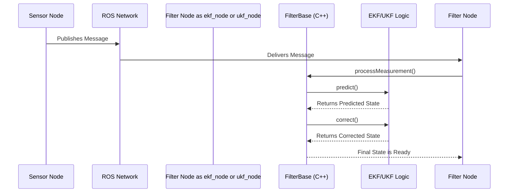

# Chapter 3: State Estimation Filters (EKF & UKF)

In the [previous chapter](02_sensor_fusion_configuration_.md), we learned how to use the `_config` parameter as a switchboard to tell the filter *what* data to use from our sensors. Now, we're going to pull back the curtain and look at the "brain" of the operation: the filtering algorithms themselves. How does the filter take these carefully selected pieces of data and fuse them into a single, cohesive story of the robot's movement?

### The Detective and the Case of the Lost Robot

Imagine you're a detective trying to track a suspect (our robot). You don't have a live video feed, but you get occasional, sometimes fuzzy, clues.

*   **Clue 1 (from Wheel Encoders):** "The suspect's getaway car tires spun for 3 seconds, suggesting they moved forward about 5 meters." (This is a measurement).
*   **Clue 2 (from IMU):** "The suspect made a sharp right turn." (Another measurement).

As a detective, you do two things constantly:
1.  **Predict:** Based on your last known location and the laws of physics, you form a theory. "If they were at Main Street and heading east, they are probably approaching Oak Avenue by now."
2.  **Correct:** A new clue arrives. You compare it to your theory. "My theory put them at Oak Avenue, but a witness just reported a sighting on Pine Street. I need to update my theory."

This **Predict-Correct** cycle is exactly what a Kalman filter does. It is the core algorithm inside the `ekf_node` and `ukf_node` that acts as the robot's brain for figuring out where it is.

### The Two Steps of the Filter Dance

At its heart, the filter is constantly performing a two-step dance:

#### Step 1: The Predict Step (The Theory)

Between sensor measurements, the filter doesn't just sit and wait. It uses a **motion model**—a set of physics equations that describe how a robot moves—to predict where the robot will be in the next instant.

*   **It updates the state:** "If my current velocity is 1 m/s, then in 0.1 seconds, I will be 0.1 meters ahead of where I was."
*   **It increases uncertainty:** Prediction is just a guess. The filter knows this, so it also increases its own uncertainty. Think of it as a "cone of uncertainty" that gets wider the further into the future you predict. Our robot's estimated position is no longer a sharp point, but a blurry bubble that grows over time.

#### Step 2: The Correct Step (The Clue)

Suddenly, a new sensor measurement arrives! The filter now performs the "Correct" or "Update" step.

1.  **Compare:** It compares the incoming sensor measurement to its own predicted state. "I predicted I was at position `X=5.2`, but the wheel odometry says I'm at `X=5.3`."
2.  **Fuse:** It finds a smart middle ground. It doesn't blindly trust the new measurement, nor does it stubbornly stick to its prediction. It computes a weighted average. The weight given to the measurement versus the prediction depends on their respective uncertainties.
    *   If the filter is very certain about its prediction and the sensor is known to be noisy, it will barely nudge its estimate.
    *   If the filter is very uncertain (the blurry bubble is huge) and a high-precision sensor provides a reading, it will shift its estimate significantly toward the new measurement.
3.  **Reduce Uncertainty:** After fusing the new information, the filter becomes *more* certain about the robot's state. The blurry bubble of uncertainty shrinks!

This cycle repeats dozens of times per second, constantly refining the robot's state estimate.

```mermaid
graph TD
    A[Start: Initial State Estimate] --> B{Predict};
    B -- Motion Model --> C[Predicted State<br>(Higher Uncertainty)];
    C --> D{Correct};
    E[New Sensor<br>Measurement] --> D;
    D -- Fuse Data --> F[Corrected State<br>(Lower Uncertainty)];
    F --> B;
```

### EKF vs. UKF: Two Different Detective Styles

The `robot_localization` package gives you two detectives to choose from: the Extended Kalman Filter (EKF) and the Unscented Kalman Filter (UKF). They both follow the Predict-Correct cycle, but they handle the Predict step differently, especially when the robot's motion is complex (or "non-linear").

Think of non-linear motion like turning a car. A simple `position = old_position + velocity * time` formula doesn't quite work because the direction of the velocity is changing.

#### The EKF: The Fast Approximator

The Extended Kalman Filter deals with non-linear motion by **approximating**. It treats a curve like a series of very short, straight lines.

*   **Analogy:** The EKF detective is a quick thinker who's great with approximations. When tracking a car around a bend, they say, "Close enough! For the next tiny step, let's just pretend it's going straight."
*   **How it works:** It uses calculus (specifically, Jacobian matrices) to linearize the non-linear motion model at the current state.
*   **Pros:** It's computationally fast.
*   **Cons:** If the motion is *highly* non-linear (e.g., a very fast-spinning robot), the straight-line approximation can be poor, leading to inaccuracies.

#### The UKF: The Careful Sampler

The Unscented Kalman Filter takes a more sophisticated approach. Instead of approximating the motion, it approximates the *uncertainty bubble* itself.

*   **Analogy:** The UKF detective is more methodical. Instead of making one guess, they place several "agents" (called **sigma points**) strategically around the area where they think the suspect is. They then ask each agent to follow the suspect's true, curved path. By combining the reports from all their agents, they get a much more accurate picture of the final location.
*   **How it works:** It selects a small number of sigma points that capture the mean and covariance of the state. It passes these points through the *true, non-linear* motion model and then reconstructs the new mean and covariance from the results.
*   **Pros:** It's much more accurate for highly non-linear systems.
*   **Cons:** It's more computationally expensive because it has to process multiple sigma points for every prediction.

### How to Choose?

As a beginner, this choice is simpler than it sounds.

| Feature            | Extended Kalman Filter (EKF) | Unscented Kalman Filter (UKF) |
| :----------------- | :--------------------------- | :---------------------------- |
| **Node**           | `ekf_node`                   | `ukf_node`                    |
| **Speed**          | Faster                       | Slower                        |
| **Accuracy**       | Good for many systems        | Better for non-linear systems |
| **When to use?**   | Your robot moves in relatively straight lines with smooth turns (e.g., a typical indoor robot). You have limited CPU power. | Your robot moves dynamically with sharp, fast turns (e.g., a drone, an Ackermann-steering car). Accuracy is your top priority. |
| **Beginner's Pick**| **Start with the EKF.** It's the workhorse and is sufficient for a huge number of applications. | Try this if you see your EKF estimate is not performing well during complex maneuvers. |

### Under the Hood: The Code

You will likely never need to change the C++ code for these filters, but knowing where it lives is helpful. The entire Predict-Correct logic is managed within the [FilterBase](06_filterbase_.md) class.

When your filter node receives a sensor message, it calls the `processMeasurement` method inside `src/filter_base.cpp`.

```cpp
// A simplified view of what happens in FilterBase::processMeasurement
void FilterBase::processMeasurement(const Measurement &measurement)
{
    // ... some checks ...

    if (initialized_) {
        // How much time has passed since the last update?
        delta = measurement.time_ - last_measurement_time_;

        // Step 1: Predict where the robot should be now
        predict(measurement.time_, delta);

        // Step 2: Correct the prediction with the new sensor data
        correct(measurement);
    } else {
        // ... initialize the filter with the first measurement ...
    }
}
```
This code shows the dance in action. `FilterBase` calls `predict()` and then `correct()`. The magic is that `predict()` and `correct()` are implemented differently in each filter.

*   `src/ekf.cpp`: Contains the math for the EKF's prediction and correction steps.
*   `src/ukf.cpp`: Contains the math for the UKF's prediction and correction steps.


This shows that while your interaction is with the high-level `ekf_node` or `ukf_node`, the core work is delegated to the C++ classes that implement these powerful filtering algorithms.

### Conclusion

You've now peeked into the "brain" of `robot_localization`! You understand that the EKF and UKF are sophisticated algorithms that continuously run a **Predict-Correct** cycle to fuse noisy sensor data into a reliable state estimate.

*   The **Predict** step uses a motion model to guess the robot's next state.
*   The **Correct** step uses a new sensor measurement to refine that guess.
*   **EKF** is the fast approximator, great for simpler systems.
*   **UKF** is the robust sampler, better for complex, non-linear motion.

So far, we've talked about sensors like wheel encoders and IMUs. But what about GPS? A GPS gives you your position on Earth, not in your local `odom` frame. How do we translate that data so our filter can understand it? That's the job of a special helper node.

Next: [Chapter 4: NavSat Transform Node](04_navsat_transform_node_.md)

---

Generated by [AI Codebase Knowledge Builder](https://github.com/The-Pocket/Tutorial-Codebase-Knowledge)