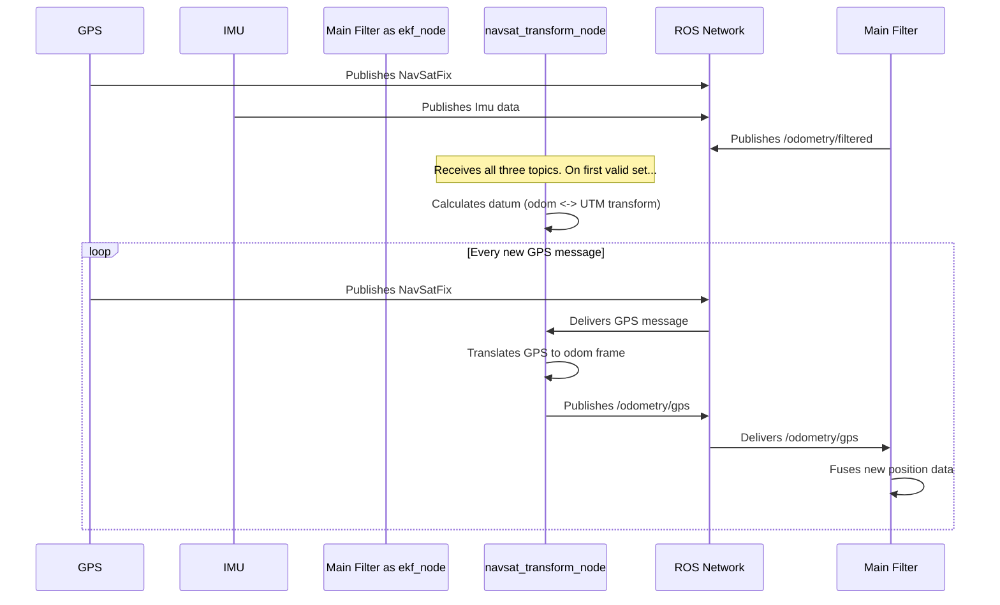

# Chapter 4: NavSat Transform Node

In the [previous chapter](03_state_estimation_filters__ekf___ukf__.md), we explored the "brain" of our system—the EKF and UKF filters that cleverly fuse sensor data. However, all the sensors we discussed (wheel encoders, IMUs) operate in the robot's local world. They are great at answering "How far have I moved from my starting point?" but terrible at answering "Where am I on Planet Earth?"

What if we want to use a GPS? A GPS gives us global coordinates (latitude and longitude), which is incredibly useful for outdoor navigation. But there's a problem: our EKF doesn't speak "latitude." It speaks in meters relative to its starting point. We need a translator.

This is where the `navsat_transform_node` comes in. It's a specialized helper node that acts as the essential bridge between the global GPS world and your robot's local world.

### The Tourist in a New City Analogy

Imagine you're a tourist (our robot) arriving in a new city.
*   Your **GPS** on your phone shows your exact latitude and longitude on a world map. This is your global position.
*   You also have a local **tourist map** that says "You are here, at the Grand Fountain." This map measures everything in meters from the fountain (e.g., "the museum is 200 meters north"). This is your `odom` frame.

To use both, you need to do one crucial thing first: you must pin your tourist map to the world map. You find the Grand Fountain's latitude/longitude on your phone and declare, "Aha! *This spot* on my local map corresponds to *this spot* on the world map."

Once you've made that connection, you can translate between the two maps forever. `navsat_transform_node` is the program that does this "pinning" for your robot.

### What Does it Do?

The `navsat_transform_node` is a separate program you run alongside your main `ekf_node` or `ukf_node`. Its sole job is to translate GPS data.

Here's its process step-by-step:

1.  **Wait for the First "Fix":** The node starts up and waits for three key pieces of information:
    *   The first valid GPS message (`sensor_msgs/NavSatFix`).
    *   The robot's current orientation from an IMU (`sensor_msgs/Imu`).
    *   The robot's current local odometry from your main filter (`nav_msgs/Odometry`).
2.  **Establish the "Datum":** When it has all three, it performs its one-time magic trick. It creates a fixed reference point, called a **datum**. It declares that the robot's current `odom` position and orientation correspond *exactly* to the first GPS coordinate it received. This "pins" the local map to the global map.
3.  **Translate Continuously:** From this point on, every new GPS coordinate that arrives is instantly translated from latitude/longitude into an (X, Y) position within the robot's `odom` frame.
4.  **Publish as Odometry:** The node packages this translated (X, Y) position into a standard `nav_msgs/Odometry` message and publishes it on a new topic (typically `/odometry/gps`).

The beautiful result is that your main EKF/UKF node can now subscribe to `/odometry/gps` and treat it just like any other position sensor. It doesn't need to know anything about latitude or longitude; the `navsat_transform_node` has handled all the complex translation work.

### How to Use It

Using this node involves three steps: running the node, configuring it, and telling your main filter to listen to its output.

#### Step 1: Launch the Node

Just like the `ekf_node`, you run `navsat_transform_node` from a launch file.

```python
# navsat_transform.launch.py
from launch import LaunchDescription
import launch_ros.actions

def generate_launch_description():
    return LaunchDescription([
        launch_ros.actions.Node(
            package='robot_localization',
            executable='navsat_transform_node',
            name='navsat_transform_node',
            # Remap input topics to match your robot
            remappings=[('imu', 'your/imu/topic'),
                        ('gps/fix', 'your/gps/topic'),
                        ('odometry/filtered', 'odometry/filtered')],
            parameters=['path/to/your/navsat_params.yaml']
        ),
    ])
```
This starts the node and tells it where to find its parameters and which topics to listen to.

#### Step 2: Configure the Node

The node needs a few parameters in a YAML file. The two most important ones for getting started are related to your robot's orientation.

```yaml
# navsat_params.yaml
navsat_transform_node:
    ros__parameters:
        # IMPORTANT: Set this to the magnetic declination for your location!
        magnetic_declination_radians: 0.0 # Example value, find yours online

        # If your IMU reads 0 when facing North instead of East
        yaw_offset: 1.5707963

        # If you're on a flat plane and want to ignore altitude
        zero_altitude: true
```

*   `magnetic_declination_radians`: Your compass points to magnetic north, but GPS coordinates are aligned with true north. This value corrects for that difference. You can find it for your location online (e.g., from [NOAA](https://www.ngdc.noaa.gov/geomag/calculators/magcalc.shtml)).
*   `yaw_offset`: ROS expects a heading of 0 to point East. Most IMUs report a heading of 0 when pointing North. This parameter corrects for that `π/2` (90-degree) offset.
*   `zero_altitude`: For ground robots, it's often easiest to just work in 2D and set the altitude to 0.

#### Step 3: Fuse the Output in Your Main EKF

Finally, you need to tell your main `ekf_node` to use the new `/odometry/gps` topic. You just add it as another odometry source in your `ekf.yaml`.

```yaml
# In your main ekf.yaml file
ekf_filter_node:
    ros__parameters:
        # ... your other sensors (odom0, imu0) ...

        # Add the GPS data from navsat_transform_node
        odom1: /odometry/gps
        odom1_config: [true,  true,  false,  # Use X, Y position
                       false, false, false,
                       false, false, false,
                       false, false, false,
                       false, false, false]
```
We set the `config` to only use the X and Y position from this source. Now, your main filter is fusing wheel odometry, IMU data, AND globally-corrected GPS data!

### Under the Hood: The Information Flow

Let's visualize how all these nodes work together.



The `navsat_transform_node` acts as a pre-processor for the main filter. It does the specialized, one-way translation from the GPS world to the robot's local world.

Diving into the code, the `main` function in `src/navsat_transform_node.cpp` is very simple. It just creates and runs an instance of the `NavSatTransform` class.

```cpp
// A simplified view of src/navsat_transform_node.cpp
int main(int argc, char ** argv)
{
  rclcpp::init(argc, argv);
  // Create the object that does all the work
  auto navsat_transform_node =
    std::make_shared<robot_localization::NavSatTransform>(options);
  // Run the node
  rclcpp::spin(navsat_transform_node->get_node_base_interface());
  // ...
}
```

The real logic lives in `src/navsat_transform.cpp`. Two functions are key:

1.  `computeTransform()`: This is the function that establishes the datum. It's called only once at the beginning. It takes the first GPS, IMU, and odom messages and calculates the static transform between the global UTM grid and your robot's `odom` frame.

2.  `prepareGpsOdometry()`: This function runs in the main loop. It takes the latest GPS data, applies the transform calculated by `computeTransform()`, and creates the `nav_msgs/Odometry` message that gets published.

```cpp
// A conceptual view of what happens inside NavSatTransform
bool NavSatTransform::prepareGpsOdometry(nav_msgs::msg::Odometry * gps_odom)
{
    // ... check if data is ready ...

    // Take the latest Cartesian (UTM) GPS pose and apply the transform
    // to get its position in the robot's "odom" world.
    *gps_odom = cartesianToMap(latest_cartesian_pose_);

    // ... handle covariance rotation ...

    return true; // We have a new odometry message to publish
}
```
This shows that once the initial transform is set, the node's main job is a continuous, straightforward conversion.

### Conclusion

You've now learned about the special-purpose `navsat_transform_node`. It's not a filter itself, but an indispensable utility for anyone wanting to use GPS with `robot_localization`.

You now know:
*   The core problem: GPS speaks a global language (latitude/longitude) while the filter speaks a local one (meters from start).
*   The solution: `navsat_transform_node` acts as a translator, creating a fixed link (a datum) between these two worlds.
*   How it works: It takes in `NavSatFix` messages and outputs standard `Odometry` messages that your main EKF/UKF can easily fuse.
*   How to set it up by launching the node, providing a simple configuration, and telling your main filter to listen to its output.

We've covered the main components of a typical `robot_localization` setup. But what happens when you need to look back in time or get an even smoother estimate? The package has features for that too.

Next: [Chapter 5: State History and Smoothing](05_state_history_and_smoothing_.md)

---

Generated by [AI Codebase Knowledge Builder](https://github.com/The-Pocket/Tutorial-Codebase-Knowledge)