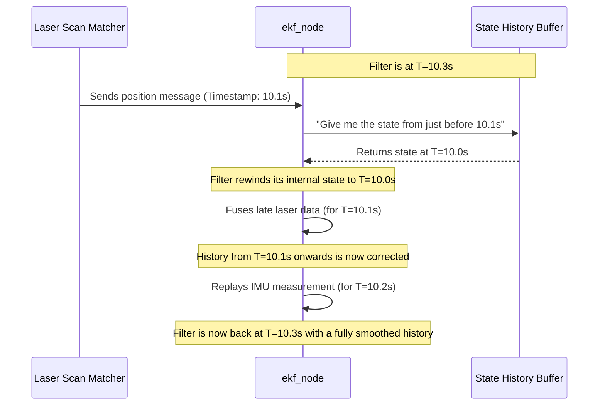

# Chapter 5: State History and Smoothing

In the [previous chapter](04_navsat_transform_node_.md), we learned how to use the `navsat_transform_node` to translate GPS data into a format our filter can understand. We've built a robust system that can fuse data from many different sensors. But what happens if some of that data is delayed?

Imagine your robot has a powerful laser scanner. It uses this scanner to match its surroundings against a map, a process that might take a fraction of a second. By the time it calculates a very accurate position, that position is already in the past! How can we use this high-quality, but "stale," information? This chapter introduces a powerful feature that lets our filter act like a time traveler to solve this exact problem.

### The Problem: When Good News Arrives Late

Let's follow a timeline of our filter's life. The filter is happily running along, producing an estimate every few milliseconds.

*   `Time = 10.0s`: Filter produces an estimate.
*   `Time = 10.1s`: Filter gets a wheel encoder reading and produces a new estimate.
*   `Time = 10.2s`: Filter gets an IMU reading and produces another new estimate.
*   `Time = 10.3s`: Suddenly, a message arrives from our laser scan matcher. It's a very accurate position measurement, but its timestamp is **`10.1s`**!

What should the filter do? It can't just apply this old measurement to its current state at `10.3s`, as that would be like teleporting the robot back to where it was a moment ago. The only correct way to handle this is to go back in time, revise history, and replay the events that followed.

### The Solution: A History Buffer and a Time Machine

This is where the state history and smoothing feature comes in. When you enable it, the filter doesn't just keep track of its *current* state; it maintains a buffer, or a "history book," of its recent past states.

When a late measurement arrives, the filter performs a remarkable sequence of actions:
1.  **Rewind:** It finds the state in its history book from just before the late measurement's timestamp. It temporarily resets its internal state to this past moment.
2.  **Correct:** It fuses the late measurement at its correct place in time, creating a new, more accurate state for that past moment.
3.  **Replay:** It then takes all the *other* measurements that it had already processed (the IMU reading from `10.2s` in our example) and rapidly re-applies them in order.

The result is a corrected, or "smoothed," history. The filter has effectively revised its own past to create a more accurate and consistent timeline. It's as if it never made a mistake in the first place.

### How to Enable Smoothing

Enabling this feature is incredibly simple and requires just two parameters in your main filter configuration file (e.g., `ekf.yaml`).

1.  `smooth_lagged_data`: This is the master switch. Set it to `true` to turn the feature on.
2.  `history_length`: This tells the filter how many seconds of history to remember. This value should be slightly larger than the maximum delay you expect from any of your sensors.

Here is what it looks like in your configuration file:

```yaml
# In your main ekf.yaml or ukf.yaml file
ekf_filter_node:
    ros__parameters:
        # ... your other filter settings ...

        # Enable the time machine!
        smooth_lagged_data: true

        # Remember the last 5 seconds of history.
        # Choose a value based on your sensor's max delay.
        history_length: 5.0
```
That's it! With these two lines, your filter is now equipped to handle lagged data gracefully. If you have a sensor that takes 0.5 seconds to process, a `history_length` of 1.0 or 2.0 would be a safe choice.

### Under the Hood: The Smoothing Process

Let's visualize the "rewind, correct, replay" cycle when that late laser scan arrives.


This entire process happens internally and automatically whenever a lagged measurement is detected.

#### The Code Behind the History

This powerful capability is built on a simple data structure. The main filter nodes use a class called `RobotLocalizationEstimator` to manage the filter's state over time. Inside this class is the key component: a circular buffer.

In `src/robot_localization_estimator.cpp`, you can see this buffer being created:

```cpp
// In RobotLocalizationEstimator's constructor
RobotLocalizationEstimator::RobotLocalizationEstimator(
  unsigned int buffer_capacity,
  /*...*/)
{
  state_buffer_.set_capacity(buffer_capacity);
  // ...
}
```
This `state_buffer_` is the filter's memory. Every time the filter produces a new state estimate, it adds it to this buffer. When a late measurement comes in, the logic (located in the [FilterBase](06_filterbase_.md) class) uses this buffer to perform the rewind operation.

#### Making History Available: The Listener

While the main filter uses its history for internal smoothing, what if another part of your robot's software needs to ask, "Where was the robot 0.5 seconds ago?"

This is the job of the `RosRobotLocalizationListener`. It's a separate utility that subscribes to the filter's output and maintains its own history buffer. It provides a service that other nodes can call to query the robot's state at any point in the recent past.

This listener uses the same `RobotLocalizationEstimator` class internally to store and retrieve historical states. The core of its public-facing functionality is the `getState` method in `src/ros_robot_localization_listener.cpp`:

```cpp
// In RosRobotLocalizationListener
bool RosRobotLocalizationListener::getState(
  const double time,
  const std::string & frame_id,
  Eigen::VectorXd & state,
  /*...*/) const
{
    // ...
    // This call looks up the state in the history buffer.
    // It can even interpolate if the exact time isn't stored.
    estimator_->getState(time, estimator_state);
    // ...
}
```
This shows that the concept of maintaining a state history is used for both internal smoothing *and* for providing historical data to the rest of your system.

### Conclusion

You now understand one of the most advanced features of `robot_localization`: its ability to handle sensor data that arrives out of order. By maintaining a history of its past states, the filter can intelligently go back in time to incorporate late measurements, resulting in a smoother and more accurate final estimate.

You've learned:
*   Why late sensor data is a problem.
*   The "rewind, correct, replay" strategy that the filter uses to solve it.
*   How to enable this feature with just two simple parameters: `smooth_lagged_data` and `history_length`.
*   That this functionality is powered by an internal state history buffer.

All the features we've discussed—the ROS nodes, the filter algorithms, and the history mechanism—are built upon a common C++ foundation. In our final chapter, we will take a brief look at this foundational class.

Next: [Chapter 6: FilterBase](06_filterbase_.md)

---

Generated by [AI Codebase Knowledge Builder](https://github.com/The-Pocket/Tutorial-Codebase-Knowledge)