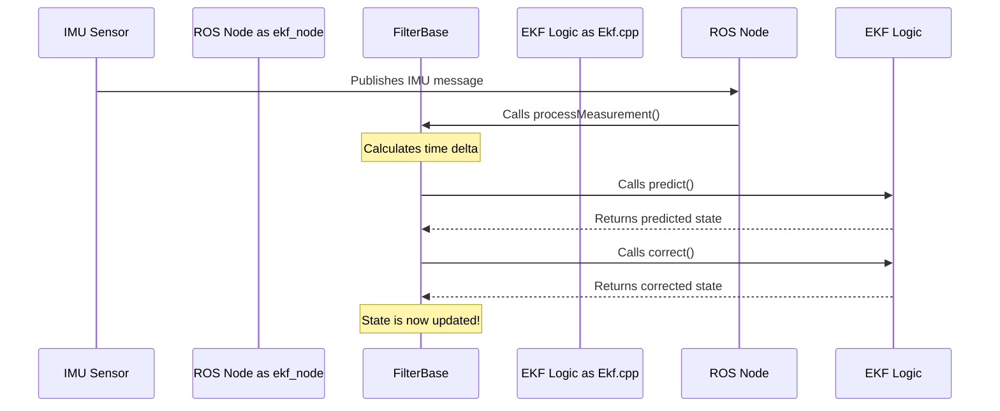

# Chapter 6: FilterBase

In [Chapter 5: State History and Smoothing](05_state_history_and_smoothing_.md), we explored how the filter can act like a time traveler to handle delayed sensor data. We've now covered all the major features and nodes you'll interact with. For our final chapter, let's look at the C++ blueprint that holds everything together: the `FilterBase` class.

Understanding this class isn't about writing code; it's about understanding the fundamental design of `robot_localization`. It's the key to seeing how the EKF and UKF, which seem so different, are actually just two variations on the same theme.

### The Car Chassis Analogy

Imagine you are building a car. You could design a V8 engine or a quiet electric motor. These are your filter algorithms—the [EKF and UKF](03_state_estimation_filters__ekf___ukf__.md). But no matter which engine you choose, you still need a chassis.

The chassis is the car's skeleton. It provides the structure, holds the wheels, connects the steering, and has a space where you can drop in your chosen engine.

`FilterBase` is the chassis of `robot_localization`. It is the foundational C++ class that provides the common structure and functionality for both the EKF and the UKF. The specific EKF and UKF classes are like the engines that get "dropped into" this chassis.

### What Does the `FilterBase` Chassis Do?

`FilterBase` is the workhorse that handles all the tasks that are common to *any* Kalman filter, regardless of the specific math inside.

Its main responsibilities include:
*   **Managing the State:** It holds the 15-variable state vector (`X`, `Y`, `Z`, `Roll`, `Pitch`, `Yaw`, velocities, etc.) and the uncertainty covariance matrix.
*   **Implementing the Main Loop:** It contains the master logic for the **Predict-Correct** cycle that we discussed in Chapter 3.
*   **Processing Measurements:** It provides the primary entry point, `processMeasurement()`, which is called every time a new sensor message arrives.
*   **Handling Time:** It keeps track of sensor timestamps to calculate the time delta (`Δt`) needed for prediction.
*   **Applying Control Inputs:** If you provide velocity commands to your robot, `FilterBase` handles the logic for incorporating them into the prediction step.
*   **Checking for Timeouts:** It manages the sensor timeout logic, ensuring the filter doesn't get stuck waiting for a sensor that has gone offline.

In short, `FilterBase` is the grand orchestrator. It manages the flow of data and the lifecycle of the state estimation process, while leaving the complex mathematical details of prediction and correction to its children, the `Ekf` and `Ukf` classes.

### The Heart of the Operation: `processMeasurement()`

The single most important function in this class is `processMeasurement`. Every time your `ekf_node` or `ukf_node` receives a sensor message, it eventually calls this function. Let's look at a simplified version of what this function does, found in `src/filter_base.cpp`.

```cpp
// A simplified view of src/filter_base.cpp
void FilterBase::processMeasurement(const Measurement &measurement)
{
    // If the filter has been initialized...
    if (initialized_) {
        // 1. Calculate time since the last measurement
        delta = measurement.time_ - last_measurement_time_;

        // 2. Predict where the robot is now
        predict(measurement.time_, delta);

        // 3. Correct the prediction with the new sensor data
        correct(measurement);
    } else {
        // ... otherwise, initialize the state with this first measurement
        // ...
    }
    // ... update timestamps ...
}
```
This short block of code is the core of the entire package!
1.  It calculates the time `delta` that has passed.
2.  It calls `predict()` to move the state forward in time.
3.  It calls `correct()` to fuse the new sensor data.

But wait, where is the code for `predict()` and `correct()`? They aren't in `FilterBase`! This is where the magic of software design comes in. `FilterBase` defines that these functions *must exist*, but it lets the specific filter types (EKF and UKF) provide their own unique implementations.

### Under the Hood: The Power of Inheritance

In C++, this is called **inheritance**. The `Ekf` and `Ukf` classes inherit from `FilterBase`. This means they get all the functionality of the "chassis" for free, and they only need to provide the "engine" parts.

*   `src/ekf.cpp` provides an `Ekf::predict()` and `Ekf::correct()` that use EKF math (linear approximations).
*   `src/ukf.cpp` provides a `Ukf::predict()` and `Ukf::correct()` that use UKF math (sigma points).

When `FilterBase` calls `predict()`, it's actually calling the specific version provided by the filter you are using.

Let's visualize this flow. When a new IMU measurement arrives, this is what happens behind the scenes:



As you can see, `FilterBase` acts as the manager. It knows the *steps* of the dance (predict, then correct), but it delegates the actual dance *moves* to the EKF or UKF specialist.

### Why This Matters to You

You will probably never edit `filter_base.cpp`. So why should you care about it? Because understanding this architecture helps you build a mental model of how the system works, which is invaluable for debugging.

*   **Problem:** "My filter's estimate jumps wildly when I get a GPS reading."
    *   **Your thought process:** The GPS data is used in the `correct` step. Since `FilterBase` calls this step, the general flow is okay. The problem must be in the specific math of the `correct` function for my filter (e.g., in `ekf.cpp`) or in my sensor's covariance values.
*   **Problem:** "My robot's estimate drifts even when it's standing still."
    *   **Your thought process:** Drifting happens during the `predict` step. The `FilterBase` is calling `predict` over and over based on time. The issue is likely in the motion model math inside `ekf.cpp`/`ukf.cpp` or in my `process_noise_covariance` parameter, which `FilterBase` adds during prediction.

By knowing who is responsible for what, you can narrow down problems much faster.

### Conclusion

Congratulations! You've reached the end of our beginner's tour through `robot_localization`. We've journeyed from the high-level [ROS Filter Nodes](01_ros_filter_nodes__ekf_node__ukf_node__.md) all the way down to the C++ foundation, `FilterBase`.

You've learned that `FilterBase` is the unsung hero of the package. It's the common chassis that provides the structure, lifecycle management, and core loop for both the EKF and UKF "engines." It embodies a powerful software design that separates the general process of filtering from the specific mathematical implementation.

With the knowledge from all six chapters, you now have a complete picture of how `robot_localization` works: from configuring your sensors, to choosing a filter, to handling GPS data, and even understanding the underlying software architecture. You are now well-equipped to set up, tune, and debug your own state estimation system. Happy fusing

---

Generated by [AI Codebase Knowledge Builder](https://github.com/The-Pocket/Tutorial-Codebase-Knowledge)