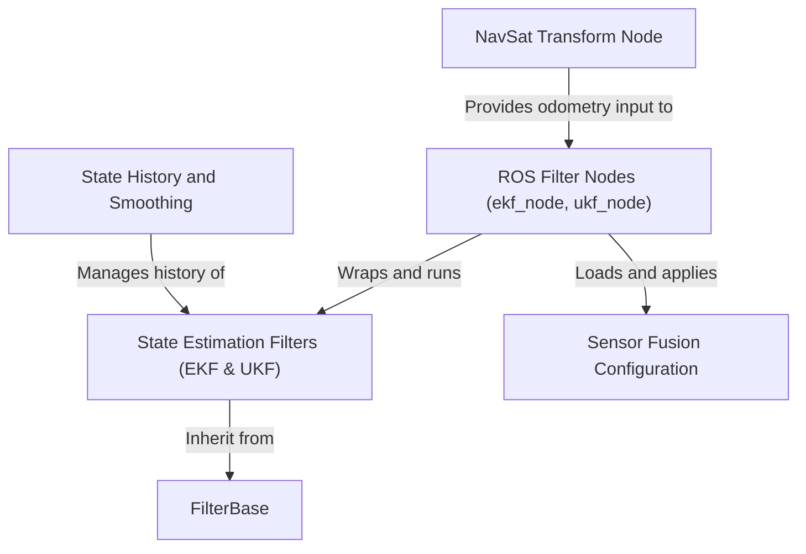

# Tutorial: robot_localization

`robot_localization` is a powerful ROS package for robot state estimation. It uses advanced algorithms, like the **Extended Kalman Filter (EKF)** and **Unscented Kalman Filter (UKF)**, to determine a robot's precise position, orientation, and velocity. The system *fuses* noisy data from various sensors—such as wheel encoders, IMUs, and GPS—into a single, more accurate and complete state estimate. Users have fine-grained control over this fusion process through simple configuration files. The package also includes a specialized `navsat_transform_node` to properly integrate *global GPS data* with the robot's local coordinate system.

**Source Repository:** [None](None)

## Chapters

1. [ROS Filter Nodes (ekf_node, ukf_node)
](01_ros_filter_nodes__ekf_node__ukf_node__.md)
2. [Sensor Fusion Configuration
](02_sensor_fusion_configuration_.md)
3. [State Estimation Filters (EKF & UKF)
](03_state_estimation_filters__ekf___ukf__.md)
4. [NavSat Transform Node
](04_navsat_transform_node_.md)
5. [State History and Smoothing
](05_state_history_and_smoothing_.md)
6. [FilterBase
](06_filterbase_.md)

---

Generated by [AI Codebase Knowledge Builder](https://github.com/The-Pocket/Tutorial-Codebase-Knowledge)