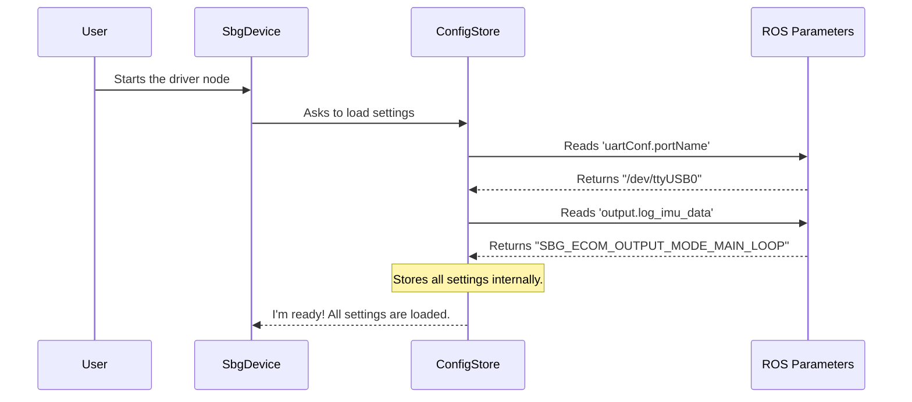

# Chapter 1: Configuration Blueprint (ConfigStore)

Welcome to the `sbg_driver` tutorial! We're excited to guide you through the inner workings of this ROS 2 driver. In this first chapter, we'll start with the very first step the driver takes: understanding your specific setup.

Imagine you're building a complex LEGO model. Before you even connect two bricks, you look at the instruction manual. You need to know which parts you need, what the final model should look like, and any specific options you can choose.

The `ConfigStore` class is exactly like that instruction manual or blueprint for our driver. It’s a dedicated component whose only job is to read all the settings you provide and store them in an organized way. This ensures every other part of the driver knows exactly how to behave—from how to talk to the sensor to what data it should send back.

---

### The Problem: How Does the Driver Know Your Settings?

Your SBG sensor can be connected in different ways. You might use a USB cable (a serial interface) or an Ethernet cable (a UDP interface). You might want to receive gyroscope data but not magnetometer data. How do you tell the driver about these choices?

You provide these settings in a ROS 2 configuration file (usually a `.yaml` file). Here’s a tiny example of what that might look like:

```yaml
# Example settings in a user's config file
sbg_device_node:
  ros__parameters:
    # How should we connect to the sensor?
    confWithRos: True
    uartConf:
      portName: "/dev/ttyUSB0"
      baudRate: 921600
    
    # What data should we ask the sensor for?
    output:
      log_imu_data: "SBG_ECOM_OUTPUT_MODE_MAIN_LOOP"
      log_ekf_nav: "SBG_ECOM_OUTPUT_MODE_DISABLED"
```

The `ConfigStore` is the part of our project that reads this file and makes sense of it.

### The Blueprint in Action

The main "manager" of our driver is a class called `SbgDevice`, which we will explore in the next chapter. When the driver starts, the first thing `SbgDevice` does is create a `ConfigStore` object to gather all the necessary settings.

Let's look at how `SbgDevice` uses `ConfigStore`.

**File:** `src/sbg_device.cpp`
```cpp
#include "sbg_device.h"

SbgDevice::SbgDevice(rclcpp::Node& ref_node_handle):
m_ref_node_(ref_node_handle)
// ...
{
  // First, we load all user settings!
  loadParameters();
  
  // Then, we use those settings to connect.
  connect();
}
```
In the constructor, before doing anything else, it calls `loadParameters()`. This is our key function.

**File:** `src/sbg_device.cpp`
```cpp
void SbgDevice::loadParameters(void)
{
  // ... (create a temporary ROS node to access parameters)
  rclcpp::Node n_private("npv", "", node_opt);

  // Tell our config store to read everything from the node.
  m_config_store_.loadFromRosNodeHandle(n_private);
}
```
As you can see, `SbgDevice` doesn't read the parameters itself. It delegates this important task to our blueprint, the `m_config_store_` object. This is a great example of the "Single Responsibility Principle" in software design—each class has one clear job. `SbgDevice` orchestrates, and `ConfigStore` handles configuration.

### Under the Hood: How `ConfigStore` Works

So, what happens inside `ConfigStore` when `loadFromRosNodeHandle` is called? Let's trace the process.

First, a simple diagram to show the flow:



The `loadFromRosNodeHandle` method acts as a master function that calls many smaller, specialized methods, each responsible for a specific group of settings.

**File:** `src/config_store.cpp`
```cpp
void ConfigStore::loadFromRosNodeHandle(const rclcpp::Node& ref_node_handle)
{
  // Load settings for different parts of the system
  loadCommunicationParameters(ref_node_handle);
  loadSensorParameters(ref_node_handle);
  loadImuAlignementParameters(ref_node_handle);
  loadMagnetometersParameters(ref_node_handle);
  loadGnssParameters(ref_node_handle);
  
  // ... and many more for all the output logs!
  loadOutputConfiguration(ref_node_handle, "output.log_imu_data", ...);
  loadOutputConfiguration(ref_node_handle, "output.log_ekf_nav", ...);
}
```

This keeps our code clean and easy to manage. If we need to change how communication settings are handled, we only need to look inside `loadCommunicationParameters`.

Let's dive into one of these functions to see how it reads a specific parameter.

**File:** `src/config_store.cpp`
```cpp
void ConfigStore::loadCommunicationParameters(const rclcpp::Node& ref_node_handle)
{
  // Check if the user defined a serial port
  if (ref_node_handle.has_parameter("uartConf.portName"))
  {
    m_serial_communication_ = true; 
    
    // Read the port name, or use '/dev/ttyUSB0' if not provided.
    ref_node_handle.get_parameter_or<std::string>("uartConf.portName", m_uart_port_name_, "/dev/ttyUSB0");

    // Read the baud rate
    m_uart_baud_rate_ = getParameter<uint32_t>(ref_node_handle, "uartConf.baudRate", 0);
  }
  // ... code to handle UDP connections would be here ...
}
```
Here's what this code does:
1.  It checks if a parameter named `uartConf.portName` exists.
2.  If it does, it sets a flag `m_serial_communication_` to `true`.
3.  It then uses `get_parameter_or` to read the value of `uartConf.portName` into the `m_uart_port_name_` variable. The beauty of `get_parameter_or` is that it lets us provide a default value (`"/dev/ttyUSB0"`) in case the user forgets to set one.
4.  It does the same for the baud rate.

After all the `load...` methods have run, the `ConfigStore` object is now a complete blueprint, holding every setting the driver needs to run correctly. Other components, like the [Device Configurator (ConfigApplier)](03_device_configurator__configapplier__.md), can then ask the `ConfigStore` for these values to properly initialize the physical sensor.

### Conclusion

You've just learned about the `ConfigStore`, the foundational component of our driver. Its role is simple but critical:

*   It acts as a **structured blueprint** for the entire driver's configuration.
*   It **reads all user-defined settings** from ROS 2 parameters.
*   It provides a **single, reliable source** for configuration, ensuring every component is on the same page.

By isolating this task, we make the rest of our code cleaner and more focused. The `ConfigStore` prepares the "recipe" so that other components can start "cooking."

In the next chapter, we'll meet the head chef: the [Device Orchestrator (SbgDevice)](02_device_orchestrator__sbgdevice__.md). We'll see how it uses the blueprint we just created to bring the sensor to life.

---

Generated by [AI Codebase Knowledge Builder](https://github.com/The-Pocket/Tutorial-Codebase-Knowledge)