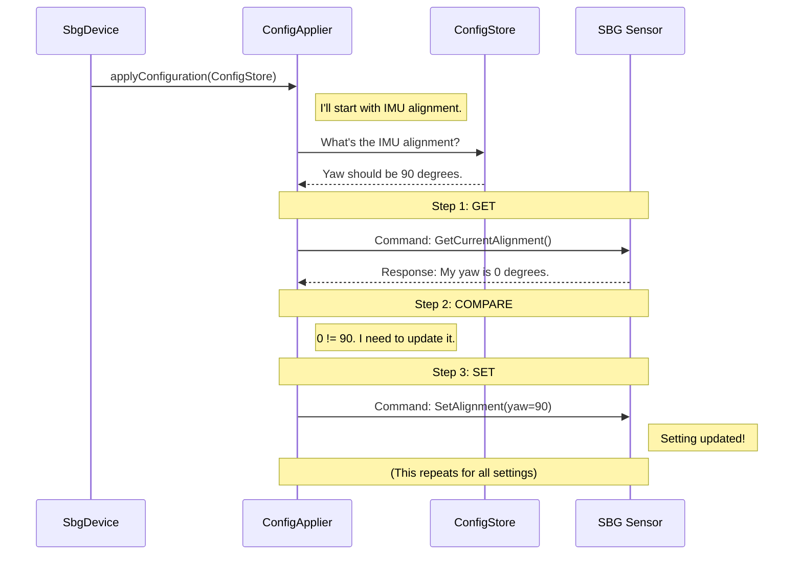

# Chapter 3: Device Configurator (ConfigApplier)

In the [previous chapter](02_device_orchestrator__sbgdevice__.md), we met the `SbgDevice`, our project's head chef or orchestrator. We saw how it gets everything started, but we glossed over one very important step: configuring the physical sensor. The `SbgDevice` knows *that* the sensor needs to be configured, but it doesn't know *how*.

Imagine our head chef has the final recipe (the `ConfigStore` blueprint). Now, they need a specialized line cook to actually go to the oven, read the temperature from the recipe, and set the dial. This is where the `ConfigApplier` comes in. It is the hands-on technician for our hardware. It takes the blueprint and talks directly to the SBG sensor to apply every single setting.

---

### The Problem: How Do We "Program" the Hardware?

Our `ConfigStore` holds all our desired settings, like "align the IMU with a 90-degree yaw rotation" or "please send me GPS data every 100 milliseconds." But the SBG sensor hardware doesn't understand our configuration file. It speaks its own low-level language of binary commands.

So, how do we translate our high-level desires from the blueprint into the specific commands the hardware understands?

This is the exact job of the `ConfigApplier`. It is a specialist that knows how to communicate with the device, sending it the correct sequence of commands to set its internal state and, if needed, save those changes permanently.

### The ConfigApplier in Action

The `SbgDevice` orchestrator delegates the entire configuration task to a `ConfigApplier`. It does this in its `configure()` method, which is called right after connecting to the device.

**File:** `src/sbg_device.cpp`
```cpp
void SbgDevice::configure(void)
{
  // If the user wants to configure the device from ROS settings...
  if (m_config_store_.checkConfigWithRos())
  {
    // Create our specialist technician.
    ConfigApplier configApplier(m_com_handle_);

    // Hand it the blueprint and tell it to get to work.
    configApplier.applyConfiguration(m_config_store_);
  }
}
```
Let's break down this simple but powerful interaction:
1.  `SbgDevice` first checks if the user actually wants to apply settings from the ROS configuration file.
2.  It creates a temporary `ConfigApplier` object. Notice it gives it `m_com_handle_`, which is like handing the technician the key to the machine room—it's the communication link to the sensor.
3.  Finally, it calls `applyConfiguration`, giving the technician the complete blueprint (`m_config_store_`).

From this point on, the `ConfigApplier` takes over completely.

### Under the Hood: The Technician's Checklist

So what happens inside `applyConfiguration`? The `ConfigApplier` behaves like a meticulous technician with a checklist. For every setting in the `ConfigStore` blueprint, it performs a three-step process: **Get, Compare, Set**.

1.  **Get**: Ask the device, "What is your current setting for X?"
2.  **Compare**: Compare the device's answer with the desired setting from the blueprint.
3.  **Set**: If they don't match, tell the device, "Please change your setting for X to this new value."

This approach is very efficient. If a setting on the device already matches our blueprint, we don't waste time sending unnecessary commands.

Here is a diagram showing how it works for a single setting, like the IMU alignment.



#### The Master Method

The `applyConfiguration` method in the `ConfigApplier` is the master function that walks through the entire checklist. It calls a separate helper function for each category of settings.

**File:** `src/config_applier.cpp`
```cpp
void ConfigApplier::applyConfiguration(const ConfigStore& ref_config_store)
{
  // Apply settings for each part of the device.
  configureImuAlignement(ref_config_store.getSensorAlignement(), ...);
  configureGnssModel(ref_config_store.getGnssModel());
  configureOdometer(ref_config_store.getOdometerConf());
  
  // ...and so on for every setting...
  
  // Finally, if any changes were made, save them.
  if (m_reboot_needed_)
  {
    saveConfiguration();
  }
}
```

#### A Closer Look at "Get, Compare, Set"

Let's dive into one of these helper functions, `configureGnssModel`, to see the pattern in code.

**File:** `src/config_applier.cpp`
```cpp
void ConfigApplier::configureGnssModel(const SbgEComModelInfo& ref_gnss_model)
{
  SbgEComModelInfo  model_info;
  SbgErrorCode      error_code;

  // 1. GET: Ask the device for its current GNSS model.
  error_code = sbgEComCmdGnss1GetModelInfo(&m_ref_sbg_com_handle, &model_info);
  // ... (error checking) ...

  // 2. COMPARE: Is the device's model ID different from our blueprint's?
  if (model_info.id != ref_gnss_model.id)
  {
    // 3. SET: If so, tell the device the new model ID.
    error_code = sbgEComCmdGnss1SetModelId(&m_ref_sbg_com_handle, ref_gnss_model.id);
    checkConfigurationApplied(error_code, "Gnss model");
  }
}
```
This elegant pattern is repeated for every single setting, from IMU alignment to sensor outputs. The `checkConfigurationApplied` function is a small helper that prints a success message and sets a flag, `m_reboot_needed_`, to `true`.

### Making it Permanent: Saving the Configuration

Just setting the configuration isn't enough. The changes only exist in the device's temporary memory. If we were to turn it off, all our settings would be lost!

This is why the `m_reboot_needed_` flag is so important. After `applyConfiguration` has gone through all the settings, it checks this flag. If even one setting was changed, it calls `saveConfiguration`.

**File:** `src/config_applier.cpp`
```cpp
void ConfigApplier::saveConfiguration(void)
{
  SbgErrorCode error_code;

  // Send the single command to save all changes to permanent memory.
  error_code = sbgEComCmdSettingsAction(&m_ref_sbg_com_handle, SBG_ECOM_SAVE_SETTINGS);

  if (error_code == SBG_NO_ERROR)
  {
    RCLCPP_INFO(rclcpp::get_logger("Config"), "Settings saved and device rebooted.");
  }
}
```
This function sends a special command to the SBG device telling it to "write all current settings to your non-volatile memory." This ensures that the next time the device powers on, it will start up with our new configuration.

### Conclusion

You've just met the `ConfigApplier`, the diligent technician of our driver. It plays a crucial role by bridging the gap between our software configuration and the hardware's reality.

You learned that `ConfigApplier`:
*   Acts as a **specialist** for applying settings to the physical device.
*   Is given the configuration blueprint by the [Device Orchestrator (SbgDevice)](02_device_orchestrator__sbgdevice__.md).
*   Uses a "Get, Compare, Set" pattern to **efficiently update** only the settings that have changed.
*   Is responsible for sending the command to **save changes** to the device's permanent memory.

With the device now fully configured, it's ready to start sending us data! But what do we do with that raw stream of binary data? In the next chapter, we'll meet the [ROS Broadcaster (MessagePublisher)](04_ros_broadcaster__messagepublisher__.md), the component responsible for translating this data into standard ROS 2 messages for everyone else to use.

---

Generated by [AI Codebase Knowledge Builder](https://github.com/The-Pocket/Tutorial-Codebase-Knowledge)