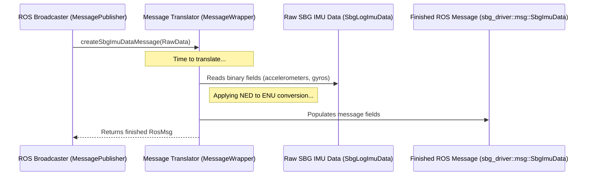

# Chapter 5: Message Translator (MessageWrapper)

In the [previous chapter](04_ros_broadcaster__messagepublisher__.md), we met the `MessagePublisher`, our driver's town crier. It sets up the broadcast channels and announces data to the ROS world. However, the broadcaster itself doesn't speak the sensor's native language. It needs a skilled interpreter to translate the sensor's raw, binary messages into something everyone can understand.

This is where our final data-pipeline component comes in: the `MessageWrapper`. Think of it as a universal translator at the United Nations. It takes incoming data in a very specific, technical format and expertly converts it into a standard, widely understood language—in our case, the language of ROS messages.

---

### The Problem: Mismatched Languages and Worldviews

Our SBG sensor is an incredible piece of hardware, but it has its own way of seeing the world and communicating. This creates two major challenges:

1.  **Coordinate System Mismatch:** By default, many inertial sensors, including the SBG, use a **NED** (North, East, Down) coordinate system. This is common in aerospace and naval applications. However, the ROS world has standardized on an **ENU** (East, North, Up) system. If we just passed the data along, our robot would think "up" is "down" and "north" is "east"—a recipe for disaster!

2.  **Data Format Mismatch:** The sensor sends highly efficient binary logs. A navigation system, on the other hand, expects a standard `sensor_msgs/msg/Imu` or `nav_msgs/msg/Odometry` message. We need to unpack the binary data and carefully repackage it into these standard ROS structures.

The `MessageWrapper` is the specialist that solves both these problems. It's the critical "last mile" of data processing before the data is ready for the wider ROS ecosystem.

### The Translator in Action

The `MessageWrapper` works as a loyal assistant to the [ROS Broadcaster (MessagePublisher)](04_ros_broadcaster__messagepublisher__.md). The broadcaster doesn't need to know any of the complex translation rules. It simply hands a raw data log to the `MessageWrapper` and gets a perfectly formatted ROS message back.

Let's revisit the moment the `MessagePublisher` wants to broadcast IMU data.

**File:** `src/message_publisher.cpp`
```cpp
void MessagePublisher::publishIMUData(const SbgBinaryLogData &ref_sbg_log)
{
  // 1. Ask the translator to create the ROS message.
  m_sbg_imu_message_ = m_message_wrapper_.createSbgImuDataMessage(ref_sbg_log.imuData);
  
  // 2. Use our publisher to broadcast the message.
  m_sbgImuData_pub_->publish(m_sbg_imu_message_);
}
```
This interaction is beautifully simple. The broadcaster (`MessagePublisher`) says, "Here's some raw IMU data," and the translator (`m_message_wrapper_`) handles all the messy details, returning a complete `sbg_driver::msg::SbgImuData` message, ready for publishing.

### Under the Hood: The Art of Translation

So, what are those "messy details"? Let's follow the `createSbgImuDataMessage` call and see how the `MessageWrapper` works its magic.

First, a simple diagram showing the process:



The core of the `MessageWrapper` is a series of `create...Message` functions, one for each type of data log. Let's look at the implementation for our IMU data.

**File:** `src/message_wrapper.cpp`
```cpp
const sbg_driver::msg::SbgImuData MessageWrapper::createSbgImuDataMessage(const SbgLogImuData& ref_log_imu_data) const
{
  sbg_driver::msg::SbgImuData  imu_data_message;

  // 1. Fill in basic info like timestamp and temperature.
  imu_data_message.header       = createRosHeader(ref_log_imu_data.timeStamp);
  imu_data_message.temp         = ref_log_imu_data.temperature;
  // ... other status fields ...

  // 2. The critical coordinate system conversion!
  if (m_use_enu_)
  {
    // Convert from NED (sensor) to ENU (ROS)
    imu_data_message.accel.x = ref_log_imu_data.accelerometers[0];
    imu_data_message.accel.y = -ref_log_imu_data.accelerometers[1];
    imu_data_message.accel.z = -ref_log_imu_data.accelerometers[2];

    // Also convert gyroscope data
    imu_data_message.gyro.x = ref_log_imu_data.gyroscopes[0];
    imu_data_message.gyro.y = -ref_log_imu_data.gyroscopes[1];
    imu_data_message.gyro.z = -ref_log_imu_data.gyroscopes[2];
  }
  else
  {
    // If not using ENU, just copy the data directly.
    imu_data_message.accel.x = ref_log_imu_data.accelerometers[0];
    // ... and so on ...
  }

  return imu_data_message;
}
```

This function does two main things:
1.  **Simple Assignments:** It copies straightforward values like temperature directly from the raw log (`ref_log_imu_data`) to the ROS message (`imu_data_message`). It also calls a helper, `createRosHeader`, to generate a standard ROS message header with the correct timestamp and `frame_id`.
2.  **Coordinate Transformation:** This is the most important step. If the user has requested the ROS-standard ENU format (`m_use_enu_` is true), it performs the necessary conversion. Notice how it remaps the axes and flips the signs to correctly translate from the sensor's NED worldview to ROS's ENU worldview.

### More Than Just One-to-One Translation

The `MessageWrapper` is even smarter than a simple translator. It can also act as an **aggregator**, combining information from multiple different data logs to create a single, more useful ROS message.

A perfect example is creating the standard `sensor_msgs/msg/Imu` message. This message type requires both acceleration/gyroscope data *and* orientation (as a quaternion). The SBG device sends these in two separate logs: `SbgImuData` and `SbgEkfQuat`.

The `MessagePublisher` stores the most recent of each, and when it has both, it asks the `MessageWrapper` to combine them.

**File:** `src/message_wrapper.cpp`
```cpp
const sensor_msgs::msg::Imu MessageWrapper::createRosImuMessage(
    const sbg_driver::msg::SbgImuData& ref_sbg_imu_msg,
    const sbg_driver::msg::SbgEkfQuat& ref_sbg_quat_msg) const
{
  sensor_msgs::msg::Imu imu_ros_message;

  // Get the header from the IMU data's timestamp.
  imu_ros_message.header = createRosHeader(ref_sbg_imu_msg.time_stamp);

  // 1. Get orientation from the EKF Quat message.
  imu_ros_message.orientation = ref_sbg_quat_msg.quaternion;

  // 2. Get angular velocity & linear acceleration from the IMU message.
  imu_ros_message.angular_velocity    = ref_sbg_imu_msg.gyro;
  imu_ros_message.linear_acceleration = ref_sbg_imu_msg.accel;

  // ... (fill in covariance from accuracy fields) ...
  
  return imu_ros_message;
}
```
Here, the `MessageWrapper` skillfully cherry-picks the necessary pieces from two different translated messages (`SbgImuData` and `SbgEkfQuat`) to construct a fully-formed, standard ROS `Imu` message. This aggregation is what makes the driver so useful to other ROS nodes.

### Conclusion

You've now met the `MessageWrapper`, the unsung hero of our data pipeline. It's the expert linguist and cartographer that makes communication between the SBG sensor and the ROS world seamless.

You learned that the `MessageWrapper`:
*   Acts as a **universal translator** for raw sensor data.
*   **Parses** binary log structures into usable ROS message fields.
*   Handles the critical task of **converting coordinate systems** from the device's native NED to the ROS standard ENU.
*   Intelligently **manages timestamps** to create valid ROS message headers.
*   Can **aggregate data** from multiple logs to create rich, standard ROS messages like `sensor_msgs/msg/Imu`.

Together, the [ROS Broadcaster (MessagePublisher)](04_ros_broadcaster__messagepublisher__.md) and the `MessageWrapper` form a powerful team that delivers clean, standardized, and ready-to-use sensor data to your entire robotic system.

We have now covered the entire data flow from configuration to publication. In the final chapter, we'll look at a different capability of the driver: how it provides interactive services. We'll explore the [Magnetometer Calibration Service](06_magnetometer_calibration_service_.md) to see how you can command the driver to perform specific actions.

---

Generated by [AI Codebase Knowledge Builder](https://github.com/The-Pocket/Tutorial-Codebase-Knowledge)