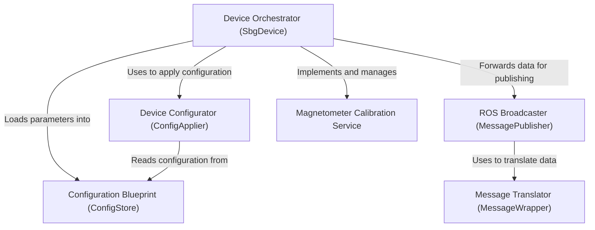

# Tutorial: src

This project is a **ROS 2 driver** for *SBG Systems inertial sensors*. It establishes a connection with the physical device, configures it based on user-defined parameters, and then continuously receives sensor data. The driver translates this raw data into *standard ROS messages* (like IMU, GPS, and odometry) and publishes them on various topics. It also provides a special service to perform **magnetometer calibration**, helping to improve the device's heading accuracy.

**Source Repository:** [None](None)

## Chapters

1. [Configuration Blueprint (ConfigStore)
](01_configuration_blueprint__configstore__.md)
2. [Device Orchestrator (SbgDevice)
](02_device_orchestrator__sbgdevice__.md)
3. [Device Configurator (ConfigApplier)
](03_device_configurator__configapplier__.md)
4. [ROS Broadcaster (MessagePublisher)
](04_ros_broadcaster__messagepublisher__.md)
5. [Message Translator (MessageWrapper)
](05_message_translator__messagewrapper__.md)
6. [Magnetometer Calibration Service
](06_magnetometer_calibration_service_.md)

---

Generated by [AI Codebase Knowledge Builder](https://github.com/The-Pocket/Tutorial-Codebase-Knowledge)