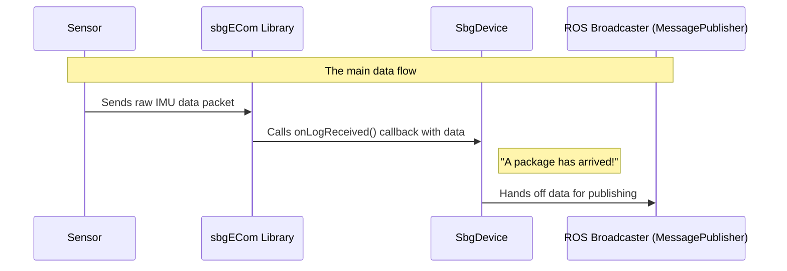

# Chapter 2: Device Orchestrator (SbgDevice)

In the [previous chapter](01_configuration_blueprint__configstore__.md), we learned about the `ConfigStore`, which acts as the instruction manual or blueprint for our driver. It reads your settings and holds them, ready for use. But a blueprint on its own doesn't build anything. You need a project manager or a head chef to read the instructions and put everything into motion.

Meet the `SbgDevice` class. If `ConfigStore` is the recipe, `SbgDevice` is the head chef. It's the central, most important component in the driver. It takes the configuration, talks to the physical sensor, and tells all the other components what to do and when. It is the conductor of our software orchestra.

---

### The Problem: Who Manages Everything?

We have our settings loaded, but now what? Something needs to:
1.  Actually open a connection to the SBG sensor using the correct port (e.g., `/dev/ttyUSB0`) or IP address.
2.  Listen continuously for data coming from the sensor.
3.  When data arrives, pass it to the right component to be translated and published.
4.  Handle special requests from the user, like "start calibrating the magnetometer."

This management role is far too complex for a single, monolithic block of code. Instead, we have the `SbgDevice` to act as the central orchestrator, delegating tasks to its team of specialists.

### The Orchestrator in Action

When you launch the driver, the `main()` function's primary job is to create an instance of `SbgDevice`. This single action kicks off the entire process.

**File:** `main.cpp`
```cpp
int main(int argc, char **argv)
{
  // ... (ROS initialization)
  rclcpp::Node node_handle("sbg_device");

  // Create the orchestrator! This starts everything.
  SbgDevice sbg_device(node_handle);

  // ... (The rest of the main loop)
}
```
Creating the `sbg_device` object immediately triggers its constructor, which is where the magic begins.

#### Step 1: Reading the Blueprint and Connecting

The very first thing the `SbgDevice` chef does is read the recipe from the `ConfigStore`. Then, it immediately uses that recipe to connect to the physical device.

**File:** `src/sbg_device.cpp`
```cpp
SbgDevice::SbgDevice(rclcpp::Node& ref_node_handle):
m_ref_node_(ref_node_handle)
// ...
{
  // First, read the recipe (from ConfigStore).
  loadParameters();
  
  // Second, connect to the device.
  connect();
}
```
The `connect()` method uses the settings loaded into `m_config_store_` to establish a real connection, either over a serial (USB) or UDP (Ethernet) interface.

**File:** `src/sbg_device.cpp`
```cpp
void SbgDevice::connect(void)
{
  // Ask the ConfigStore if we are using a serial port
  if (m_config_store_.isInterfaceSerial())
  {
    // Use the port name and speed from the config to connect
    RCLCPP_INFO(m_ref_node_.get_logger(), "Connecting to serial port...");
    sbgInterfaceSerialCreate(&m_sbg_interface_, m_config_store_.getUartPortName().c_str(), m_config_store_.getBaudRate());
  }
  else if (m_config_store_.isInterfaceUdp())
  {
    // ... code to connect via UDP using the stored IP address ...
  }
  
  // ... initialize the SBG communication library ...
}
```
Notice how `SbgDevice` doesn't have hardcoded values like `/dev/ttyUSB0`. It is a flexible manager that adapts its behavior based on the configuration it was given by the `ConfigStore`.

#### Step 2: Setting Up the Data Pipeline

Once connected, `SbgDevice` needs to prepare to receive a constant stream of data from the sensor. Back in `main.cpp`, we see the next instruction given to our orchestrator.

**File:** `main.cpp`
```cpp
// ...
SbgDevice sbg_device(node_handle);

// Tell the orchestrator to prepare for incoming data
sbg_device.initDeviceForReceivingData();

// ...
```
This call sets up a "listener" — a special function that will be automatically called by the underlying SBG library whenever a new piece of data arrives. In programming, this is known as a **callback**.

Imagine you're expecting a package. You tell the delivery service, "When my package arrives, please call this phone number." You don't have to wait by the door all day. You can go about your business, and when the package arrives, your phone will ring. `initDeviceForReceivingData()` is like giving the delivery service your phone number.

#### Step 3: The Main Loop - Listening for Data

The driver then enters its main loop. In each cycle, it gives the SBG library a chance to process any incoming communication.

**File:** `main.cpp`
```cpp
while (rclcpp::ok())
{
  // Let the orchestrator handle any pending device communications.
  sbg_device.periodicHandle();
  loop_rate.sleep();
}
```
The `periodicHandle()` function is where our callback gets triggered. When the SBG library detects a complete data message inside `periodicHandle()`, it immediately "rings the phone" by calling our listener function.

### Under the Hood: The Data Flow

Let's visualize how a single data packet travels from the sensor to ROS.



1.  The physical **SBG Sensor** sends a binary data log (e.g., IMU data).
2.  The **sbgECom Library**, processing events inside `periodicHandle()`, receives the full packet.
3.  The library invokes the `onLogReceived` callback that `SbgDevice` registered earlier.
4.  `SbgDevice`'s job is not to understand the data, but to delegate. It immediately passes the raw data to the [ROS Broadcaster (MessagePublisher)](04_ros_broadcaster__messagepublisher__.md), whose job is to translate it and publish it as a ROS message.

Let's look at the simple code for this handoff.

**File:** `src/sbg_device.cpp`
```cpp
void SbgDevice::onLogReceived(SbgEComClass msg_class, SbgEComMsgId msg, const SbgBinaryLogData& ref_sbg_data)
{
  // I received some data! I don't know what it is,
  // but I'll pass it to the publisher. It knows what to do.
  m_message_publisher_.publish(msg_class, msg, ref_sbg_data);
}
```
This is a perfect example of orchestration. `SbgDevice` doesn't get bogged down in the details of ROS message types. It simply directs the flow of work to the correct specialist.

### More Than Just Data: Orchestrating Actions

The `SbgDevice` also manages other key operations.

*   **Device Configuration**: Before listening for data, the device itself needs to be configured (e.g., telling it *which* logs to send). `SbgDevice` delegates this task to another specialist, which we will meet in the next chapter: the [Device Configurator (ConfigApplier)](03_device_configurator__configapplier__.md).
    **File:** `src/sbg_device.cpp`
    ```cpp
    void SbgDevice::configure(void)
    {
        // I need to configure the device. I'll create a temporary
        // 'ConfigApplier' to do the job for me.
        ConfigApplier configApplier(m_com_handle_);
        configApplier.applyConfiguration(m_config_store_);
    }
    ```

*   **User Services**: What if a user wants to start a magnetometer calibration? They do this by calling a ROS service. The `SbgDevice` is responsible for hosting this service and managing the start/stop logic of the calibration process. We will explore this in the [Magnetometer Calibration Service](06_magnetometer_calibration_service_.md) chapter.

### Conclusion

You've now met the `SbgDevice`, the central nervous system of the driver. It is the master orchestrator that brings all the other components together.

You learned that `SbgDevice`:
*   Acts as the **main manager** or "conductor" of the driver.
*   Uses the [Configuration Blueprint (ConfigStore)](01_configuration_blueprint__configstore__.md) to initialize a **connection** with the physical sensor.
*   Establishes a **callback system** to listen for incoming data without blocking.
*   **Delegates tasks** to specialized components: it tells the `ConfigApplier` to configure the device and the `MessagePublisher` to publish data.
*   Handles **high-level user interactions** like ROS services.

Understanding the `SbgDevice` is crucial because it defines the primary control flow of the entire application. It shows how a complex problem can be solved by a manager that delegates work to a team of experts.

In the next chapter, we'll look at one of those key experts: the [Device Configurator (ConfigApplier)](03_device_configurator__configapplier__.md). We'll see how it takes the settings from our blueprint and applies them to the physical SBG sensor.

---

Generated by [AI Codebase Knowledge Builder](https://github.com/The-Pocket/Tutorial-Codebase-Knowledge)