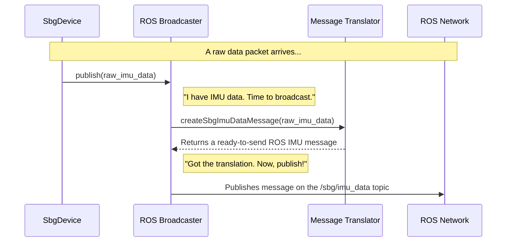

# Chapter 4: ROS Broadcaster (MessagePublisher)

In the [previous chapter](03_device_configurator__configapplier__.md), we met the `ConfigApplier`, our hardware technician. It took our settings and meticulously applied them to the SBG sensor. Now, the device is fully configured and ready to start sending us a firehose of data.

This data arrives as a stream of raw, binary packets—a language that only the sensor and our driver understand. But what's the point of getting all this rich data if no other part of our robot's software can use it? We need a town crier to shout the news to the entire ROS village.

This is the job of the `MessagePublisher`. It acts as the driver's official broadcaster. It takes the incoming sensor data, and with the help of a translator, announces it on the correct ROS channels (called "topics") for anyone to hear.

---

### The Problem: How Do We Share Data with Other ROS Nodes?

Imagine our robot has a navigation system that needs to know its orientation (which way it's facing). Our SBG sensor provides this information, but it sends it in a compact binary format. The navigation system, on the other hand, expects a standard ROS `Imu` message on a topic like `/imu/data`.

How do we bridge this gap? We need a component that can:
1.  Look at the user's configuration and know which topics to create (e.g., `/sbg/imu_data`, `/sbg/status`, and maybe even the standard `/imu/data`).
2.  Receive the raw binary data packet for IMU information.
3.  Coordinate the translation of that packet into a proper ROS message.
4.  Broadcast, or "publish," that ROS message onto the correct topic.

The `MessagePublisher` is designed to handle this entire broadcasting pipeline.

### The Broadcaster in Action

The `MessagePublisher`'s life begins when the [Device Orchestrator (SbgDevice)](02_device_orchestrator__sbgdevice__.md) is preparing to receive data. The orchestrator tells the publisher to get ready by setting up all its broadcast channels.

**File:** `src/sbg_device.cpp`
```cpp
void SbgDevice::initDeviceForReceivingData(void)
{
  SbgErrorCode error_code;
  
  // Tell the publisher to create all necessary ROS topics.
  initPublishers();
  
  // Now, configure the device itself.
  configure();

  // ... (set up the callback to listen for data)
}
```

The `initPublishers()` method is a one-line command from the `SbgDevice` to the `MessagePublisher`:

**File:** `src/sbg_device.cpp`
```cpp
void SbgDevice::initPublishers(void)
{
  // Tell our publisher to get ready, using the blueprint.
  m_message_publisher_.initPublishers(m_ref_node_, m_config_store_);
}
```
`SbgDevice` hands the `MessagePublisher` the configuration blueprint ([Configuration Blueprint (ConfigStore)](01_configuration_blueprint__configstore__.md)) and tells it to create all the topics the user asked for.

Once the driver is running and data starts arriving, the `SbgDevice`'s `onLogReceived` function is called. As a good orchestrator, it immediately delegates the task of publishing to the `MessagePublisher`.

**File:** `src/sbg_device.cpp`
```cpp
void SbgDevice::onLogReceived(SbgEComClass msg_class, SbgEComMsgId msg, const SbgBinaryLogData& ref_sbg_data)
{
  // A new data packet arrived! I'll pass it straight to the broadcaster.
  m_message_publisher_.publish(msg_class, msg, ref_sbg_data);
}
```
This is the core data flow: `SbgDevice` receives, `MessagePublisher` broadcasts.

### Under the Hood: The Broadcast Pipeline

Let's follow a single IMU data packet on its journey from the sensor to the rest of the ROS system.



1.  **Hand-off**: `SbgDevice` gives the raw binary data to `MessagePublisher`.
2.  **Translation Request**: `MessagePublisher` doesn't know how to parse the binary data itself. It's a broadcaster, not a translator. It hands the raw data to its helper, the [Message Translator (MessageWrapper)](05_message_translator__messagewrapper__.md), and asks, "Please turn this into a ROS message."
3.  **Translation Complete**: The `MessageWrapper` does the hard work of reading the binary fields and populating a ROS message structure. It then returns the finished message. We'll explore this component in detail in the next chapter.
4.  **Broadcast**: `MessagePublisher` takes the finished, translated message and sends it out over the appropriate ROS topic. Any other node in the system subscribed to that topic will now receive the data.

#### Step 1: Creating the Publishers Dynamically

Inside `initPublishers`, the `MessagePublisher` reads the list of requested logs from the `ConfigStore` and creates a ROS publisher for each one.

**File:** `src/message_publisher.cpp`
```cpp
void MessagePublisher::initPublishers(rclcpp::Node& ref_ros_node_handle, const ConfigStore &ref_config_store)
{
  // Get the list of all outputs the user enabled.
  const std::vector<ConfigStore::SbgLogOutput> &outputs = ref_config_store.getOutputModes();

  // Loop through each enabled output.
  for (const ConfigStore::SbgLogOutput &output : outputs)
  {
    // Create a specific publisher for this output type.
    initPublisher(ref_ros_node_handle, output.message_id, ...);
  }
}
```

The `initPublisher` helper method is a large `switch` statement that creates the correct type of publisher for each message ID.

**File:** `src/message_publisher.cpp`
```cpp
void MessagePublisher::initPublisher(...)
{
  if (output_conf != SBG_ECOM_OUTPUT_MODE_DISABLED)
  {
    switch (sbg_msg_id)
    {
      case SBG_ECOM_LOG_IMU_DATA:
        // Create a publisher for 'SbgImuData' messages on topic 'sbg/imu_data'
        m_sbgImuData_pub_ = ref_ros_node_handle.create_publisher<sbg_driver::msg::SbgImuData>("sbg/imu_data", ...);
        break;
      // ... and so on for every other message type ...
    }
  }
}
```
This dynamic setup is powerful. If you only enable IMU and Status logs in your config file, only those two publishers will be created, saving system resources.

#### Step 2: Publishing the Message

When `publish` is called, it also uses a `switch` statement to find the right logic for the incoming data type.

**File:** `src/message_publisher.cpp`
```cpp
void MessagePublisher::publish(..., const SbgBinaryLogData &ref_sbg_log)
{
  switch (sbg_msg_id)
  {
    case SBG_ECOM_LOG_IMU_DATA:
      // If we have an IMU publisher, process the data.
      if (m_sbgImuData_pub_)
      {
        publishIMUData(ref_sbg_log);
      }
      break;
    
    // ... other cases for GPS, Status, etc. ...
  }
}
```
The helper function, `publishIMUData`, completes the pipeline we saw in the diagram: get the translation, then publish.

**File:** `src/message_publisher.cpp`
```cpp
void MessagePublisher::publishIMUData(const SbgBinaryLogData &ref_sbg_log)
{
  // 1. Ask the translator to create the ROS message.
  m_sbg_imu_message_ = m_message_wrapper_.createSbgImuDataMessage(ref_sbg_log.imuData);
  
  // 2. Use our publisher to broadcast the message to the ROS world.
  m_sbgImuData_pub_->publish(m_sbg_imu_message_);
}
```

### Conclusion

You've just learned about the `MessagePublisher`, the driver's town crier. Its job is to ensure that the valuable data from our sensor is made available to the rest of the ROS ecosystem in a clean, standard way.

You learned that the `MessagePublisher`:
*   Acts as the **broadcaster** for all sensor data.
*   Dynamically **creates ROS publishers** for each data type requested by the user in the configuration.
*   Receives raw data from the [Device Orchestrator (SbgDevice)](02_device_orchestrator__sbgdevice__.md) when it arrives.
*   **Delegates the task of translation** to a helper component.
*   **Publishes the final, translated ROS messages** on the correct topics.

The `MessagePublisher` is the critical link between our driver's internal world and the outside ROS world. But how does it get its perfectly translated messages?

In the next chapter, we'll meet its indispensable partner: the [Message Translator (MessageWrapper)](05_message_translator__messagewrapper__.md). We'll dive into how it takes raw binary data and skillfully converts it into structured ROS messages.

---

Generated by [AI Codebase Knowledge Builder](https://github.com/The-Pocket/Tutorial-Codebase-Knowledge)