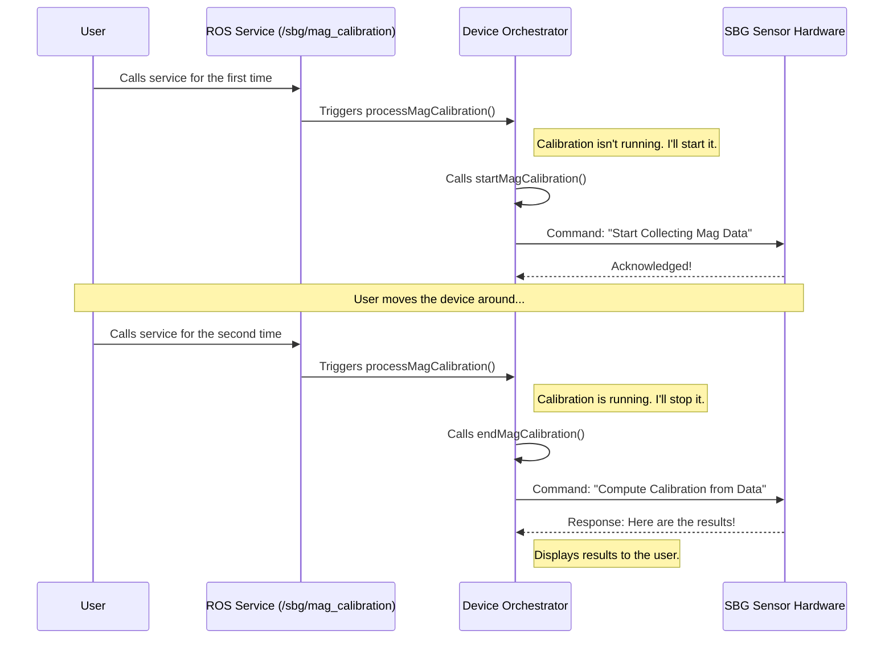

# Chapter 6: Magnetometer Calibration Service

In the [previous chapter](05_message_translator__messagewrapper__.md), we met the `MessageWrapper`, the expert translator that converts raw sensor data into clean, standard ROS messages. We have now followed the entire data pipeline, from reading a configuration file to broadcasting data across the ROS network.

But what if we want to do more than just listen? What if we need to actively command the device to perform a special task? In this final chapter, we'll explore how the driver exposes interactive functionality through a **ROS Service**.

---

### The Problem: My Robot's Compass is Wrong!

Your robot's magnetometer acts like a digital compass, which is essential for knowing its heading (the direction it's facing). However, the Earth's magnetic field is not the only magnetic field around! The motors, metal frame, and electronics on your robot can create their own local magnetic fields, which can confuse the sensor and lead to inaccurate heading readings.

To fix this, we need to perform a **calibration**. This process involves teaching the sensor to distinguish between the Earth's magnetic field and the "noise" created by the robot itself. The standard way to do this is to slowly move the device in all orientations (like making a figure-8 in the air) while it collects data.

So, how do we tell the driver: "Hey, I'm ready to start the calibration dance now!" and then, a minute later, "Okay, I'm done, please calculate the results"? We need a simple, interactive command.

### The Service in Action: A Special Command Channel

The `sbg_driver` provides a perfect solution: a ROS Service. A service is like a remote control with a button. You press the button (call the service) to trigger a specific action in the driver.

The magnetometer calibration uses a simple "toggle" service. You call it once to start, and you call it again to stop.

Here's how you would use it from the command line:

1.  **Start Calibration:** Open a terminal and run this command. This tells the driver to start listening to the magnetometer data for calibration.
    ```bash
    # Command to start the calibration
    ros2 service call /sbg/mag_calibration std_srvs/srv/Trigger
    ```
    The driver will respond in your terminal, confirming that the process has begun:
    ```
    response:
    std_srvs.srv.Trigger_Response(success=True, message='Magnetometer calibration process started.')
    ```
    Now, you physically pick up your device (or the whole robot) and move it around to gather magnetic data points from all angles.

2.  **Stop Calibration:** Once you're done moving the device, you run the *exact same command* again.
    ```bash
    # Command to stop the calibration and compute results
    ros2 service call /sbg/mag_calibration std_srvs/srv/Trigger
    ```
    This time, the driver knows you want to stop. It tells the sensor to process all the data it just collected. It will confirm that it's finished and tell you to check the driver's console for the results.
    ```
    response:
    std_srvs.srv.Trigger_Response(success=True, message='Magnetometer calibration is finished. See the output console to get calibration informations.')
    ```

3.  **Save the Results (Optional):** The new calibration is only in temporary memory. If you are happy with the results, you can call a second service to write them permanently to the device's hardware.
    ```bash
    # Command to save the new calibration to the device
    ros2 service call /sbg/mag_calibration_save std_srvs/srv/Trigger
    ```

This simple, interactive workflow makes a complex hardware task easy for any user to perform.

### Under the Hood: The Orchestrator Takes Command

Who is responsible for managing this interactive process? This is a perfect job for our [Device Orchestrator (SbgDevice)](02_device_orchestrator__sbgdevice__.md). It already manages the state of the driver and communication with the hardware, so it's the natural place to handle these special commands.

Let's look at the sequence of events when you call the service.



The logic is handled inside `SbgDevice`, which acts as a state machine. It keeps track of whether a calibration is currently in progress.

#### Step 1: Setting up the Service

When the driver starts in calibration mode, the `SbgDevice` creates the ROS services and links them to its internal handler functions.

**File:** `src/sbg_device.cpp`
```cpp
void SbgDevice::initDeviceForMagCalibration(void)
{
  // Create the main start/stop service.
  m_calib_service_ = m_ref_node_.create_service<std_srvs::srv::Trigger>(
    "sbg/mag_calibration", 
    std::bind(&SbgDevice::processMagCalibration, this, ...));

  // Create the "save" service.
  m_calib_save_service_ = m_ref_node_.create_service<std_srvs::srv::Trigger>(
    "sbg/mag_calibration_save",
    std::bind(&SbgDevice::saveMagCalibration, this, ...));
}
```
This code registers our two services, `/sbg/mag_calibration` and `/sbg/mag_calibration_save`, and tells ROS, "When someone calls these services, please execute my `processMagCalibration` or `saveMagCalibration` function."

#### Step 2: Handling the Call (The Toggle Logic)

The `processMagCalibration` function is the heart of the toggle logic. It uses a simple boolean flag, `m_mag_calibration_ongoing_`, to decide what to do.

**File:** `src/sbg_device.cpp`
```cpp
bool SbgDevice::processMagCalibration(...)
{
  // Is a calibration already in progress?
  if (m_mag_calibration_ongoing_)
  {
    // Yes -> Stop the calibration.
    endMagCalibration();
    m_mag_calibration_ongoing_ = false; // Toggle the flag
  }
  else
  {
    // No -> Start a new calibration.
    startMagCalibration();
    m_mag_calibration_ongoing_ = true; // Toggle the flag
  }
  // ... (code to set the response message) ...
}
```
This is a beautiful and simple implementation of a stateful service. The same input triggers different actions depending on the internal state of the `SbgDevice` object.

#### Step 3: Talking to the Hardware

The `startMagCalibration` and `endMagCalibration` functions are the ones that actually talk to the hardware. They send the low-level binary commands to the SBG sensor.

**File:** `src/sbg_device.cpp`
```cpp
bool SbgDevice::startMagCalibration(void)
{
  // ... (get calibration mode from ConfigStore) ...

  // Send the "start calibration" command to the device.
  SbgErrorCode error_code = sbgEComCmdMagStartCalib(&m_com_handle_, ...);

  // ... (check for errors and log messages) ...
}
```
`startMagCalibration` tells the device to enter calibration mode. Later, `endMagCalibration` tells it to stop and compute the results.

**File:** `src/sbg_device.cpp`
```cpp
bool SbgDevice::endMagCalibration(void)
{
  // Send "compute calibration" command and store results in m_magCalibResults.
  SbgErrorCode error_code = sbgEComCmdMagComputeCalib(&m_com_handle_, &m_magCalibResults);

  // ... (check for errors) ...

  // Show the results on the screen.
  displayMagCalibrationStatusResult();
  
  return true;
}
```
Finally, if the user calls the save service, `SbgDevice` sends the new calibration data back to the device and—in a great example of code reuse—uses a [Device Configurator (ConfigApplier)](03_device_configurator__configapplier__.md) to make the changes permanent!

### Conclusion

Congratulations! You have completed the tour of the `sbg_driver` project. In this final chapter, you learned about providing interactive functionality through ROS services.

You learned that the Magnetometer Calibration Service:
*   Solves the real-world problem of **improving heading accuracy** by correcting for local magnetic interference.
*   Is exposed to the user as a **simple, interactive ROS service**.
*   Uses a **toggle mechanism** (call once to start, call again to stop) for a user-friendly workflow.
*   Is managed by the [Device Orchestrator (SbgDevice)](02_device_orchestrator__sbgdevice__.md), which handles the state and communication with the hardware.
*   Provides a separate service to **permanently save** the new calibration parameters.

Throughout this tutorial, we have journeyed through the entire architecture of a robust ROS 2 driver. We started with the [Configuration Blueprint (ConfigStore)](01_configuration_blueprint__configstore__.md), saw how the [Device Orchestrator (SbgDevice)](02_device_orchestrator__sbgdevice__.md) managed everything, watched the [Device Configurator (ConfigApplier)](03_device_configurator__configapplier__.md) program the hardware, and followed the data pipeline through the [ROS Broadcaster (MessagePublisher)](04_ros_broadcaster__messagepublisher__.md) and [Message Translator (MessageWrapper)](05_message_translator__messagewrapper__.md).

We hope this tour has given you a clear understanding of how each component plays a vital role, working together to create a powerful and flexible driver. Happy developing

---

Generated by [AI Codebase Knowledge Builder](https://github.com/The-Pocket/Tutorial-Codebase-Knowledge)