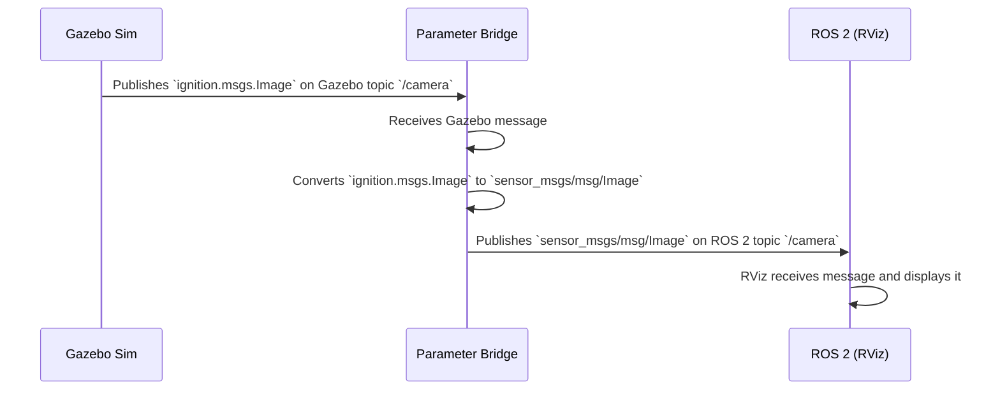

# Chapter 2: Parameter Bridge

In [Chapter 1: Gazebo Sim Convenience Tools](01_gazebo_sim_convenience_tools_.md), we learned how to start the Gazebo simulator and add a robot to it from ROS 2. We now have our simulation world set up, but it's a bit like a silent movie. We can see things, but we can't get any information out of them (like sensor data) or send any commands to them (like telling a robot to move).

How do we bridge this communication gap? ROS 2 and Gazebo are two separate systems that speak different "languages" (message types) over different "phone lines" (transport layers). We need a translator.

This is where the **Parameter Bridge** comes in. It's the most important tool for establishing communication between ROS 2 and Gazebo.

**Analogy: The Universal Travel Adapter**

Imagine you're traveling and need to plug your laptop (ROS 2) into a foreign wall socket (Gazebo). Your plug doesn't fit, and the voltage might be different. The Parameter Bridge is like a universal travel adapter. You tell it which plug you have (`sensor_msgs/msg/Image`) and which socket you need to connect to (`ignition.msgs.Image`), and it handles the conversion, allowing electricity (data) to flow.

## What Problem Does it Solve? A Camera Example

Let's say we have a robot with a camera in our Gazebo simulation.
*   **Gazebo** sees the world and publishes camera data on a Gazebo topic as an `ignition.msgs.Image` message.
*   **ROS 2** tools, like the visualizer `RViz`, expect to receive camera data on a ROS 2 topic as a `sensor_msgs/msg/Image` message.

These two systems can't talk to each other directly. We need the Parameter Bridge to listen to the Gazebo topic, translate the message, and republish it on a ROS 2 topic.

```mermaid
graph TD
    subgraph Gazebo
        GzCam[Camera Sensor] -->|ignition.msgs.Image| GzTopic[/world/default/model/camera_model/link/camera/sensor/camera/image]
    end

    subgraph ROS 2
        RosTopic[/camera/image] -->|sensor_msgs/msg/Image| Rviz[RViz]
    end

    GzTopic -- ??? --> RosTopic
```

The Parameter Bridge is the "???" that connects the two.

## How to Use the Parameter Bridge

The bridge is an executable called `parameter_bridge` from the `ros_gz_bridge` package. You use it by giving it a list of "connections" you want it to create as command-line arguments.

The syntax for a single connection looks like this:

`TOPIC_NAME@ROS_MESSAGE_TYPE@GAZEBO_MESSAGE_TYPE`

Let's break it down:
*   **`TOPIC_NAME`**: The name of the channel you want to share. The bridge will create both a ROS 2 topic and a Gazebo topic with this name.
*   **`@`**: A special character that separates the parts.
*   **`ROS_MESSAGE_TYPE`**: The "ROS plug," like `sensor_msgs/msg/Image`.
*   **`@`**: The second separator. This `@` means the bridge is **bidirectional** (data can flow both ways). We'll see other options later.
*   **`GAZEBO_MESSAGE_TYPE`**: The "Gazebo socket," like `ignition.msgs.Image`.

### A Practical Demonstration

Let's try it! First, start a Gazebo world that contains a camera. The `ros_gz_sim_demos` package has a perfect example.

In a **new terminal**, run:
```bash
ros2 launch ros_gz_sim_demos camera.launch.py
```
This will start Gazebo with a camera model and also automatically start `RViz`, a ROS 2 visualization tool. You should see a blank RViz window and a Gazebo window showing a camera.

Right now, RViz is blank because no ROS 2 image messages are being published. Let's fix that.

In a **second terminal**, we'll manually start the bridge:
```bash
ros2 run ros_gz_bridge parameter_bridge \
  /camera@sensor_msgs/msg/Image@ignition.msgs.Image
```

**What Happens?**
Look at your RViz window. It should now be displaying the view from the camera in Gazebo!

You just told the bridge:
1.  Connect to a topic named `/camera`.
2.  On the ROS 2 side, use the `sensor_msgs/msg/Image` message type.
3.  On the Gazebo side, use the `ignition.msgs.Image` message type.
4.  Translate between them automatically.

> **Note:** The Gazebo topic name is actually much longer (e.g., `/world/default/model/.../image`), but the camera plugin in the simulation is configured to remap its output to the simple topic name `/camera`.

## Using the Bridge in a Launch File

Running the bridge manually in a separate terminal is great for testing, but for a real project, you'll want it to start automatically with your simulation. We can do this by adding it to our launch file.

Let's look at a simplified piece of the `camera.launch.py` file we just used.

```python
# From ros_gz_sim_demos/launch/camera.launch.py

# ... other setup code for Gazebo and RViz ...

# Bridge
bridge = Node(
    package='ros_gz_bridge',
    executable='parameter_bridge',
    arguments=['/camera@sensor_msgs/msg/Image@ignition.msgs.Image',
               '/camera_info@sensor_msgs/msg/CameraInfo@ignition.msgs.CameraInfo'],
    output='screen'
)
```

This code snippet defines a `Node` action, which is ROS 2's way of saying "please run this program."
*   `package`: `ros_gz_bridge` (where the tool lives).
*   `executable`: `parameter_bridge` (the name of the program).
*   `arguments`: A list of strings to pass to the program. Here, we're bridging both the camera image and its associated camera info.

When you ran `ros2 launch ros_gz_sim_demos camera.launch.py` earlier, it was already running this bridge for you! This is the standard way to set up communication for your simulation environment.

## Under the Hood: The Bilingual Translator

How does the bridge actually work? It's a single program that creates both a ROS 2 node and a Gazebo Transport node. It acts as a translator between them.

Let's trace the data flow for our camera example.



1.  **Gazebo Sim**'s camera plugin publishes an `ignition.msgs.Image` on its transport network.
2.  The **Parameter Bridge**'s Gazebo-side listener receives this message.
3.  The bridge uses a built-in conversion function to turn the Gazebo message into a ROS 2 `sensor_msgs/msg/Image` message.
4.  The **Parameter Bridge**'s ROS-2-side publisher sends out the newly translated message.
5.  **RViz**, which is subscribed to the ROS 2 topic, receives the message and displays the image.

This all happens very quickly, allowing for near-real-time data streaming.

### A Peek at the Code

The magic happens inside `ros_gz_bridge/src/parameter_bridge.cpp`. The `main` function is responsible for parsing your command-line arguments and setting up the requested bridges.

Here's a highly simplified view of what it does:

```cpp
// Simplified from ros_gz_bridge/src/parameter_bridge.cpp

int main(int argc, char * argv[])
{
  // 1. Initialize ROS 2 and Gazebo Transport nodes
  auto ros_node = std::make_shared<rclcpp::Node>("ros_gz_bridge");
  auto gz_node = std::make_shared<ignition::transport::Node>();

  // 2. Loop through arguments like "/camera@sensor_msgs/msg/Image@..."
  for (auto & arg : command_line_arguments) {
    // 3. Parse the string to get topic name, ROS type, and GZ type
    std::string topic_name = ParseTopic(arg);
    std::string ros_type = ParseRosType(arg);
    std::string gz_type = ParseGzType(arg);

    // 4. Call a factory function to create the actual bridge
    ros_gz_bridge::create_bidirectional_bridge(
      ros_node, gz_node, ros_type, gz_type, topic_name, ...);
  }

  // 5. Spin and wait for messages
  rclcpp::spin(ros_node);
}
```
The key takeaway is that the executable is a simple "factory" program. It takes string recipes from you (the arguments) and uses them to build and activate the specific translator objects you need. This makes it incredibly flexible, as it doesn't need to know at compile time which topics you're going to bridge. You decide at runtime!

## Conclusion

You've now learned about the most fundamental tool for ROS-Gazebo communication. The **Parameter Bridge** is your "universal adapter" that translates messages between the two systems.

You learned that:
*   It solves the problem of ROS and Gazebo using different message types and communication protocols.
*   You configure it using a `TOPIC@ROS_TYPE@GZ_TYPE` syntax.
*   You can run it from the command line with `ros2 run` for quick tests.
*   The best practice is to include it as a `Node` in your ROS 2 launch files for automated setup.

The Parameter Bridge is perfect for connecting standard, existing topics. But what if you need more complex or custom logic that is tightly integrated with the physics simulation? For example, what if you wanted to create a plugin that applies a force to a robot link whenever it receives a ROS message? For that, you need to write code that lives *inside* Gazebo but can also speak ROS.

In the next chapter, we'll explore this powerful technique with [ROS-Enabled Gazebo Plugins](03_ros_enabled_gazebo_plugins_.md).

---

Generated by [AI Codebase Knowledge Builder](https://github.com/The-Pocket/Tutorial-Codebase-Knowledge)