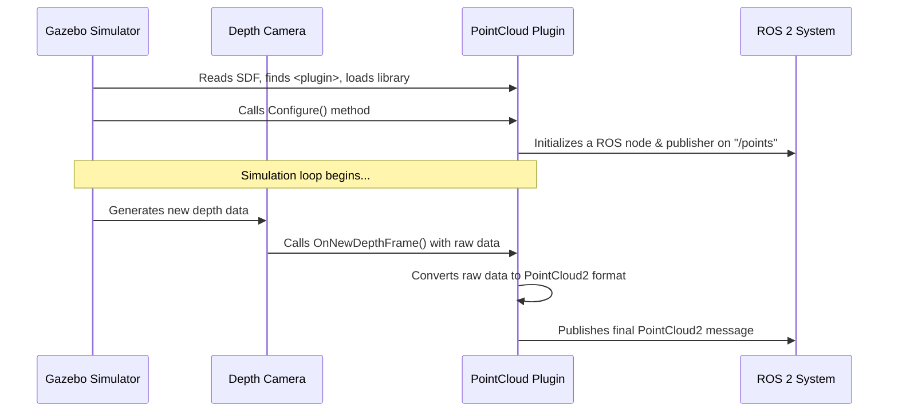

# Chapter 3: ROS-Enabled Gazebo Plugins

In [Chapter 2: Parameter Bridge](02_parameter_bridge_.md), we discovered the "universal adapter" for connecting ROS 2 and Gazebo. The Parameter Bridge is fantastic for translating standard messages between the two systems, like taking a Gazebo camera image and turning it into a ROS camera image.

But what happens when a simple, one-to-one translation isn't enough? What if we need to perform complex calculations on sensor data *before* it even leaves the simulator? For these special cases, we need a tool that's more powerful and more deeply integrated than an external bridge.

**Analogy: The Embedded Reporter**

Think of the [Parameter Bridge](02_parameter_bridge_.md) as a translator in a booth outside an important meeting. They listen to the meeting audio (Gazebo data) on headphones and translate it for an external audience (ROS).

A **ROS-Enabled Gazebo Plugin** is completely different. It's like an "embedded reporter" who is also a delegate *inside* the meeting. They witness events firsthand, analyze them, write a detailed report (process the data), and then send that report directly to their news agency (publish to ROS) from inside the room. This is far more efficient for complex reporting that requires in-depth knowledge of the situation.

## The Problem: From a Depth Image to a 3D Point Cloud

Let's consider a common robotics task: using a depth camera.
*   A **depth camera** works like a normal camera, but instead of color, each pixel represents the distance from the camera to an object. This produces a 2D image of depth values.
*   A **point cloud** is a 3D representation of the world, where each point has an (x, y, z) coordinate. This is extremely useful for 3D navigation and object recognition.

To get a point cloud from a depth camera, we need to do some math. For every pixel in the 2D depth image, we must calculate its corresponding 3D coordinate in space.

We *could* use the Parameter Bridge to send the depth `Image` to ROS and then have a *separate ROS node* do the conversion to a `PointCloud2`.

```mermaid
graph TD
    subgraph Gazebo
        GzDepthCam[Depth Camera] -->|gz.msgs.Image| GzTopic[/depth_image]
    end

    subgraph "External Programs"
       Bridge[Parameter Bridge]
       Converter[ROS Point Cloud Converter Node]
    end

    subgraph ROS
        RosImageTopic[/depth_image] --> |sensor_msgs.Image| Converter
        Converter --> |sensor_msgs.PointCloud2| RosPCTopic[/points]
        RosPCTopic --> RViz[RViz]
    end

    GzTopic --> Bridge
    Bridge --> RosImageTopic
```
This works, but it's inefficient. We are sending a large, raw image message from Gazebo to ROS, only to immediately process it in another program.

What if we could do the conversion *inside Gazebo* where we have direct, high-speed access to the sensor data? This is exactly what a ROS-Enabled Gazebo Plugin does.

## How to Use a ROS-Enabled Plugin

Unlike the Parameter Bridge which you run from a terminal or launch file, you enable a Gazebo plugin directly inside your robot's or world's **SDF file**. The SDF (Simulation Description Format) is the file that describes everything in your simulation world.

The `ros_gz_point_cloud` package provides a perfect example of such a plugin. It's a pre-compiled piece of code that can be loaded by Gazebo. Its job is to attach to a depth camera or GPU Lidar, perform the conversion to a point cloud, and publish the result directly to ROS.

Let's look at how you would attach this plugin to a depth camera sensor in an SDF file.

```xml
<!-- Inside a robot's .sdf file -->
<sensor name="depth_camera" type="depth_camera">
  <!-- ... other sensor settings like resolution, etc. ... -->

  <plugin
    filename="libros_gz_point_cloud.so"
    name="ros_gz_point_cloud::PointCloud">
    <topic>points</topic>
  </plugin>
</sensor>
```

Let's break this down:
*   `<plugin>`: This tag tells Gazebo to load a special piece of code.
*   `filename="libros_gz_point_cloud.so"`: This is the name of the compiled C++ library file for the plugin. Gazebo knows where to find these files.
*   `name="ros_gz_point_cloud::PointCloud"`: This is the specific C++ class name inside the library that Gazebo should use.
*   `<topic>points</topic>`: This is a configuration parameter we pass to the plugin. It tells the plugin to publish the final ROS point cloud on the `/points` topic.

When you launch Gazebo with a model containing this SDF, the plugin is automatically loaded and activated. You don't need to run a separate bridge or converter node!

Now, you can start a simulation that uses such a model:
```bash
# This demo uses a world with a plugin-enabled RGBD camera
ros2 launch ros_gz_sim_demos rgbd_camera.launch.py
```

And in a new terminal, you can directly listen to the final processed data on the ROS topic:
```bash
ros2 topic echo /points
```
You will see `sensor_msgs/msg/PointCloud2` data streaming out, created from *inside* the simulator.

## Under the Hood: The Embedded Code

So how does a piece of C++ code running inside Gazebo manage to publish a ROS message? It's a powerful combination of Gazebo's plugin architecture and ROS client libraries.

Here is a step-by-step walkthrough:



1.  **Loading:** Gazebo starts, parses the SDF file, and sees the `<plugin>` tag. It finds and loads the `libros_gz_point_cloud.so` shared library into its own memory.
2.  **Configuration:** Gazebo creates an instance of the `PointCloud` C++ class and calls its `Configure` method. Inside this method, the plugin code reads parameters (like the topic name) and, crucially, **initializes a ROS node and a ROS publisher**.
3.  **Data Callback:** The plugin registers a "callback" function with the simulated sensor. This is like saying, "Hey, depth camera, please call my `OnNewDepthFrame` function every time you have a new frame of data."
4.  **Processing:** During the simulation, whenever the camera generates data, it directly calls the plugin's function, passing the raw depth values at memory-level speeds.
5.  **Publishing:** The plugin code performs the heavy math to convert the raw data into a complete `sensor_msgs/msg/PointCloud2` message. It then uses its ROS publisher to send the message out onto the ROS network.

### A Peek at the Code

Let's look at a simplified snippet from `ros_gz_point_cloud/src/point_cloud.cc` to see how the plugin initializes itself.

```cpp
// Simplified from ros_gz_point_cloud/src/point_cloud.cc
void PointCloud::Configure(...)
{
  // Initialize ROS if it's not already running
  if (!ros::isInitialized()) {
    ros::init(...); // A ROS node is started inside the plugin
  }

  // Read the topic name from the <topic> tag in the SDF file
  auto topic = _sdf->Get<std::string>("topic", "points").first;

  // Create a ROS publisher
  this->dataPtr->rosnode_ = std::make_unique<ros::NodeHandle>();
  this->dataPtr->pc_pub_ =
    this->dataPtr->rosnode_->advertise<sensor_msgs::PointCloud2>(topic, 1);
}
```
This `Configure` function is the plugin's setup routine. It connects to the ROS world by creating a node and a publisher, all based on the configuration you provided in the SDF file.

Next, let's look at the core logic where the work happens. This function is called every time the sensor has new data.

```cpp
// Simplified from ros_gz_point_cloud/src/point_cloud.cc
void PointCloudPrivate::OnNewDepthFrame(const float *_scan, ...)
{
  // 1. Create an empty ROS PointCloud2 message
  sensor_msgs::PointCloud2 msg;
  // ... set headers, width, height ...

  // 2. Loop through the raw depth data from the simulator
  for (/* each pixel */) {
    // 3. Do math to convert depth value to a 3D point (x,y,z)
    // ... complex calculations happen here ...

    // 4. Add the new point to the ROS message
  }

  // 5. Publish the final, completed message to ROS
  this->pc_pub_.publish(msg);
}
```
This is the "embedded reporter" at work. It gets raw information (`_scan`), processes it into a finished story (the `PointCloud2` message), and sends it to the world (publishes to ROS).

## Conclusion

You've now seen the most tightly-coupled way to connect ROS and Gazebo. **ROS-Enabled Gazebo Plugins** are the perfect solution for high-performance or custom-logic scenarios where simple message bridging isn't enough.

You learned that:
*   They solve the problem of needing to do **complex data processing** on simulation data.
*   They are "embedded reporters" that **live inside the simulator** but can speak ROS.
*   You activate them using a **`<plugin>` tag in an SDF file**, not from the command line.
*   They offer higher performance by avoiding the need to send large, raw messages over the network for later processing.

Both the external Parameter Bridge and these internal plugins need a way to translate between Gazebo's message format and ROS's message format. How is an `ignition::msgs::Image` actually converted into a `sensor_msgs::msg::Image`?

In the next chapter, we will look under the hood of the `ros_gz` packages to understand the functions and patterns used for [Message Conversion](04_message_conversion_.md).

---

Generated by [AI Codebase Knowledge Builder](https://github.com/The-Pocket/Tutorial-Codebase-Knowledge)