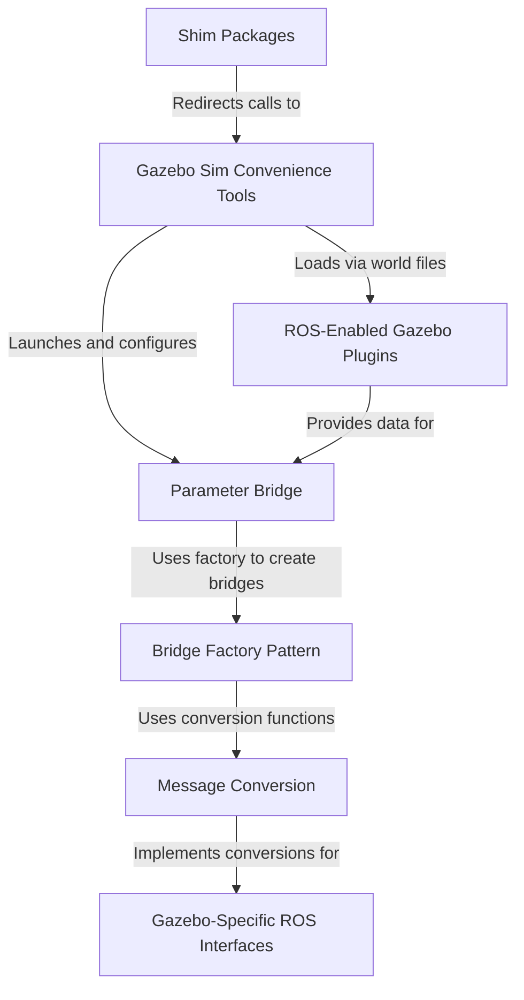

# Tutorial: ros_gz

`ros_gz` is the official project for connecting the **ROS 2** ecosystem with the **Gazebo** simulator (formerly *Ignition*).
It acts as a communication bridge, allowing you to send commands to simulated robots and receive sensor data back into your ROS application.
The core of this is a versatile **Parameter Bridge** that translates messages between the two systems. The project also provides *convenience tools* for easily launching simulations and *specialized plugins* for integrating complex sensors.

**Source Repository:** [None](None)

## Chapters

1. [Gazebo Sim Convenience Tools
](01_gazebo_sim_convenience_tools_.md)
2. [Parameter Bridge
](02_parameter_bridge_.md)
3. [ROS-Enabled Gazebo Plugins
](03_ros_enabled_gazebo_plugins_.md)
4. [Message Conversion
](04_message_conversion_.md)
5. [Gazebo-Specific ROS Interfaces
](05_gazebo_specific_ros_interfaces_.md)
6. [Bridge Factory Pattern
](06_bridge_factory_pattern_.md)
7. [Shim Packages
](07_shim_packages_.md)

---

Generated by [AI Codebase Knowledge Builder](https://github.com/The-Pocket/Tutorial-Codebase-Knowledge)