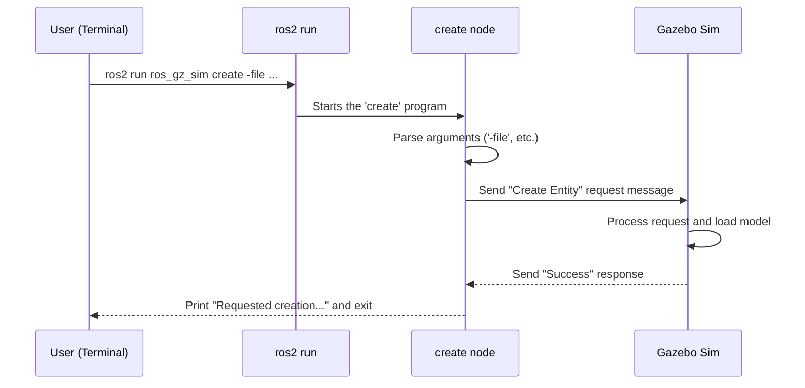

# Chapter 1: Gazebo Sim Convenience Tools

Welcome to the `ros_gz` tutorial series! If you're looking to connect your ROS 2 projects with the powerful Gazebo simulator, you're in the right place. In this first chapter, we'll start with the most fundamental question: "How do I even start Gazebo and add my robot to it from ROS 2?"

Let's imagine you've just bought a complex piece of furniture that needs assembly. It would be frustrating if it didn't come with the right tools! In the world of ROS and Gazebo, the `ros_gz_sim` package is your essential toolbox. It doesn't contain the simulator itself, but it provides the special scripts and programs that make managing the simulator from ROS 2 a breeze.

In this chapter, we'll explore the two most important tools in this toolbox:
1.  **The "Ignition Switch"**: A launch file to start Gazebo Sim from a ROS 2 context.
2.  **The "Model Placer"**: A command-line tool to add objects (like your robot) into the running simulation.

## Starting the Simulator with `gz_sim.launch.py`

In ROS 2, we use `launch` files to start one or more programs (called "nodes") at the same time. The `ros_gz_sim` package gives us a special launch file, `gz_sim.launch.py`, that acts as our "ignition switch" for Gazebo.

Let's try it out! Open a new terminal and run the following command:

```bash
ros2 launch ros_gz_sim gz_sim.launch.py gz_args:="shapes.sdf"
```

**What Happens?**
This command tells ROS 2 to find the `gz_sim.launch.py` file and execute it.
*   The `gz_args:="shapes.sdf"` part is an argument we pass to the launch file.
*   `gz_args` tells Gazebo what "world" file to load. In this case, it's a simple world called `shapes.sdf` that comes with Gazebo.

After a moment, the Gazebo Sim graphical window should appear, showing a few basic shapes on a ground plane.


You've just started the simulator from a ROS 2 command! This is the first and most crucial step in integrating the two systems.

## Adding a Robot with the `create` Executable

Now that our simulation is running, what if we want to add a new object to it, like a robot model? This is where our second tool, the `create` executable, comes in handy. It acts like a "model placer," letting us spawn new things into the world from the command line.

First, let's start an empty world. If your `shapes` world is still running, close it. Then run:

```bash
# This starts Gazebo with a default empty world
ros2 launch ros_gz_sim gz_sim.launch.py
```

Now, open a **second terminal**. We'll use this to tell the running simulation to create a new model.

```bash
ros2 run ros_gz_sim create -world default \
  -file 'https://fuel.ignitionrobotics.org/1.0/openrobotics/models/Gazebo'
```

**What Happens?**
Look at your Gazebo window. You should see the classic "Gazebo" logo model appear in the world!

Let's break down the command:
*   `ros2 run ros_gz_sim create`: This tells ROS 2 to run the executable named `create` from the `ros_gz_sim` package.
*   `-world default`: We specify which world to add the model to. The default empty world is named `default`.
*   `-file '...'`: We provide the model we want to add. This can be a file on your computer or, in this case, a URL to a model hosted on the Gazebo Fuel server (a cloud repository for simulation models).

This `create` tool is incredibly useful for dynamically adding robots or objects to your simulation without having to restart it.

## Under the Hood: How Does it Work?

You've successfully used the tools, but what's happening behind the scenes? Understanding this will help you build more complex systems.

### `gz_sim.launch.py`: A Simple Conductor

When you run `ros2 launch`, you're running a Python script. In a typical ROS 2 project, you might use a launch file to start your robot's driver, a navigation node, and a visualization tool all at once.

The `ros_gz_sim_demos` package has a great example. Let's look at a simplified piece of its `joint_states.launch.py` file.

```python
# Part of a larger launch file

# Find the gz_sim.launch.py file provided by the toolbox package
from launch.actions import IncludeLaunchDescription
from launch.launch_description_sources import PythonLaunchDescriptionSource
from ament_index_python.packages import get_package_share_directory
pkg_ros_gz_sim = get_package_share_directory('ros_gz_sim')

# Define the action to start Gazebo
gazebo = IncludeLaunchDescription(
    PythonLaunchDescriptionSource(
        os.path.join(pkg_ros_gz_sim, 'launch', 'gz_sim.launch.py')
    ),
    # Pass arguments to the launch file
    launch_arguments={'gz_args': '-r empty.sdf'}.items(),
)
```

This code snippet shows how you would use `gz_sim.launch.py` inside your *own* launch file. The `IncludeLaunchDescription` action is like saying, "As part of my launch sequence, please also run this *other* launch file." It's a clean way to start Gazebo alongside all your other ROS 2 nodes.

### The `create` Executable: Sending a Message

The `create` tool is a bit more magical. How does a command in one terminal affect a completely separate program (the Gazebo simulator)? It does so by sending a message over the network.

Here’s a step-by-step breakdown:



1.  **You** run the `ros2 run ... create ...` command.
2.  **ROS 2** finds the `create` program and starts it.
3.  The **`create` node** reads your command-line arguments (`-file`, `-name`, etc.).
4.  It packs this information into a special "Create Entity" request message.
5.  It sends this message to a specific address that **Gazebo Sim** is listening on (e.g., `/world/default/create`).
6.  **Gazebo Sim** receives the message, understands the request, and spawns the model into the simulation.
7.  It sends back a "Success" reply.
8.  The **`create` node** receives the reply, prints a success message to your terminal, and shuts down.

The `create` program is a C++ application that uses ROS 2 to get started but then uses Gazebo's own transport library to talk directly to the simulator. Let's peek at a tiny part of the `create.cpp` code to see how it defines the command-line arguments.

```cpp
// From ros_gz_sim/src/create.cpp

// Define command-line flags that the program will accept
DEFINE_string(world, "", "World name.");
DEFINE_string(file, "", "Load XML from a file.");
DEFINE_string(name, "", "Name for spawned entity.");
DEFINE_double(x, 0, "X component of initial position...");
```

This code uses a library called `gflags` to declare the arguments you used, like `-world` and `-file`. Later, the program reads the values you provided and puts them into that special message sent to Gazebo.

## Conclusion

You've just mastered the first and most important step of using `ros_gz`: controlling the simulation's lifecycle from the ROS 2 ecosystem. You learned that:

*   The `ros_gz_sim` package is a **"toolbox"** with helpful scripts.
*   `ros2 launch ros_gz_sim gz_sim.launch.py` is your **"ignition switch"** to start the simulator.
*   `ros2 run ros_gz_sim create` is your **"model placer"** to spawn robots and objects into a running simulation.

Now that we can start a simulation and put things in it, the next logical step is to get information *out* of it. How do we read sensor data, like a camera image or an IMU reading? For that, we need a way to translate messages between Gazebo and ROS 2.

In the next chapter, we will explore the tool that makes this possible: the [Parameter Bridge](02_parameter_bridge_.md).

---

Generated by [AI Codebase Knowledge Builder](https://github.com/The-Pocket/Tutorial-Codebase-Knowledge)