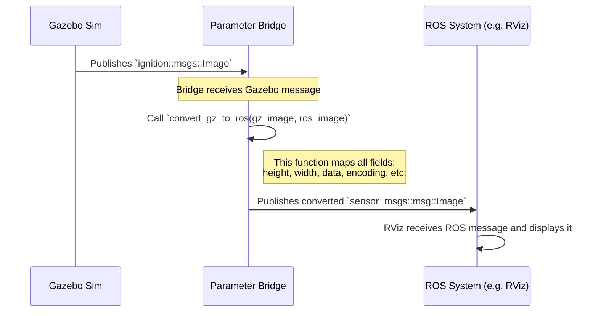

# Chapter 4: Message Conversion

In the last two chapters, we explored two powerful ways to connect ROS 2 and Gazebo: the external [Parameter Bridge](02_parameter_bridge_.md) and the internal [ROS-Enabled Gazebo Plugins](03_ros_enabled_gazebo_plugins_.md). Both methods achieve the same fundamental goal: they allow data to flow between the two systems.

But how does a `sensor_msgs/msg/Image` from ROS 2 actually get turned into an `ignition::msgs::Image` that Gazebo understands? What is the secret sauce that performs this translation?

This chapter dives into the heart of `ros_gz`: the message conversion functions that make all this communication possible.

**Analogy: The Bilingual Dictionary**

Imagine you have two friends, "ROS" who only speaks Spanish, and "Gazebo" who only speaks English. You need to pass a message between them. You could use a simple word-for-word dictionary, but that often loses meaning. For example, "salir" in Spanish can mean "to leave" or "to go out," and the correct translation depends on the context.

The message conversion logic in `ros_gz` is like a very smart, context-aware bilingual dictionary. For every pair of message "phrases" (like a ROS `Image` and a Gazebo `Image`), it has a precise, field-by-field set of rules to ensure the translation is perfect and preserves the original meaning.

## The Core of the Translator: `convert` functions

At its core, the entire translation system is built on a simple pattern. For every pair of ROS and Gazebo messages that can be bridged, there are two C++ functions:

1.  `convert_ros_to_gz()`: Takes a ROS message and fills in the fields of a Gazebo message.
2.  `convert_gz_to_ros()`: Takes a Gazebo message and fills in the fields of a ROS message.

These functions live inside the `ros_gz_bridge` package, in the `src/convert/` directory. Let's look at how they work for a couple of examples.

### A Simple Case: `std_msgs/msg/Bool`

This is one of the simplest possible messages. In ROS, it looks like this:

```
# std_msgs/msg/Bool.msg
bool data
```

In Gazebo, the equivalent is `ignition::msgs::Boolean`, which also just contains a single boolean data field. The conversion is a straightforward, one-to-one copy.

Let's look at the actual C++ code from `ros_gz_bridge/src/convert/std_msgs.cpp`.

**ROS to Gazebo:**
```cpp
// From ros_gz_bridge/src/convert/std_msgs.cpp
template<>
void
convert_ros_to_gz(
  const std_msgs::msg::Bool & ros_msg,
  ignition::msgs::Boolean & gz_msg)
{
  gz_msg.set_data(ros_msg.data);
}
```
*   **What it does:** This function takes a constant ROS message (`ros_msg`) as input and a modifiable Gazebo message (`gz_msg`) as output. It copies the `data` field from the ROS message into the Gazebo message using Gazebo's `set_data()` method.

**Gazebo to ROS:**
```cpp
// From ros_gz_bridge/src/convert/std_msgs.cpp
template<>
void
convert_gz_to_ros(
  const ignition::msgs::Boolean & gz_msg,
  std_msgs::msg::Bool & ros_msg)
{
  ros_msg.data = gz_msg.data();
}
```
*   **What it does:** This function does the exact opposite. It copies the data from the Gazebo message (using `gz_msg.data()`) into the `data` field of the ROS message.

This pair of functions forms the complete "dictionary entry" for the `Bool` message type.

### A More Complex Case: `std_msgs/msg/Header`

Not all translations are this simple. Message fields don't always have the same names or even the same structure. A great example is the `Header` message, which is included in almost every sensor message to provide a timestamp and coordinate frame.

*   The ROS `Header` (`std_msgs/msg/Header`) has a `stamp` and a string field called `frame_id`.
*   The Gazebo `Header` (`ignition::msgs::Header`) has a `stamp`, but it **does not** have a `frame_id` field. Instead, it has a generic list of key-value pairs to store extra metadata.

The conversion functions must handle this structural difference.

**ROS to Gazebo:**
```cpp
// From ros_gz_bridge/src/convert/std_msgs.cpp
template<>
void
convert_ros_to_gz(
  const std_msgs::msg::Header & ros_msg,
  ignition::msgs::Header & gz_msg)
{
  // 1. Convert the timestamp (this calls another convert function!)
  convert_ros_to_gz(ros_msg.stamp, *gz_msg.mutable_stamp());

  // 2. Add a new key-value pair for the frame_id
  auto newPair = gz_msg.add_data();
  newPair->set_key("frame_id");
  newPair->add_value(ros_msg.frame_id);
}
```
*   **What it does:**
    1.  First, it calls *another* conversion function to handle the `stamp` field. This shows how conversions can be built on top of each other.
    2.  It then manually creates a new key-value pair in the Gazebo message's data list. It sets the `key` to the string `"frame_id"` and the `value` to the actual `frame_id` from the ROS message.

**Gazebo to ROS:**
```cpp
// From ros_gz_bridge/src/convert/std_msgs.cpp
template<>
void
convert_gz_to_ros(
  const ignition::msgs::Header & gz_msg,
  std_msgs::msg::Header & ros_msg)
{
  // 1. Convert the timestamp
  convert_gz_to_ros(gz_msg.stamp(), ros_msg.stamp);

  // 2. Search for the 'frame_id' key in the data list
  for (auto i = 0; i < gz_msg.data_size(); ++i) {
    auto aPair = gz_msg.data(i);
    if (aPair.key() == "frame_id" && aPair.value_size() > 0) {
      ros_msg.frame_id = aPair.value(0);
    }
  }
}
```
*   **What it does:**
    1.  Again, it starts by converting the simple `stamp` field.
    2.  It then loops through all the key-value pairs in the Gazebo message's `data` list.
    3.  It checks if any pair has the key `"frame_id"`. If it finds one, it copies that pair's value into the `ros_msg.frame_id` field.

This shows how the conversion functions encode the special rules needed to maintain the meaning of the data across different message structures.

## Under the Hood: Who Calls These Functions?

Now we know what the conversion functions look like, but who uses them? Both the [Parameter Bridge](02_parameter_bridge_.md) and [ROS-Enabled Gazebo Plugins](03_ros_enabled_gazebo_plugins_.md) rely on these functions to do their work.

Let's trace how the [Parameter Bridge](02_parameter_bridge_.md) uses these functions to translate a camera image from Gazebo to ROS.


1.  **Gazebo Sim** publishes an `ignition::msgs::Image`.
2.  The **Parameter Bridge** receives this message on its Gazebo transport subscriber.
3.  Inside the bridge's callback function, it creates an empty `sensor_msgs::msg::Image` and calls `convert_gz_to_ros()`, passing it the Gazebo message it just received and the new empty ROS message.
4.  The `convert_gz_to_ros()` function for `Image` messages (located in `sensor_msgs.cpp`) executes, meticulously copying and translating every field.
5.  Once the function returns, the bridge has a fully populated ROS `Image` message, which it then publishes on its ROS 2 publisher.

The process is the same for ROS-enabled plugins; when they need to publish a ROS message, they first populate a Gazebo message from the simulator's internal state and then call the appropriate `convert_gz_to_ros()` function to create the ROS message they will publish.

## The Dictionary is on Your Bookshelf

You can browse all the available message conversions by looking in the `ros_gz_bridge/src/convert/` directory of the `ros_gz` source code. You'll find files named after the ROS message packages they support:
*   `geometry_msgs.cpp` (for Pose, Twist, Vector3...)
*   `sensor_msgs.cpp` (for Image, Imu, LaserScan...)
*   `nav_msgs.cpp` (for Odometry...)
*   and many more.

If you ever need to bridge a message type that isn't supported yet, this is where you would add your own pair of conversion functions!

## Conclusion

You've now peeked into the engine room of `ros_gz` and seen the fundamental mechanism that powers all communication.

You learned that:
*   **Message Conversion** is the core translation logic, like a bilingual dictionary.
*   It consists of pairs of `convert_ros_to_gz` and `convert_gz_to_ros` C++ functions for each supported message type.
*   These functions handle both simple one-to-one field mapping and complex structural differences between message formats.
*   Both the [Parameter Bridge](02_parameter_bridge_.md) and [ROS-Enabled Gazebo Plugins](03_ros_enabled_gazebo_plugins_.md) use these functions to translate data.

So far, we've talked about converting *standard* ROS messages. But Gazebo has features that don't exist in the standard ROS world, like pausing the simulation, resetting the world, or controlling the user's camera. How do we send commands for these special actions from ROS? For that, we need a special set of ROS messages designed specifically to talk to Gazebo.

In the next chapter, we will explore these with [Gazebo-Specific ROS Interfaces](05_gazebo_specific_ros_interfaces_.md).

---

Generated by [AI Codebase Knowledge Builder](https://github.com/The-Pocket/Tutorial-Codebase-Knowledge)