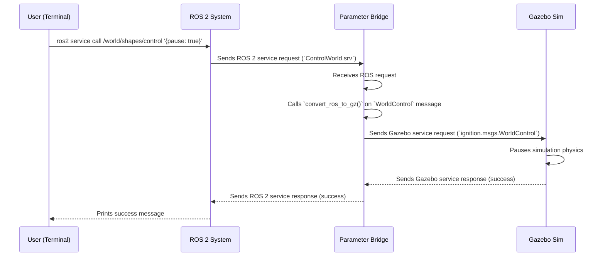

# Chapter 5: Gazebo-Specific ROS Interfaces

In [Chapter 4: Message Conversion](04_message_conversion_.md), we looked into the "bilingual dictionary" that translates messages between ROS 2 and Gazebo. This works wonderfully for concepts that exist in both worlds, like camera images (`sensor_msgs/msg/Image`) or robot poses (`geometry_msgs/msg/Pose`).

But what about concepts that are unique to Gazebo? Think about actions like pausing the simulation, resetting the world to its initial state, or deleting a model. Standard ROS message packages don't have messages for these actions because they are specific to a simulator, not to a physical robot.

How do we give ROS 2 the ability to talk about these Gazebo-specific ideas? We need to invent a new, specialized vocabulary.

**Analogy: Creating a Specialized Vocabulary**

Imagine our "bilingual dictionary" from the last chapter can translate everyday words between English (Gazebo) and Spanish (ROS). But now, we need to discuss a technical topic like "quantum physics." Neither language has a simple, single word for "quantum entanglement." To have a meaningful conversation, we first need to agree on a new term and define it for both speakers.

The `ros_gz_interfaces` package is that agreement. It defines a set of new ROS messages and services that act as a "specialized vocabulary" for controlling and introspecting the Gazebo simulation itself.

## The Problem: How Do You Pause Gazebo from ROS?

Let's take a simple but important use case: pausing the simulation from a ROS 2 command line. This is something you might do to debug your robot's state at a specific moment.

We can't use a standard ROS message. We could try to create a ROS topic named `/pause` and send a `std_msgs/msg/Bool`, but that's clumsy. What if we also want to tell the simulation to advance by exactly 10 steps? A simple boolean can't express that.

We need a richer, more descriptive way to send commands to the simulation world. We need a dedicated interface.

## The Solution: `ros_gz_interfaces`

The `ros_gz_interfaces` package provides exactly this. It's a standard ROS 2 package that contains a collection of custom `.msg` (message) and `.srv` (service) files. These files define the structure for commands and data that are unique to Gazebo.

For our use case of controlling the world, `ros_gz_interfaces` provides:
*   `WorldControl.msg`: A message that can hold instructions like "pause," "step forward N times," or "reset."
*   `ControlWorld.srv`: A service definition that uses `WorldControl.msg` to send a command to Gazebo and get a simple success/failure response back.

Let's look at a simplified version of the service definition file, `ControlWorld.srv`:

```
# The command to send to the world
ros_gz_interfaces/WorldControl world_control
---
# True if the command was received successfully
bool success
```

This defines a classic request/response interaction:
1.  The **request** is a `WorldControl` message containing our desired action (e.g., pause).
2.  The `---` separates the request from the response.
3.  The **response** is a simple boolean indicating if the command was successful.

### A Practical Demonstration

Let's use this service to pause a running simulation.

First, start a Gazebo world. In a **new terminal**, run:
```bash
ros2 launch ros_gz_sim gz_sim.launch.py gz_args:="-r shapes.sdf"
```
The `-r` flag tells Gazebo to start running immediately (not paused). You should see the shapes dropping due to gravity.

Now, we need to create a bridge for the world control service. Gazebo automatically provides a service endpoint for controlling the world. For a world named `shapes`, the Gazebo service is at `/world/shapes/control`.

In a **second terminal**, start the [Parameter Bridge](02_parameter_bridge_.md) to connect this Gazebo service to a ROS 2 service:
```bash
ros2 run ros_gz_bridge parameter_bridge \
  /world/shapes/control@ros_gz_interfaces/srv/ControlWorld
```
This command tells the bridge to create a ROS 2 service named `/world/shapes/control` that is linked to the corresponding Gazebo service.

Finally, in a **third terminal**, call the ROS 2 service to send a "pause" command:
```bash
ros2 service call /world/shapes/control ros_gz_interfaces/srv/ControlWorld "{world_control: {pause: true}}"
```
**What Happens?**
Look at your Gazebo window. The simulation should instantly freeze! You've just used a specialized ROS 2 interface to control the simulator.

Let's break down the command:
*   `ros2 service call`: The standard ROS 2 tool for calling a service.
*   `/world/shapes/control`: The name of the ROS 2 service we created with the bridge.
*   `ros_gz_interfaces/srv/ControlWorld`: The type of the service.
*   `"{...}"`: The actual request message in YAML format. We're creating a `WorldControl` message and setting its `pause` field to `true`.

## Under the Hood: A Simple Vocabulary with a Smart Translator

How does this all fit together? It's a beautiful interplay between the simple `ros_gz_interfaces` package and the powerful [Parameter Bridge](02_parameter_bridge_.md).

1.  **`ros_gz_interfaces`**: This package is just a collection of definitions. It contains no executable code. When you build it, it simply generates the C++ and Python code for the messages so that other ROS nodes can use them. It's the "official ROS-side dictionary" for Gazebo-specific terms.

2.  **`ros_gz_bridge`**: The bridge is what brings these definitions to life. When you ask it to bridge a service of type `ros_gz_interfaces/srv/ControlWorld`, it knows about this "specialized vocabulary" and understands how to translate it to the equivalent Gazebo service call.

The data flow looks like this:


### A Peek at the Code

Just like the standard messages we saw in the [previous chapter](04_message_conversion_.md), these specialized `ros_gz_interfaces` messages also need conversion functions. These functions live in `ros_gz_bridge` and teach the bridge how to translate this new vocabulary.

Here's the conversion function that translates our ROS `WorldControl` message into a Gazebo `WorldControl` message.

```cpp
// From ros_gz_bridge/src/convert/ros_gz_interfaces.cpp
template<>
void
convert_ros_to_gz(
  const ros_gz_interfaces::msg::WorldControl & ros_msg,
  ignition::msgs::WorldControl & gz_msg)
{
  gz_msg.set_pause(ros_msg.pause);
  gz_msg.set_step(ros_msg.step);
  gz_msg.set_multi_step(ros_msg.multi_step);
  // ... and so on for other fields ...
}
```
This function is the heart of the translation. It takes the ROS message you created on the command line and uses it to fill out an equivalent Gazebo message that will be sent to the simulator.

The `ros_gz_interfaces` package provides a whole suite of these specialized messages and services for things like:
*   `SpawnEntity`: Create a new model in the world (this is what the `create` tool from Chapter 1 uses!).
*   `DeleteEntity`: Remove a model from the world.
*   `SetEntityPose`: Teleport a model to a new position and orientation.
*   `Contacts`: Get information about which objects are currently colliding.

## Conclusion

You've now learned how `ros_gz` allows ROS 2 to communicate about concepts that are unique to the simulator.

You learned that:
*   The `ros_gz_interfaces` package provides a **"specialized vocabulary"** of custom ROS messages and services for controlling Gazebo.
*   This avoids misusing standard ROS messages and provides clear, dedicated interfaces for simulation control.
*   You can use these interfaces from the ROS command line (e.g., `ros2 service call`) to directly manipulate the simulation.
*   The [Parameter Bridge](02_parameter_bridge_.md) can bridge these custom services, using special conversion functions to translate between the ROS and Gazebo versions of the requests.

We've seen that the Parameter Bridge can connect an amazing variety of topics and services, both standard and custom. But how does one program, `parameter_bridge`, know how to handle all these different message types based on a simple string argument like `TOPIC@ROS_TYPE@GZ_TYPE`?

In the next chapter, we'll dive into the clever software design pattern that makes this possible: the [Bridge Factory Pattern](06_bridge_factory_pattern_.md).

---

Generated by [AI Codebase Knowledge Builder](https://github.com/The-Pocket/Tutorial-Codebase-Knowledge)