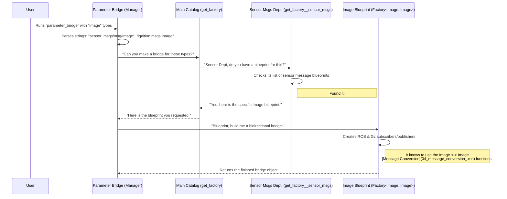

# Chapter 6: Bridge Factory Pattern

In our journey so far, we've seen how the [Parameter Bridge](02_parameter_bridge_.md) is a powerful tool for connecting ROS 2 and Gazebo. We've used it to bridge everything from camera images to specialized commands from [Gazebo-Specific ROS Interfaces](05_gazebo_specific_ros_interfaces_.md).

This raises a crucial question: how can one single program, `parameter_bridge`, be so smart? How does it know how to handle all these different message types—`Image`, `Pose`, `WorldControl`, and more—based on a simple string you give it on the command line? If it were just a giant list of `if/else` statements, adding new message types would be a nightmare!

The answer lies in a clever and powerful software design choice: the **Bridge Factory Pattern**.

**Analogy: The 3D Printing Factory**

Imagine you have a high-tech 3D printing factory. Customers can upload any blueprint file they want, and your factory can produce the object. The factory doesn't have a single machine that knows how to build everything. Instead, it has an "assembly line manager" and a library of blueprints.

1.  **The Order:** A customer submits an order: "I want to print `robot_arm.stl`."
2.  **The Manager:** The factory manager (our `parameter_bridge` executable) receives the order. It doesn't know how to build a robot arm itself.
3.  **The Blueprint Library:** The manager goes to a large library of blueprints (`factories.cpp`). It searches for `robot_arm.stl`.
4.  **The Blueprint:** When it finds the matching blueprint (a `Factory` template), that blueprint contains all the specific instructions: "use PLA plastic, set the nozzle to 210°C, build layer by layer this way..."
5.  **Construction:** The manager gives this specific blueprint to an assembly station, which follows the instructions to create the final product (the actual bridge with its publishers and subscribers).

The Bridge Factory Pattern works exactly like this. It makes the `parameter_bridge` incredibly flexible and easy to extend without changing its core logic.

## The Problem: A Rigid, Monolithic Bridge

Let's imagine how we *could* have built the parameter bridge without a factory pattern. The main program might look something like this:

```cpp
// A BAD, hypothetical design
void main(int argc, char **argv) {
  // ...
  std::string ros_type = parse_ros_type(argv[1]);
  std::string gz_type = parse_gz_type(argv[1]);

  if (ros_type == "sensor_msgs/msg/Image") {
    // Create an Image bridge...
  } else if (ros_type == "geometry_msgs/msg/Twist") {
    // Create a Twist bridge...
  } else if (ros_type == "...") {
    // ... endless list of types ...
  }
}
```

This is terrible! Every time we want to support a new message type, we would have to come back and edit this one central file. It's not modular or scalable.

## The Solution: A Factory for Bridges

The Bridge Factory Pattern solves this by separating the "request" from the "construction." The `parameter_bridge` executable only knows how to *request* a bridge; the specialized factory objects know how to *build* it.

The user's experience is still simple. They just run the command:

```bash
ros2 run ros_gz_bridge parameter_bridge \
  /camera/image@sensor_msgs/msg/Image@ignition.msgs.Image
```
This command is the "order form" sent to our factory. Behind the scenes, a powerful system springs into action.

## Under the Hood: The Assembly Line in Action

Let's trace how an order for a `sensor_msgs/msg/Image` bridge is processed by the factory.



### A Peek at the Code

Let's look at the C++ files that implement this factory.

**1. The "Main Catalog" (`factories.cpp`)**

This file contains the main `get_factory` function. It's like the main office of our factory. It doesn't know details; it just delegates the request to different "departments."

```cpp
// Simplified from ros_gz_bridge/src/factories.cpp
std::shared_ptr<FactoryInterface>
get_factory_impl(
  const std::string & ros_type_name,
  const std::string & gz_type_name)
{
  std::shared_ptr<FactoryInterface> impl;

  // Ask the geometry department
  impl = get_factory__geometry_msgs(ros_type_name, gz_type_name);
  if (impl) {return impl;}

  // Ask the sensor department
  impl = get_factory__sensor_msgs(ros_type_name, gz_type_name);
  if (impl) {return impl;}

  // ... ask other departments ...
  return nullptr;
}
```
This function tries each department one by one. If the `sensor_msgs` department finds a match, it returns a valid "blueprint" (`impl`), and the search stops.

**2. A "Department Catalog" (`factories/sensor_msgs.cpp`)**

This is where the specific blueprints for a category of messages live. It checks the string names to find the exact match.

```cpp
// Simplified from ros_gz_bridge/src/factories/sensor_msgs.cpp
std::shared_ptr<FactoryInterface>
get_factory__sensor_msgs(
  const std::string & ros_type_name,
  const std::string & gz_type_name)
{
  if (ros_type_name == "sensor_msgs/msg/Image" && /* ... */)
  {
    // Found it! Create and return the Image blueprint.
    return std::make_shared<
      Factory<
        sensor_msgs::msg::Image,
        ignition::msgs::Image
      >
    >("sensor_msgs/msg/Image", gz_type_name);
  }
  // ... check for LaserScan, Imu, etc. ...
  return nullptr;
}
```
This is the key step! When it finds a match for the "Image" message strings, it creates a very specific object: `Factory<sensor_msgs::msg::Image, ignition::msgs::Image>`.

**3. The "Blueprint" (`factory.hpp`)**

The `Factory<RosMsg, GzMsg>` is a C++ class template. It's a generic blueprint for creating bridges. When we create an instance like `Factory<sensor_msgs::msg::Image, ignition::msgs::Image>`, C++ generates a specialized version of this class that *only* knows how to work with `Image` messages.

This specialized factory object has all the necessary tools built-in. It knows:
*   Which ROS subscriber and publisher types to create.
*   Which Gazebo subscriber and publisher types to create.
*   Which specific [Message Conversion](04_message_conversion_.md) functions (`convert_ros_to_gz` for `Image`, `convert_gz_to_ros` for `Image`) to call when a message arrives.

This is the power of the pattern: the main `parameter_bridge` program is completely decoupled from the details of any specific message. It just needs to find the right blueprint and tell it to get to work.

## Conclusion

You've just learned about the elegant software architecture that makes `ros_gz` so flexible and powerful. The **Bridge Factory Pattern** is the "assembly line" that dynamically builds bridges on demand.

You learned that:
*   It solves the problem of creating a modular and extensible `parameter_bridge`.
*   The `parameter_bridge` executable acts as a "factory manager," taking orders from the user.
*   It uses a "catalog" of "blueprints" (`Factory` templates) to find the right instructions for building a specific bridge.
*   This design makes it easy to add support for new message types by simply adding a new blueprint, without modifying the core bridging logic.

The `ros_gz_bridge` package already comes with blueprints for a huge number of standard ROS messages. But what if you have a custom project with your own unique messages, and you can't (or don't want to) modify the `ros_gz_bridge` source code to add your new blueprint? Is there a way to provide your own blueprints from a completely separate package? Yes, there is!

In the next chapter, we'll explore how to do exactly that using [Shim Packages](07_shim_packages_.md).

---

Generated by [AI Codebase Knowledge Builder](https://github.com/The-Pocket/Tutorial-Codebase-Knowledge)