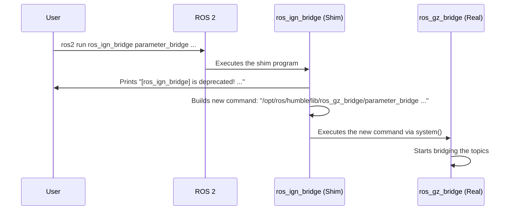

# Chapter 7: Shim Packages

In our previous chapter on the [Bridge Factory Pattern](06_bridge_factory_pattern_.md), we saw how `ros_gz` uses a clever design to make the `parameter_bridge` flexible and easy to extend. This chapter deals with a different kind of problem: not how to extend functionality, but how to handle change and maintain backward compatibility.

You may have heard that the Gazebo simulator was once called "Ignition." This wasn't just a name change; it meant that all the ROS integration packages were renamed too, from `ros_ign_*` to `ros_gz_*`. What happens to all the old tutorials, projects, and habits that still use the `ros_ign_` names? This is where Shim Packages come to the rescue.

**Analogy: The Mail Forwarding Service**

Imagine you move to a new house. For a while, some of your mail will still be sent to your old address. If you do nothing, you'll miss important letters. The smart solution is to set up a mail forwarding service.

For a few months, the post office will:
1.  Intercept any mail sent to your old address.
2.  Put a little yellow sticker on it saying, "This person has moved, please use their new address in the future!"
3.  Forward the mail to your new address so you still receive it.

Shim packages are the `ros_gz` project's "mail forwarding service." They ensure that commands sent to the old `ros_ign_*` "addresses" are not lost and are safely redirected to their new `ros_gz_*` homes.

## The Problem: Broken Tutorials and Old Habits

Imagine you find an excellent online tutorial for a robot simulation. It's a year old, and it tells you to run this command to start a camera demo:

`ros2 launch ros_ign_gazebo_demos camera.launch.py`

If the `ros_ign_gazebo_demos` package doesn't exist anymore, this command will simply fail with a "package not found" error. This is incredibly frustrating for newcomers and breaks existing projects that depend on the old names.

## The Solution: A "Forwarding Address" Package

The `ros_gz_shims` packages solve this problem perfectly. These are lightweight packages that have the old names, like `ros_ign_bridge`, `ros_ign_gazebo`, and `ros_ign_gazebo_demos`.

When you try to use one of these old packages, the shim does two things:
1.  **It prints a friendly warning message** to your terminal, telling you that this name is "deprecated" (outdated) and you should use the new `ros_gz_*` name instead.
2.  **It automatically forwards your command** to the correct new `ros_gz_*` package, passing along all of your arguments.

This means your old command *just works*, while also teaching you the new, correct way to do things.

### A Practical Demonstration

Let's try it out. Make sure you have the `ros_gz` packages installed, including the shims.

In a new terminal, let's try to run the parameter bridge using its **old name**:
```bash
ros2 run ros_ign_bridge parameter_bridge /clock@rosgraph_msgs/msg/Clock@ignition.msgs.Clock
```

**What Happens?**
You will see two things in your terminal. First, a warning message:
```
[ros_ign_bridge] is deprecated! Redirecting to use [ros_gz_bridge] instead!
```

Second, the `parameter_bridge` will start up and run exactly as you expect, bridging the `/clock` topic. The shim package successfully caught the call, printed the warning, and then forwarded your command to the real `ros_gz_bridge` executable.

The same magic works for launch files. If you run the old camera demo command:
```bash
ros2 launch ros_ign_gazebo_demos camera.launch.py
```

You'll see a similar warning, and then the Gazebo camera demo will launch successfully because the shim package redirected the call to `ros_gz_sim_demos`.

## Under the Hood: How the Redirection Works

The "forwarding" mechanism is surprisingly simple and effective. It's implemented slightly differently for executables (like `parameter_bridge`) and for launch files.

Let's trace what happens when you run `ros2 run ros_ign_bridge ...`:



### The C++ Shim Executable

The `ros_ign_bridge` package contains a tiny C++ program that gets executed instead of the real bridge. Let's look at a simplified version of its code.

```cpp
// Simplified from ros_gz_shims/ros_ign_bridge/src/parameter_bridge_shim.cpp
int main(int argc, char * argv[])
{
  // 1. Build the full path to the REAL executable
  std::stringstream cli_call;
  cli_call << ament_index_cpp::get_package_prefix("ros_gz_bridge")
           << "/lib/ros_gz_bridge/parameter_bridge";

  // 2. Add all the user's arguments to the command
  for (int i = 1; i < argc; i++)
    cli_call << " " << argv[i];

  // 3. Print the deprecation warning
  std::cerr << "[ros_ign_bridge] is deprecated! ..." << std::endl;
  
  // 4. Execute the new command
  system(cli_call.str().c_str());

  return 0;
}
```
1.  It uses an `ament` function to find the installation path of the *new* `ros_gz_bridge` package and builds the full path to the real `parameter_bridge` executable.
2.  It loops through all the command-line arguments you provided (`argv`) and appends them to the new command.
3.  It prints the helpful warning message to the console.
4.  It uses the standard C++ `system()` function to execute the command string it just built.

### The Python Shim Launch File

The redirection for launch files is even simpler. The `ros_ign_gazebo_demos` package contains a `camera.launch.py` file, but it's just a pass-through.

```python
# Simplified from ros_gz_shims/ros_ign_gazebo_demos/launch/camera.launch.py
def generate_launch_description():
    # 1. Print the warning
    print("ros_ign_gazebo_demos is deprecated! Please use ros_gz_sim_demos instead!")

    # 2. Find the REAL launch file's package
    pkg_ros_gz_sim_demos = get_package_share_directory('ros_gz_sim_demos')

    # 3. Include and run the REAL launch file
    return LaunchDescription([
        IncludeLaunchDescription(
            PythonLaunchDescriptionSource(
                os.path.join(pkg_ros_gz_sim_demos, 'launch', 'camera.launch.py')),
        )
    ])
```
1.  It prints a deprecation warning to the console.
2.  It finds the location of the *new* `ros_gz_sim_demos` package.
3.  It uses ROS 2's `IncludeLaunchDescription` action to simply execute the `camera.launch.py` file from within that new package.

## Conclusion

Congratulations on completing the `ros_gz` tutorial series! You've just learned about the final piece of the puzzle: **Shim Packages**. These packages are a thoughtful piece of engineering that ensures a smooth transition for the entire community.

You learned that:
*   Shim packages act as a **"mail forwarding service"** to handle the rebranding from "Ignition" to "Gazebo."
*   They provide **backward compatibility** for old tutorials, code, and launch files that use the `ros_ign_*` names.
*   They work by intercepting calls to old packages, printing a **deprecation warning**, and **redirecting the command** to the new `ros_gz_*` equivalent.

Throughout this series, you've journeyed from the basics of starting a simulation with [Gazebo Sim Convenience Tools](01_gazebo_sim_convenience_tools_.md) to streaming data with the [Parameter Bridge](02_parameter_bridge_.md) and creating high-performance [ROS-Enabled Gazebo Plugins](03_ros_enabled_gazebo_plugins_.md). You've also looked under the hood at the core mechanics of [Message Conversion](04_message_conversion_.md), the powerful [Bridge Factory Pattern](06_bridge_factory_pattern_.md), and the specialized vocabulary of [Gazebo-Specific ROS Interfaces](05_gazebo_specific_ros_interfaces_.md).

You are now well-equipped with the knowledge to build amazing robotics applications by integrating the power of ROS 2 with the high-fidelity physics of Gazebo. Happy simulating

---

Generated by [AI Codebase Knowledge Builder](https://github.com/The-Pocket/Tutorial-Codebase-Knowledge)