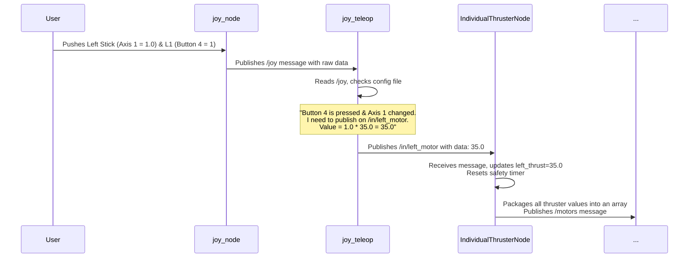

# Chapter 1: Teleoperation Control Flow

Welcome to the `usv_can` project! If you've ever wondered how moving a joystick on a game controller can make a real-world vehicle move, you're in the right place. This chapter will demystify that process from start to finish.

Our main goal is simple: **drive our Unmanned Surface Vehicle (USV) using a joystick.**

This isn't a single, magical step. Instead, it's a chain of simple, logical events, like a well-organized assembly line. Each station in the line has one specific job to do. We can visualize this "chain of command" like this:

`Joystick Input` -> `Interpreter` -> `Commander` -> `Final Motor Message`

In this chapter, we'll walk through this entire data pathway, showing how each piece of software contributes to turning your thumb movement into a command for the vehicle's thrusters.

### The Big Picture: A Data Flowchart

Before we dive into the details, let's look at a map of the journey our data will take. In the world of ROS2 (the software framework we're using), different programs called "nodes" talk to each other using "topics," which are like public announcement channels.

Here is the path from your joystick to the final command:

```mermaid
graph TD
    A[🎮<br>Joystick] --> B(joy_node);
    B --> C[/joy <br><i>Topic</i>];
    C --> D(joy_teleop);
    D --> E[/in/left_motor <br>/in/right_motor <br><i>Topics</i>];
    E --> F(IndividualThrusterNode);
    F --> G[/motors <br><i>Topic</i>];
    G --> H(...to the hardware);

    style A fill:#f9f,stroke:#333,stroke-width:2px
    style H fill:#d3d3d3,stroke:#333,stroke-width:2px
```

This diagram shows three key software nodes that we will explore:
1.  `joy_node`: Listens to the physical joystick.
2.  `joy_teleop`: Interprets the joystick's signals.
3.  `IndividualThrusterNode`: Commands the thrusters based on the interpretation.

Let's look at each step one by one.

### Step 1: Listening to the Joystick (`joy_node`)

A joystick, at its core, is a simple device. When you press a button or move a stick, it just sends out a stream of numbers like "Button 5 is now pressed" or "Axis 1 is at a value of 0.87". It doesn't know what "forward" or "turn left" means.

The `joy_node` is a standard ROS2 tool whose only job is to listen to these raw signals from the joystick device connected to your computer. It then broadcasts these raw numbers on a topic named `/joy` for any other node to hear.

We start this node in our launch file, which is used to run multiple nodes at once.

**File:** `launch/usv_joy_teleop.py`
```python
# ... other code ...
ld.add_action(launch_ros.actions.Node(
    package='joy',
    executable='joy_node',
    parameters=[joy_params_file],
))
# ... other code ...
```
This small block of code simply says, "Start the `joy_node` program." Now, whenever you use the joystick, its raw data is flying around our system on the `/joy` topic.

### Step 2: Interpreting the Signals (`joy_teleop`)

Raw numbers like "Axis 1" aren't very useful for controlling a vehicle. We need an interpreter that can translate them into meaningful commands. This is the job of the `joy_teleop` node.

This node subscribes to the `/joy` topic, listens to the raw data, and uses a configuration file to translate it. Think of this configuration file as a "translation dictionary."

Let's look at a piece of our dictionary.

**File:** `config/vtec_s3_can.yaml`
```yaml
left_thrust:
  type: topic
  topic_name: in/left_motor 
  deadman_buttons: [4]
  axis_mappings:
    data:
      axis: 1
      scale: 35.0
      offset: 0
```
This looks complex, but it's quite simple when you break it down:
*   `topic_name: in/left_motor`: When this action is triggered, send a command on the `/in/left_motor` topic.
*   `deadman_buttons: [4]`: This is a safety feature! The action only works if "Button 4" (the L1 shoulder button on our controller) is being held down. If you let go, the commands stop.
*   `axis: 1`: The value for this command should come from "Axis 1" (the left joystick's vertical movement).
*   `scale: 35.0`: The joystick axis gives a value from -1.0 to 1.0. We multiply that value by 35.0 to get our desired command strength.

So, in plain English, this configuration tells `joy_teleop`: "If the L1 button is held down, read the value from the left vertical stick, multiply it by 35, and publish the result on the `/in/left_motor` topic."

Now we have meaningful commands like "left motor thrust is 35.0" being broadcast!

### Step 3: Commanding the Thrusters (`IndividualThrusterNode`)

We're on the final step of our software chain! The `IndividualThrusterNode` is a custom node written specifically for our vehicle. Its job is to listen for the simple, meaningful commands from `joy_teleop` and package them into a final message ready for the hardware.

It has two main responsibilities:

#### 1. Applying Safety Logic

What happens if your joystick runs out of battery or you walk out of range? The `joy_teleop` node would stop sending commands. The `IndividualThrusterNode` needs to handle this gracefully.

It contains a safety timer. If it doesn't receive a new command within a short period (e.g., 250 milliseconds), it assumes the connection is lost and automatically sets the thruster speeds to zero. This prevents the USV from running away uncontrollably!

**File:** `src/individual_thrusters_node.cpp`
```cpp
void IndividualThrusterNode::update_thrust(){
    // Calculate the time since the last message was received
    rclcpp::Duration diff = this->now() - last_recev;
    int elapsed_ms = diff.nanoseconds() / 1000000;

    // If it's been too long, stop the thrusters
    if(elapsed_ms > 250){
        left_thrust = 0;
        right_thrust = 0;
    }
    // ... more code to publish commands
}
```
This function continuously checks how long it's been since the last command. If the time is too great, it overrides any previous command and stops the vehicle.

#### 2. Formatting the Final Message

This node listens to multiple topics (like `/in/left_motor` and `/in/right_motor`), collects all the latest values, and bundles them into a single array message. This array contains the final values for *all* the thrusters on the vehicle in the exact order the hardware expects.

**File:** `src/individual_thrusters_node.cpp`
```cpp
// Inside the update_thrust() function...
std_msgs::msg::Float32MultiArray msg;
msg.data = std::vector<float>{
    static_cast<float>(left_thrust), 
    static_cast<float>(left_thrust),
    // ... other thrusters ...
    static_cast<float>(-right_thrust), 
    static_cast<float>(-right_thrust),
    };

motorPub->publish(msg);
```
This code creates an array, fills it with the current thrust values, and publishes it on the `/motors` topic. This is the final output of our teleoperation control flow.

### Tying It All Together

Let's review the full sequence of events with a simple example: **You hold the L1 button and push the left joystick fully forward.**


And just like that, a physical action on a controller has been translated, checked for safety, and formatted into a precise digital command, ready to be sent to the vehicle's hardware.

### Conclusion

In this chapter, we unpacked the journey of a command from a user's joystick to a final, hardware-ready ROS2 message. We saw how a "chain of command" architecture, using specialized nodes like `joy_node`, `joy_teleop`, and our custom `IndividualThrusterNode`, breaks a complex problem into simple, manageable steps.

We now have a clean `/motors` topic that represents our desired vehicle movement. But how does this message actually make the motors spin? That requires communicating with the hardware over a different system called a CAN bus.

In the next chapter, we'll zoom out and look at how all the different nodes in our system, including those for CAN communication, are launched and organized.

Next: [ROS2 Node Orchestration](02_ros2_node_orchestration_.md)

---

Generated by [AI Codebase Knowledge Builder](https://github.com/The-Pocket/Tutorial-Codebase-Knowledge)