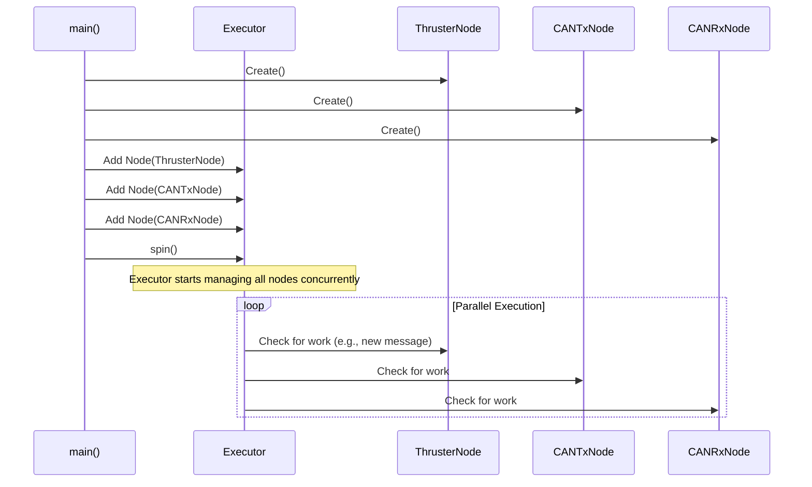

# Chapter 2: ROS2 Node Orchestration

In the [previous chapter](01_teleoperation_control_flow_.md), we followed the journey of a joystick command through a chain of ROS2 nodes. We ended with the `IndividualThrusterNode`, which prepared a final motor command.

But a single musician, no matter how talented, can't perform a symphony alone. Our `IndividualThrusterNode` needs to work together with other nodes that handle the low-level hardware communication. How do we get all these separate programs to run at the same time and work in harmony?

This is where orchestration comes in.

### The Conductor and the Orchestra

Imagine a symphony orchestra. You have violinists, cellists, and percussionists. Each is an expert at their own instrument. But without a conductor, you'd just have a lot of noise. The conductor doesn't play an instrument; their job is to start everyone at the same time, keep them in sync, and make sure they play together beautifully.

In our project, the `can_node.cpp` file is our **conductor**.

The individual ROS2 nodes are our **musicians**:
*   `IndividualThrusterNode`: The thruster section, deciding what commands to play.
*   `CANTxNode`: The messenger, responsible for *sending* our commands to the hardware.
*   `CANRxNode`: The listener, responsible for *receiving* status updates (like battery voltage) from the hardware.

The `can_node.cpp` program doesn't calculate thruster values or send hardware messages itself. Its only job is to bring all the "musician" nodes to life and hand them over to a manager that ensures they can all run concurrently.

### The Conductor's Score: `can_node.cpp`

Let's look at the `main` function inside `can_node.cpp`. This is the "score" our conductor follows to set up the entire performance. We'll break it down piece by piece.

#### Step 1: Initializing ROS2

```cpp
// File: src/can_node.cpp
#include "rclcpp/rclcpp.hpp"
// ... other includes

int main(int argc, char **argv) {
  rclcpp::init(argc, argv);
  // ...
}
```
Every ROS2 program must start with this line. Think of it as the conductor walking up to the podium and tapping the music stand. It initializes the ROS2 communication system so our nodes can talk to each other.

#### Step 2: Creating the Musicians (Nodes)

Next, the conductor brings each musician onto the stage by creating them.

```cpp
// File: src/can_node.cpp

// Create the node that SENDS messages to the CAN bus
auto txNode = std::make_shared<CANTxNode>(handler);

// Create the node that RECEIVES messages from the CAN bus
auto rxNode = std::make_shared<CANRxNode>(handler);

// Create the node that processes joystick commands
auto thrusterNode = std::make_shared<IndividualThrusterNode>();
```
Here, we create an instance of each of our three nodes. The `std::make_shared` is just a safe, modern C++ way to create objects. We now have our three "musicians" ready to go, but they aren't playing yet.

#### Step 3: Hiring a Stage Manager (The Executor)

The conductor needs help managing all the musicians simultaneously. They hire a "stage manager" called an **Executor**. In ROS2, an executor's job is to manage the work for one or more nodes. We use a special kind called a `MultiThreadedExecutor`.

```cpp
// File: src/can_node.cpp

rclcpp::executors::MultiThreadedExecutor executor;
```
The "Multi-Threaded" part is key. It means this stage manager is skilled enough to let all our musicians play their parts *at the same time* without getting in each other's way.

#### Step 4: Putting the Musicians on Stage

Now, the conductor tells the stage manager which musicians are part of today's performance.

```cpp
// File: src/can_node.cpp

executor.add_node(txNode);
executor.add_node(rxNode);
executor.add_node(thrusterNode);
```
We are adding each node we created into the executor's list of things to manage.

#### Step 5: "And... Begin!"

Finally, the conductor gives the signal to start the music.

```cpp
// File: src/can_node.cpp

executor.spin();
rclcpp::shutdown();
```
The `executor.spin()` command is the most important part. It essentially says, "Start managing all the nodes you have, and keep doing it forever." This single line kicks everything off. The program will stay on this line, and the executor will juggle all the nodes, letting them respond to messages and timers as needed. `rclcpp::shutdown()` is just a cleanup step for when the program eventually closes.

### How It Works Under the Hood

So what does the `MultiThreadedExecutor` actually do when it "spins"? It creates a pool of workers (threads) and assigns nodes their own worker. This allows all the nodes to operate in parallel.

Let's visualize the structure:

```mermaid
graph TD
    A[can_node Executable] --> B{main() function};
    B --> C(MultiThreadedExecutor);
    C --> D(CANTxNode);
    C --> E(CANRxNode);
    C --> F(IndividualThrusterNode);

    style A fill:#d3d3d3,stroke:#333,stroke-width:2px
    style C fill:#cde4ff,stroke:#333,stroke-width:2px
```

This setup is incredibly powerful. Imagine you're driving the USV forward.

1.  The `IndividualThrusterNode` is busy listening for your joystick commands on the `/in/left_motor` topic.
2.  At the *exact same time*, the `CANRxNode` might receive a message from the hardware saying, "The battery is at 75%".
3.  And at the *exact same time*, the `CANTxNode` could be sending the previous motor command you issued.

Because they are all running in parallel thanks to the orchestrator, none of them has to wait for another to finish. This makes our system highly responsive and efficient.

Here's a simplified sequence of what happens at startup:



### Conclusion

In this chapter, we learned that a ROS2 application is often more like an orchestra than a solo performance. We saw that `can_node.cpp` acts as the **conductor**, responsible for creating all the necessary nodes and handing them over to a `MultiThreadedExecutor`. This executor then acts as a "stage manager," allowing all our nodes to run in parallel, each focusing on its specific task.

This separation of concerns—where each node has one job and an orchestrator manages them—is a fundamental concept in building robust and complex robotics systems.

Now that we understand how our nodes are launched and managed, we need to understand the language they speak to the hardware. The thruster commands and battery statuses aren't sent as plain numbers; they are encoded into a specific format.

Next, we will dive into this format in [CAN Message Protocol & Serialization](03_can_message_protocol___serialization_.md).

---

Generated by [AI Codebase Knowledge Builder](https://github.com/The-Pocket/Tutorial-Codebase-Knowledge)