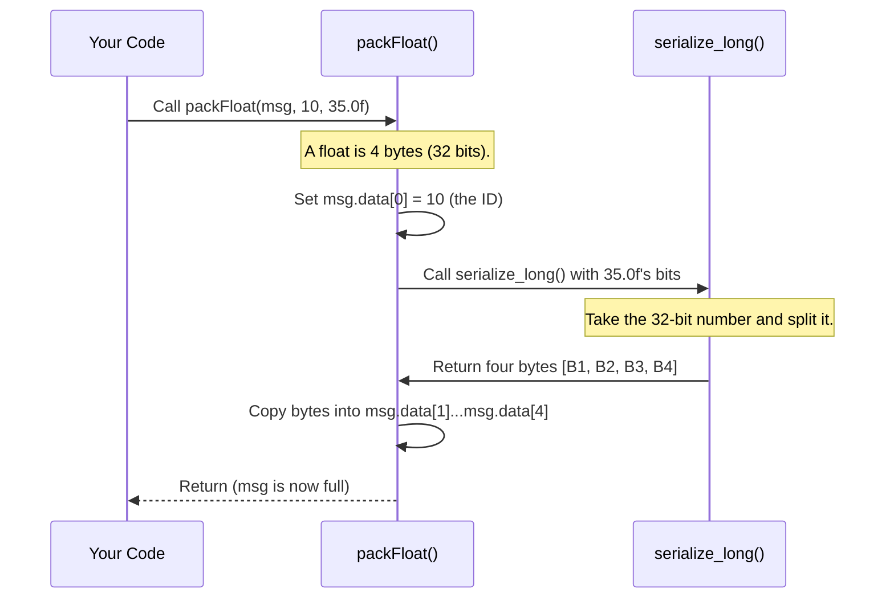

# Chapter 3: CAN Message Protocol & Serialization

In the [previous chapter](02_ros2_node_orchestration_.md), we learned how to launch and manage all our ROS2 nodes like a conductor leading an orchestra. Our system is running, and the `IndividualThrusterNode` is ready to issue commands.

But now we face a new challenge: a language barrier. The ROS2 nodes on our powerful main computer speak in rich, high-level data types like floating-point numbers (`float`). The simple microcontrollers on our thrusters, however, only understand raw binary data—a stream of bytes.

How do we translate a command like "set motor speed to `35.0`" into a format the hardware can understand? This chapter is all about the "language" and "translation dictionary" we use to bridge this gap.

### The Problem: Speaking to Simple Hardware

Imagine trying to send a detailed message to someone who can only receive tiny postcards, and they only understand a secret code. This is exactly the situation we're in.

*   **The Main Computer (ROS2):** A fluent speaker, who wants to send the message "Set the left motor speed to positive 35.0".
*   **The Thruster Microcontroller:** A simple device that can only read a short stream of 8-bit numbers (bytes). It has no idea what a "float" is.
*   **The CAN Bus:** The postal service, which only accepts tiny "postcards" called CAN frames. Each frame can only carry a maximum of 8 bytes of data.

To make this work, we need a strict set of rules—a **protocol**—that both sides agree on.

### Our Protocol: A Simple Set of Rules

Our protocol is a simple agreement on how to structure our tiny messages. Think of it like a form you have to fill out for every message:

1.  **The First Byte is the ID:** The very first byte of our message will always be a unique number that identifies the *type* of data being sent. For example, `ID=10` might mean "This is a left motor speed command," while `ID=20` could mean "This is a battery voltage update."
2.  **The Rest of the Bytes are the Data:** The bytes that follow the ID contain the actual value we want to send.

This structure is simple and effective. When a microcontroller receives a message, it first looks at the ID to understand the context, then it reads the following bytes to get the value.

```mermaid
graph TD
    subgraph CAN Message (5 Bytes)
        direction LR
        A[Byte 0: ID] --> B[Byte 1];
        B --> C[Byte 2];
        C --> D[Byte 3];
        D --> E[Byte 4];
        subgraph Data (4 Bytes)
            direction LR
            B -- value --- E
        end
    end

    style A fill:#cde4ff
```

### Serialization: Packing Our Data

Now for the tricky part. How do we fit a `float` like `35.0` into those four data bytes? This process is called **serialization**. It means converting a complex data type into a series of bytes for transmission.

Think of it as disassembling a toy car to fit it into a small box. You take it apart into its fundamental pieces (bytes).

Our project uses a library called `Vanttec_CANLib` that provides simple helper functions to do this for us. Let's see how to pack a `float`.

**Use Case: Sending a Motor Command**

Imagine our [CAN Transmit Node (CANTxNode)](04_can_transmit_node__cantxnode__.md) needs to send the command `35.0` for the left motor, which we've assigned `ID=10`.

```cpp
#include "Vanttec_CANLib/CANMessage.h"

// 1. Create a "blank postcard"
vanttec::CANMessage msg;

// 2. Define our command
uint8_t motor_id = 10;
float motor_speed = 35.0f;

// 3. "Serialize" the data into the message
vanttec::packFloat(msg, motor_id, motor_speed);
```
That's it! The `packFloat` function handles all the complex work. After this code runs, our `msg` object now contains a sequence of 5 bytes ready to be sent over the CAN bus. The first byte will be `10`, and the next four will be the special byte representation of `35.0f`.

### Deserialization: Unpacking the Data

When a message arrives at its destination (either the main computer or a microcontroller), it's just a sequence of bytes. The receiver needs to perform the reverse process: **deserialization**.

This is like re-assembling the toy car from the pieces in the box. You take the raw bytes and convert them back into a meaningful `float`.

Our library provides a helper for this, too.

**Use Case: Receiving a Sensor Reading**

Imagine our [CAN Receive Node (CANRxNode)](05_can_receive_node__canrxnode__.md) receives a 5-byte message from a sensor. It needs to decode it.

```cpp
#include "Vanttec_CANLib/CANMessage.h"

// Assume 'received_msg' is a CANMessage we got from the hardware
vanttec::CANMessage received_msg; 
// received_msg.data contains [ID, byte1, byte2, byte3, byte4]

// 1. "Deserialize" the data to get the float value
float sensor_value = vanttec::getFloat(received_msg);

// 2. We can also get the ID to know what this value means
uint8_t msg_id = vanttec::getId(received_msg);
```
The `getFloat` function reads bytes 1 through 4 of the message, performs the magic to reconstruct the `float`, and returns it. Now we have our original number back, perfectly preserved.

### Under the Hood: How Does It Actually Work?

You don't need to know the fine details to use the library, but understanding the basics is helpful. Let's trace how `packFloat` works.

The core idea is that a `float` in C++ is already stored in the computer's memory as 32 bits (which is 4 bytes) according to a standard called IEEE 754. Serialization is just the process of copying those four bytes into our message array in a specific order.

Here is a simplified sequence of what happens when you call `packFloat(msg, 10, 35.0f)`:



The key function is `serialize_long`, which takes a 4-byte number and breaks it apart.

**File:** `libs/vanttec_CANLib/src/Vanttec_CANLib/Utils/CANSerialization.cpp`
```cpp
void serialize_long(uint8_t *data, uint32_t in) {
    // ... code to handle byte order ...
    data[0] = in >> (8 * 3); // Get the 1st byte
    data[1] = in >> (8 * 2); // Get the 2nd byte
    data[2] = in >> 8;       // Get the 3rd byte
    data[3] = in & 0xFF;     // Get the 4th byte
}
```
This code uses bit-shifting (`>>`) to isolate each of the four bytes that make up the 32-bit `uint32_t` number. Deserialization is just the reverse, using bit-shifting (`<<`) to put the four bytes back together into a single number.

This strict, byte-by-byte recipe ensures that a `float` serialized on a 64-bit Linux PC will be deserialized into the exact same `float` on a tiny 32-bit microcontroller.

### Conclusion

In this chapter, we solved the "language barrier" between our high-level ROS2 software and the low-level thruster hardware. We learned that:

*   We need a **protocol** to define a common language. Ours uses the first byte as an **ID** and the following bytes as **data**.
*   **Serialization** (`packFloat`) is the process of converting complex data like a `float` into a stream of bytes to be sent.
*   **Deserialization** (`getFloat`) is the reverse process of reconstructing the original data from a stream of bytes that was received.
*   The `Vanttec_CANLib` provides simple helper functions to handle this complex process for us, ensuring communication is reliable and consistent.

Now that we know *how* to create a hardware-ready message, we need a node whose job is to take these messages and actually send them.

Next: [CAN Transmit Node (CANTxNode)](04_can_transmit_node__cantxnode__.md)

---

Generated by [AI Codebase Knowledge Builder](https://github.com/The-Pocket/Tutorial-Codebase-Knowledge)