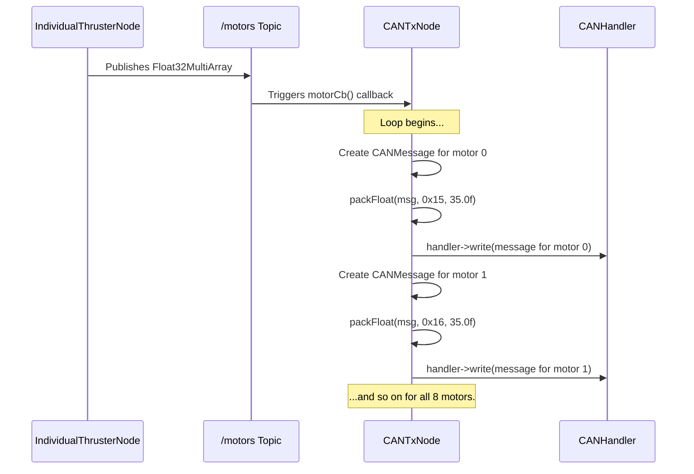

# Chapter 4: CAN Transmit Node (CANTxNode)

In the [previous chapter on the CAN Message Protocol & Serialization](03_can_message_protocol___serialization_.md), we learned the "language" of the hardware. We saw how to use `packFloat` to translate a high-level number like `35.0` into a hardware-ready CAN message, a small packet of bytes.

But knowing a language isn't enough; you need a speaker. Who in our system is responsible for taking the final motor commands from the ROS2 world, performing this translation, and handing the result off to be sent?

Meet the `CANTxNode`, the "mouth" of our system. Its sole purpose is to listen for commands and speak them onto the CAN bus.

### The Announcer in the Broadcast Booth

Imagine a live sports broadcast. In the control room, a director decides which camera angle to show. This director is like our `IndividualThrusterNode`—they make the high-level decisions and create a "script" (our `/motors` message).

The `CANTxNode` is the announcer in the booth.
1.  **Gets the script:** The announcer listens for instructions from the director. Our `CANTxNode` listens for messages on the `/motors` topic.
2.  **Translates:** The announcer takes the director's notes ("Show the crowd cheering") and turns it into a fluid, broadcast-ready sentence. Our `CANTxNode` takes the array of motor speeds and translates each one into a properly formatted CAN message using the serialization tools we just learned about.
3.  **Speaks into the microphone:** The announcer speaks into the microphone, which sends their voice out over the airwaves. Our `CANTxNode` hands the formatted CAN message to the [CAN Bus Abstraction (CANHandler)](06_can_bus_abstraction__canhandler__.md), which handles the physical transmission.

This division of labor is key: the `CANTxNode` doesn't decide *what* the motors should do; it only cares about translating and sending the commands it's given.

### Listening for Motor Commands

The first job of our announcer is to listen. The `CANTxNode` achieves this by creating a **subscriber**. A subscriber in ROS2 is like tuning a radio to a specific station. We tell our node to "tune in" to the `/motors` topic and call a specific function every time a new message is broadcast.

**File:** `src/CANTxNode.cpp`
```cpp
// In the CANTxNode constructor...
motorSub = this->create_subscription<std_msgs::msg::Float32MultiArray>(
    "motors", 10, std::bind(&CANTxNode::motorCb, this, _1));
```
This single line of code sets up the entire listening process. Let's break it down:
*   `create_subscription`: This is the ROS2 command to start listening.
*   `"motors"`: This is the name of the topic we are subscribing to.
*   `&CANTxNode::motorCb`: This tells the subscriber, "When you receive a message, please run my `motorCb` function." (`Cb` is a common abbreviation for "callback").

From now on, whenever the `IndividualThrusterNode` publishes a new set of motor speeds, our `motorCb` function will automatically be executed.

### Translating and Sending Commands

Now for the main event: the `motorCb` function. This is where the translation happens. This function receives the array of 8 motor speeds and must process each one.

**File:** `src/CANTxNode.cpp`
```cpp
void CANTxNode::motorCb(const std_msgs::msg::Float32MultiArray &msg) {
  // Loop through each of the 8 motor commands in the array
  for (size_t i = 0; i < msg.data.size(); i++) {
    // Create a blank CAN message
    vanttec::CANMessage canMsg;

    // Pack the motor's ID and speed into the message
    // ID for motor 0 is 0x15, motor 1 is 0x16, etc.
    vanttec::packFloat(canMsg, 0x15 + i, msg.data[i]);
    
    // Hand the message to the CANHandler to be sent
    handler->write(canMsg);
  }
}
```
This is the heart of the `CANTxNode`. For every single motor speed in the incoming array (`msg.data`):
1.  It creates a fresh, empty `CANMessage`.
2.  It calls `vanttec::packFloat`, just like we learned in the last chapter. It cleverly calculates the ID for each motor (`0x15` for the first motor, `0x16` for the second, and so on) and packs it along with the speed.
3.  It calls `handler->write(canMsg)`, which is like the announcer handing the final translated sentence to the broadcast engineer to put on the air.

### The Journey of a Single Command

Let's visualize this entire flow. Imagine you push the joystick forward, and the `IndividualThrusterNode` publishes a motor command array `[35.0, 35.0, ..., -35.0, -35.0]` to the `/motors` topic.



The `CANTxNode` acts as an efficient assembly line, converting the high-level ROS array into a series of low-level, hardware-ready CAN messages.

### An Important Optimization: Don't Repeat Yourself

The CAN bus is like a party line phone; only one person can talk at a time, and it has limited bandwidth. If you hold your joystick perfectly still, the `IndividualThrusterNode` might send the *exact same* motor command array over and over again. Sending this redundant information would needlessly clog up the bus.

To solve this, the `CANTxNode` includes a simple but powerful optimization: it remembers the last command it sent.

**File:** `src/CANTxNode.cpp`
```cpp
void CANTxNode::motorCb(const std_msgs::msg::Float32MultiArray &msg) {
  for (size_t i = 0; i < msg.data.size(); i++) {
    // If the new speed is the same as the old one, skip it!
    if (msg.data[i] == lastMotorArray[i]) continue;

    vanttec::CANMessage canMsg;
    vanttec::packFloat(canMsg, 0x15 + i, msg.data[i]);
    handler->write(canMsg);
  }

  // Remember this new array for the next time
  lastMotorArray = msg.data;
}
```
The new line `if (msg.data[i] == lastMotorArray[i]) continue;` is the key. In plain English, it says: "Before I do all the work of packing and sending a message for this motor, let me check if its new speed is any different from the last speed I sent. If it's the same, I'll just `continue` to the next motor and not waste any time."

This ensures we only send messages when the vehicle's state is actually changing, keeping our communication efficient and clean.

### Conclusion

In this chapter, we met the `CANTxNode`, our system's dedicated "announcer." We learned that its job is to:
1.  **Subscribe** to high-level ROS topics like `/motors`.
2.  **Translate** the ROS messages into low-level CAN messages using serialization.
3.  **Optimize** communication by only sending messages when values change.
4.  **Send** the final messages by handing them to the `CANHandler`.

The `CANTxNode` is the critical bridge that connects our software's intent with the hardware's language. It ensures that the commands generated by the teleoperation flow are correctly spoken to the thrusters.

But communication is a two-way street. We've now mastered sending commands *to* the hardware, but what about listening for data *from* the hardware, like battery voltage or sensor readings? For that, we need a dedicated listener—the system's "ears."

Next: [CAN Receive Node (CANRxNode)](05_can_receive_node__canrxnode__.md)

---

Generated by [AI Codebase Knowledge Builder](https://github.com/The-Pocket/Tutorial-Codebase-Knowledge)