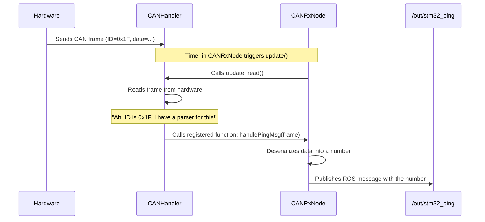

# Chapter 5: CAN Receive Node (CANRxNode)

In the [previous chapter on the CAN Transmit Node (CANTxNode)](04_can_transmit_node__cantxnode__.md), we built our system's "mouth." It takes high-level commands, translates them into the hardware's language, and sends them out. But communication is a two-way street. How do we hear what the hardware has to say back to us?

This is the job of the `CANRxNode`, the system's dedicated "ears." Its purpose is to constantly listen to the CAN bus for any incoming messages, translate them from raw bytes back into useful information, and share that information with the rest of our ROS2 system.

### The Watchtower Guard

Imagine you are a guard in a watchtower, looking out for messengers arriving at the castle. You can't just let anyone in; you need a process.

1.  **Spot a Messenger:** You are constantly scanning the horizon for incoming messages.
2.  **Check their Banner:** When a messenger arrives, you look at their banner (their unique ID) to know who they are from. A red banner might be a status report, while a blue banner could be an urgent warning.
3.  **Read the Scroll:** You take the scroll (the data) from the messenger. It's written in a special code.
4.  **Translate and Announce:** You decipher the code and then shout the translated message down to the castle courtyard so everyone who needs to know can hear it.

The `CANRxNode` operates in exactly the same way. It listens for raw CAN messages, identifies them by their ID, decodes the data, and then publishes that data on a ROS topic for other nodes to use.

### Setting Up the Listening Post

The first thing our watchtower guard needs is a list of instructions for what to do when different messengers arrive. The `CANRxNode` sets this up in its constructor, which is the function that runs when the node is first created.

It registers "parsers," which are just functions that know how to handle a specific message ID.

**File:** `src/CANRxNode.cpp`
```cpp
// In the CANRxNode constructor...
handler->register_parser(0x1F,
    std::bind(&CANRxNode::handlePingMsg, this, _1));

handler->register_parser(0x14,
    std::bind(&CANRxNode::handleDebugMsg, this, _1));
```
This is like giving our guard a rulebook:
*   `register_parser(0x1F, ...)`: "If you see a message with the ID `0x1F` (a ping), give it to the `handlePingMsg` specialist."
*   `register_parser(0x14, ...)`: "If you see a message with ID `0x14` (a debug message), give it to the `handleDebugMsg` specialist."

Now, our node is ready. It knows exactly what to do for each type of message it expects.

### The Listening Loop: "Anything to Report?"

Just having a rulebook isn't enough. The guard needs to actually *look* for messengers. The `CANRxNode` does this with a timer that runs very frequently (every 10 milliseconds).

**File:** `src/CANRxNode.cpp`
```cpp
// In the CANRxNode constructor...
updateTimer =
    this->create_wall_timer(10ms, std::bind(&CANRxNode::update, this));
```
This line sets up a timer that will call our `update()` function every 10 milliseconds.

And what does the `update()` function do? It's incredibly simple.
```cpp
// File: src/CANRxNode.cpp
void CANRxNode::update() {
    handler->update_read();
}
```
This one line is the guard turning to their communications officer (the [CAN Bus Abstraction (CANHandler)](06_can_bus_abstraction__canhandler__.md)) and asking, "Is there any mail for us?" The `CANHandler` then does the low-level work of checking the hardware for new messages.

### Handling a Message: Translate and Announce

Let's say the `CANHandler` finds a message. Because we registered our parsers, the handler knows exactly which function to call. If it finds a message with ID `0x1F`, it automatically triggers our `handlePingMsg` function.

This function is where the translation and announcement happen.

**File:** `src/CANRxNode.cpp`
```cpp
void CANRxNode::handlePingMsg(can_frame frame) {
  // 1. Create a blank ROS message
  std_msgs::msg::UInt16 msg;

  // 2. Deserialize the raw bytes into a number
  msg.data = can_parse_short(frame.data, frame.can_dlc);
  
  // 3. Publish the message on a ROS topic
  pingPublisher->publish(msg);
}
```
This short function performs the final, crucial steps:
1.  **Prepare the Announcement:** It creates an empty ROS message of type `UInt16`, which is just a simple container for a number.
2.  **Translate the Scroll:** It uses `can_parse_short` to perform **deserialization**, a concept we learned about in the [CAN Message Protocol & Serialization](03_can_message_protocol___serialization_.md) chapter. This function takes the raw bytes from the CAN frame and converts them back into a standard number.
3.  **Shout to the Courtyard:** It uses `pingPublisher->publish(msg)` to broadcast the final, clean ROS message on the `/out/stm32_ping` topic. Now any other node in our system can subscribe to this topic to get live ping updates from the hardware!

### The Full Journey of a Received Message

Let's trace the complete path of a ping message from the hardware to the rest of our software.



The process is efficient and clean. The `CANRxNode` tells the `CANHandler` *what* to do with messages, and the `CANHandler` takes care of checking for them and routing them to the correct function when they arrive. This keeps our code organized, as each message type has its own dedicated handler function.

### Conclusion

In this chapter, we met the `CANRxNode`, our system's "ears." We learned that its job is to:
1.  **Register Parsers:** Tell the `CANHandler` which functions to call for specific CAN message IDs.
2.  **Listen Continuously:** Use a timer to repeatedly ask the `CANHandler` to check for new messages.
3.  **Deserialize Data:** Translate incoming raw bytes into meaningful ROS messages.
4.  **Publish Information:** Broadcast the translated information on ROS topics, making it available to the entire software system.

With the `CANTxNode` handling sending and the `CANRxNode` handling receiving, we have a complete two-way communication channel with our hardware. Both of these nodes, however, rely on a powerful helper to manage the low-level details of talking to the physical CAN interface. This helper is the final piece of our CAN communication puzzle.

Next: [CAN Bus Abstraction (CANHandler)](06_can_bus_abstraction__canhandler__.md)

---

Generated by [AI Codebase Knowledge Builder](https://github.com/The-Pocket/Tutorial-Codebase-Knowledge)