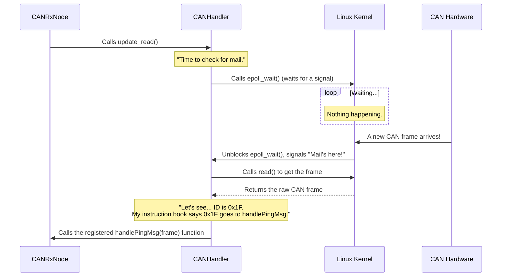

# Chapter 6: CAN Bus Abstraction (CANHandler)

In the last two chapters, we met our system's "mouth," the [CAN Transmit Node (CANTxNode)](04_can_transmit_node__cantxnode__.md), and its "ears," the [CAN Receive Node (CANRxNode)](05_can_receive_node__canrxnode__.md). You might have noticed that both of them relied on a mysterious helper object called the `handler` to do the actual work of sending and receiving messages.

What is this `handler`? And why do we need it? This chapter pulls back the curtain on the most critical piece of our hardware communication: the `CANHandler`.

### The Problem: Talking is Hard

Talking directly to hardware is messy. Different operating systems (like Linux, Windows, or a real-time OS) have completely different ways of sending and receiving CAN messages. If we wrote all that complex, low-level code directly inside our `CANTxNode` and `CANRxNode`, our code would be:
*   **Complicated:** Filled with strange commands only the Linux kernel understands.
*   **Brittle:** A small change in the operating system could break everything.
*   **Not Portable:** We couldn't easily run our code on a different system.

We need a better way. We need an **abstraction**.

### The Universal Translator and Mail Carrier

Think of the `CANHandler` as a highly skilled personal assistant who is an expert in postal services and languages.

*   **As a Mail Carrier:** When the `CANTxNode` wants to send a motor command, it doesn't go to the post office itself. It simply hands a prepared letter (a `CANMessage`) to the `CANHandler` and says, "Please send this." The handler knows the exact route, the right postage, and how to put it in the physical mailbox. This is the `write` function.
*   **As a Mail Sorter:** When the `CANRxNode` wants to check for new messages, it asks the handler, "Is there any mail?" The handler goes to the post office, picks up all the mail, and sorts it. This is the `update_read` function.
*   **As a Dispatcher:** Before starting, the `CANRxNode` gives the handler a list of instructions, like "If you get a letter with a 'ping' sticker (ID `0x1F`), deliver it to the `handlePingMsg` department." The handler keeps this list and, after sorting the mail, delivers each letter to the correct recipient. This is the `register_parser` function.

This assistant (the `CANHandler`) handles all the messy details, allowing our other nodes to focus on their simple jobs: preparing outgoing mail and processing incoming mail.

```mermaid
graph TD
    subgraph ROS2 World
        A[CANTxNode] -->|1. handler->write(msg)| C(CANHandler);
        B[CANRxNode] -->|2. handler->register_parser(id, func)| C;
        B -->|3. handler->update_read()| C;
    end

    subgraph "Messy Low-Level World"
        D[Linux SocketCAN Interface]
    end

    C <-->|Hides all the details| D;

    style C fill:#cde4ff,stroke:#333,stroke-width:2px
```

### How We Use the `CANHandler`

Let's review the three key interactions our nodes have with the `CANHandler`.

#### 1. Sending a Message (`write`)

The `CANTxNode` uses `write` to send a message. It's as simple as handing off the finished package.

**File:** `src/CANTxNode.cpp`
```cpp
// Inside the motorCb function...
vanttec::CANMessage canMsg;
vanttec::packFloat(canMsg, 0x15 + i, msg.data[i]);
    
// "Here, please send this."
handler->write(canMsg);
```
The `CANTxNode` doesn't need to know *how* the message is sent, which port it goes out on, or whether the hardware is ready. It just trusts the handler to take care of it.

#### 2. Registering a Listener (`register_parser`)

The `CANRxNode` uses `register_parser` to tell the handler what to do with incoming messages. This is the "dispatcher's instruction list."

**File:** `src/CANRxNode.cpp`
```cpp
// In the CANRxNode constructor...
handler->register_parser(0x1F,
    std::bind(&CANRxNode::handlePingMsg, this, _1));
```
This code says: "Hey handler, from now on, if you ever see a message with the ID `0x1F`, please immediately call my `handlePingMsg` function with that message."

#### 3. Checking for Mail (`update_read`)

The `CANRxNode` uses a timer to periodically call `update_read`, asking the handler to check for new mail and dispatch it according to the rules it was given.

**File:** `src/CANRxNode.cpp`
```cpp
void CANRxNode::update() {
    // "Anything new for us?"
    handler->update_read();
}
```
When this function is called, the `CANHandler` will perform the low-level check, and if it finds a message with ID `0x1F`, it will automatically call `handlePingMsg` for us.

### Under the Hood: The Post Office Secrets

So how does our assistant actually work? It uses some powerful but complex tools provided by the Linux operating system.

Let's follow the journey of a received message.



The magic here is `epoll_wait()`. Instead of constantly asking Linux "Is there mail yet? Is there mail yet?" (which is inefficient), the `CANHandler` tells Linux, "Wake me up only when mail arrives." This is an incredibly efficient way to listen for events without wasting CPU power.

Let's look at a few simplified snippets from the implementation.

#### Setting Up the Connection

When the `CANHandler` is created, it opens a special connection to the hardware called a "socket."

**File:** `libs/vanttec_CANLib/src/Vanttec_CANLib_Linux/CANHandler.cpp`
```cpp
CANHandler::CANHandler(const std::string &interfaceName) {
  // Open a special network connection to the CAN hardware
  canfd = vanttec::socketcan_open(interfaceName);
  
  // ... more setup for epoll ...
}
```
This is the handler "learning the address" of the physical post office (`can0` or `can_vtec`).

#### Reading the Mail

The `update_read` function is where the `epoll` magic happens.

**File:** `libs/vanttec_CANLib/src/Vanttec_CANLib_Linux/CANHandler.cpp`
```cpp
void CANHandler::update_read() {
    // Wait until the OS tells us there is something to read
    int ready_count = epoll_wait(epfd, ...);

    // For every message that is ready...
    for (int i = 0; i < ready_count; i++) {
        // Read the raw message from the hardware
        read(..., &frame, sizeof(frame));

        // Find the right parser function in our list and call it
        auto id = can_parse_id(frame.data, frame.can_dlc);
        // ... find and call parser for 'id' ...
    }
}
```
This code first waits patiently. When `epoll_wait` returns, it means one or more messages have arrived. It then reads each one and looks through its list of registered parsers to find the right recipient before "delivering" the message by calling the function.

### Conclusion

In this chapter, we unveiled the `CANHandler`, the unsung hero of our hardware communication layer. We learned that:

*   It serves as an **abstraction layer**, providing a simple, clean interface (`write`, `update_read`, `register_parser`).
*   It hides the complex, platform-specific details of Linux SocketCAN and `epoll`.
*   This design allows our `CANTxNode` and `CANRxNode` to be simple and focused on application logic, making our entire system more robust, maintainable, and easier to understand.

This concludes our deep dive into the core components of the `usv_can` project. We have journeyed all the way from a joystick movement, through the [ROS2 Node Orchestration](02_ros2_node_orchestration_.md), down into the binary world of the [CAN Message Protocol & Serialization](03_can_message_protocol___serialization_.md), and finally through the nodes that speak (`CANTxNode`) and listen (`CANRxNode`) using our powerful `CANHandler` abstraction. You now have a complete picture of how high-level user intent becomes low-level hardware action in a modern robotics system.

---

Generated by [AI Codebase Knowledge Builder](https://github.com/The-Pocket/Tutorial-Codebase-Knowledge)