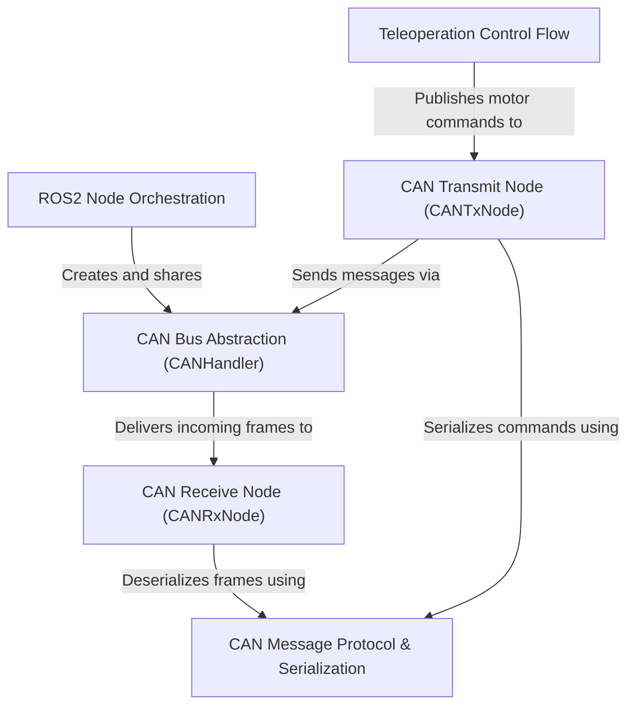

# Tutorial: usv_can

This project provides a *ROS2* interface for controlling a vehicle over a *CAN bus*. It translates high-level commands, like those from a **joystick**, into low-level CAN messages for the vehicle's thrusters, and also reads status messages back from the hardware. The system is split into distinct nodes for receiving teleoperation commands, transmitting to the CAN bus, and receiving from the CAN bus, all managed by a central orchestrator.

**Source Repository:** [None](None)

## Chapters

1. [Teleoperation Control Flow
](01_teleoperation_control_flow_.md)
2. [ROS2 Node Orchestration
](02_ros2_node_orchestration_.md)
3. [CAN Message Protocol & Serialization
](03_can_message_protocol___serialization_.md)
4. [CAN Transmit Node (CANTxNode)
](04_can_transmit_node__cantxnode__.md)
5. [CAN Receive Node (CANRxNode)
](05_can_receive_node__canrxnode__.md)
6. [CAN Bus Abstraction (CANHandler)
](06_can_bus_abstraction__canhandler__.md)

---

Generated by [AI Codebase Knowledge Builder](https://github.com/The-Pocket/Tutorial-Codebase-Knowledge)