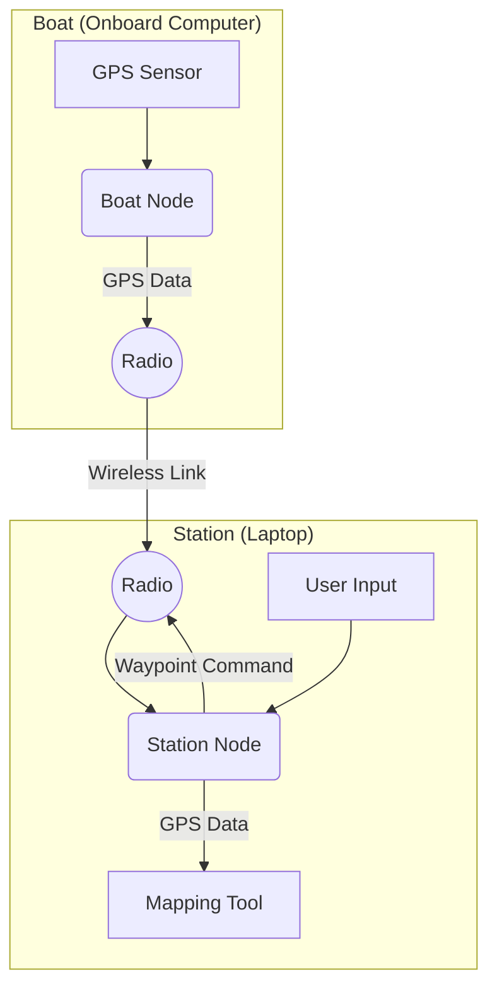
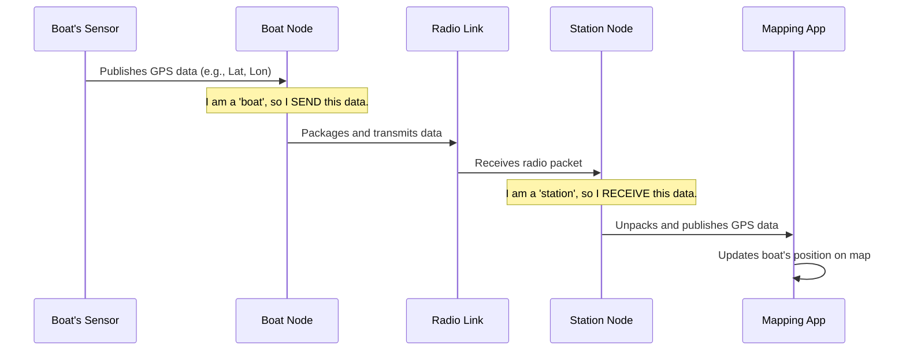

# Chapter 1: Node Roles (Boat & Station)

Welcome to the `usv_comms` tutorial! This project is designed to create a robust communication link between a robot, like an Unmanned Surface Vehicle (USV), and a ground control station.

Let's start with a simple scenario. Imagine you've built a small autonomous boat. You want to sit on the shore with your laptop and see where the boat is on a map. At the same time, you want to be able to click on the map to send the boat a new destination.

To make this happen, you need two pieces of software running:
1.  A program on the **boat's onboard computer**.
2.  A program on your **laptop (the station)**.

This fundamental split is the heart of `usv_comms`. We call this concept **Node Roles**.

### The Two Key Roles: Boat and Station

The entire system is divided into two distinct roles. Think of it like a conversation between two people with specific jobs.

#### 1. The Boat Node 🚤

The "Boat" node is the software that runs on the unmanned vehicle itself. Its primary jobs are:
*   **Gathering Data:** It listens to the boat's sensors for information like GPS position, velocity, and battery status.
*   **Reporting Home:** It packages this data and sends it over a radio link back to the station.
*   **Following Orders:** It listens for commands coming from the station, like a new waypoint to navigate to.

#### 2. The Station Node 💻

The "Station" node is the software that runs on your ground computer or laptop. Its jobs are the mirror image of the boat's:
*   **Receiving Data:** It listens for incoming data from the boat's radio.
*   **Monitoring:** It unpacks the data and makes it available to other programs, like a mapping tool or a dashboard.
*   **Sending Commands:** It takes your input (like a new waypoint) and sends it over the radio to the boat.

This relationship is very similar to a **client-server model**. The boat acts as a **client**, reporting its status and requesting guidance. The station acts as the **server**, monitoring the client and managing its operations.

This clear separation defines how information flows and keeps everything organized.



### How Roles are Defined in the Code

You might think that defining these different behaviors requires two completely separate, complex programs. But `usv_comms` makes it incredibly simple. The role of a node is set with a single word when it's created.

Let's look at the startup code for the boat.

**File:** `scripts/sik_boat_node.py`
```python
class SiKBoatNode(SiKBaseNode):
    def __init__(self):
        # For the boat, we pass node_type "boat"
        super().__init__('sik_boat_node', 'boat')
        
        # ... the rest of the setup ...
```
When we create the `SiKBoatNode`, we tell its parent class that its `node_type` is `"boat"`. That's it!

Now, let's look at the station.

**File:** `scripts/sik_station_node.py`
```python
class SiKStationNode(SiKBaseNode):
    def __init__(self):
        # For the station, pass node_type "station"
        super().__init__('sik_station_node', 'station')
        
        # ... the rest of the setup ...
```
Similarly, when we create the `SiKStationNode`, we tell its parent that its `node_type` is `"station"`. This one small difference is what configures all the logic for sending and receiving data correctly.

### Under the Hood: The Flow of Information

So, how does that one little word—`"boat"` or `"station"`—change everything? It tells the node how to interpret its configuration.

Let's trace the journey of a single GPS coordinate from the boat's sensor to your laptop's map.



1.  **On the Boat:** The `Boat Node`, having been initialized with the role `"boat"`, knows it needs to *listen* for local sensor topics (like `/gps/fix`) and *send* that data over the radio.
2.  **Over the Air:** The data is packaged into a compact format and sent wirelessly.
3.  **At the Station:** The `Station Node`, initialized as `"station"`, knows it needs to *listen* for incoming radio messages. When it receives the GPS data, it unpacks it and *publishes* it as a standard ROS 2 topic that other applications, like your mapping tool, can easily use.

This logic is all handled by the base classes. The `node_type` simply tells the base class which set of rules to follow from a configuration file.

### Conclusion

You've just learned the most fundamental concept in `usv_comms`: the division of labor between the **Boat** and **Station** nodes.

*   The **Boat** node runs on the vehicle, collecting and sending sensor data.
*   The **Station** node runs on the ground, receiving data and sending commands.
*   This role is defined with a simple string (`"boat"` or `"station"`) during initialization.

This simple but powerful design pattern keeps the communication logic clean and predictable.

But how do the nodes know *exactly* which topics to send and receive? That's where configuration files come in. In the next chapter, we'll dive into how you can declare all your communication topics in a simple file, without writing a single extra line of code.

Next up: [Chapter 2: Declarative Topic Configuration](02_declarative_topic_configuration_.md)

---

Generated by [AI Codebase Knowledge Builder](https://github.com/The-Pocket/Tutorial-Codebase-Knowledge)