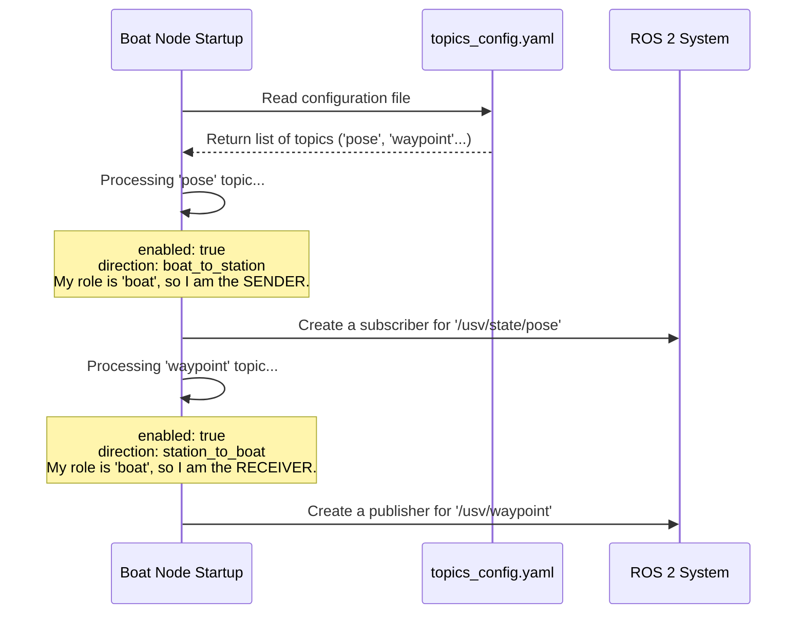

# Chapter 2: Declarative Topic Configuration

In the [previous chapter](01_node_roles__boat___station__.md), we learned about the two main roles in our communication system: the **Boat** and the **Station**. We know the boat sends sensor data and the station sends commands.

But this raises a crucial question: How does the boat node know *exactly which* sensor data to send? If we add a new temperature sensor to our boat, do we have to dig into the Python code and write new logic to send its data?

Thankfully, no. Instead of hard-coding this information, `usv_comms` uses a simple and powerful concept: **Declarative Topic Configuration**.

### The Problem with Hard-Coding

Imagine you're building a house. If you hard-code your communication logic, it's like building the electrical wiring directly into the concrete walls. What happens when you want to add a new outlet? You'd have to break the wall!

Similarly, if we wrote code like this:

```python
# The BAD way: Hard-coding topics
def send_data():
    # Code specifically for sending GPS data
    # ...
    # Code specifically for sending velocity data
    # ...
```

Adding a new battery sensor would mean changing the `send_data` function, testing it, and redeploying the software to the boat. This is slow and error-prone.

### A Better Way: The Packing List

The `usv_comms` project uses a much more flexible approach. It uses simple text files (in a format called YAML) to define what data to send.

Think of this YAML file as a **packing list** for your data. Before you ship a package, you make a list of what goes inside. You can easily add or remove items from the list without having to rebuild the delivery truck.

Our delivery truck is the code, and the packing list is our configuration file. This file tells the code what to "pack" and "ship" over the radio.

### Dissecting the Packing List: `topics_config.yaml`

Let's look at a piece of a real configuration file from the project. This is where we *declare* how our topics should behave.

**File:** `config/topics_config.yaml`
```yaml
topics:
  pose:
    topic: "/usv/state/pose"
    msg_type: "geometry_msgs/msg/Pose2D"
    enabled: true
    direction: "boat_to_station"
    fields: ["x", "y", "theta"]
```

This small block of text contains everything our program needs to know about sending the boat's position. Let's break it down line-by-line:

*   `pose:` This is just a friendly name we give to this entry. We could have called it `gps_position` or `boat_location`.
*   `topic: "/usv/state/pose"`: This is the actual name of the ROS 2 topic. It's the "address" where the data lives inside the ROS system.
*   `msg_type: "geometry_msgs/msg/Pose2D"`: This describes the *type* of data. A `Pose2D` message is a standard ROS 2 message that contains `x`, `y`, and `theta` (angle) values. It's like saying the item is a "book" or a "gadget."
*   `enabled: true`: This is a simple on/off switch. If you set this to `false`, the system will completely ignore this topic. This is perfect for debugging or for temporarily disabling a sensor to save radio bandwidth.
*   `direction: "boat_to_station"`: This is the most important line! It tells the system the flow of information. This topic's data should travel *from* the boat *to* the station. This is how the node knows whether to create a sender or a receiver for this topic, based on its role.
*   `fields: ["x", "y", "theta"]`: Radios have limited bandwidth. A full ROS 2 message might contain lots of extra information we don't need. This line lets us pick *only the specific fields* we care about. In this case, we're only packing the `x`, `y`, and `theta` values, making our data packet small and efficient.

### Putting it into Practice

Let's see how powerful this is.

1.  **Sending Boat Position:** The configuration above is already set up. Because `direction` is `"boat_to_station"`, the **Boat Node** will automatically listen for `/usv/state/pose` and send it, while the **Station Node** will listen for incoming radio data and publish it.

2.  **Sending a Command:** Now, what if we want to send a new waypoint *from* the station *to* the boat? We just add another entry to our packing list:

    **File:** `config/topics_config.yaml`
    ```yaml
    topics:
      # ... our pose topic from before ...
      
      waypoint:
        topic: "/usv/waypoint"
        msg_type: "usv_interfaces/msg/Waypoint"
        enabled: true
        direction: "station_to_boat" # The direction is reversed!
        fields: ["x", "y"]
    ```
    By setting `direction` to `"station_to_boat"`, the roles are now flipped for this specific topic. The **Station Node** will listen for `/usv/waypoint` locally and send it over the radio, and the **Boat Node** will receive it and publish it for the boat's navigation system.

We just added a completely new communication path without writing a single line of Python!

### Under the Hood: How it Works

So how does the code turn this simple file into running subscribers and publishers?

When a node starts up, it reads this YAML file and treats it like a set of instructions.

1.  **Read the List:** The node loads the `topics_config.yaml` file.
2.  **Go Through Each Item:** It loops through each entry in the `topics` section (like `pose`, `waypoint`, etc.).
3.  **Make a Decision:** For each topic, it asks a few questions based on its own role (`"boat"` or `"station"`):
    *   Is this item `enabled: true`? If not, ignore it.
    *   Based on the `direction`, am I the sender or the receiver?
        *   If I'm the **Boat Node** and `direction` is `boat_to_station`, then I am the **sender**. I need to subscribe to the local ROS topic to get the data.
        *   If I'm the **Station Node** and `direction` is `boat_to_station`, then I am the **receiver**. I need to create a ROS publisher to share the data I get from the radio.

The logic is perfectly symmetrical for the `station_to_boat` direction.

Here’s a diagram showing what the Boat Node does at startup:



The code that performs this logic is completely generic. It doesn't have any hard-coded topic names. It just dutifully follows the instructions in the config file.

Here's a simplified look at the Python code that does this:

```python
# A simplified version of the setup logic in the base node
def _setup_topics_from_config(self):
    # self.config holds the data from the YAML file
    # self.role is "boat" or "station"

    for topic_name, config in self.config['topics'].items():
        if not config.get('enabled', False):
            continue # Skip if not enabled

        # Check if this node should be the sender for this topic
        if config['direction'] == 'boat_to_station' and self.role == 'boat':
            self._setup_sender(config) # Create a subscriber
        
        # Check if this node should be the receiver
        elif config['direction'] == 'boat_to_station' and self.role == 'station':
            self._setup_receiver(config) # Create a publisher
            
        # ... and so on for the "station_to_boat" direction ...
```
This generic setup means the core logic rarely needs to change, but the system's behavior can be radically altered just by editing the YAML file.

### Conclusion

You've just learned about the power of **Declarative Topic Configuration**. By defining our data "packing list" in a YAML file, we gain incredible flexibility.

*   We can **add, remove, or modify** which topics are sent over the radio without changing the code.
*   The `enabled` flag acts as a quick **on/off switch** for any data stream.
*   The `direction` key clearly defines the flow of information, connecting back to the **Node Roles** we learned about.
*   The `fields` key lets us **optimize our bandwidth** by sending only the data we absolutely need.

This separation of configuration from code is a cornerstone of robust and maintainable robotics software.

But wait, our YAML file is generic. What if we are using two different types of radios, each with its own special settings? How does the system handle radio-specific details? We'll explore that in the next chapter.

Next up: [Chapter 3: Radio-Specific Base Nodes](03_radio_specific_base_nodes_.md)

---

Generated by [AI Codebase Knowledge Builder](https://github.com/The-Pocket/Tutorial-Codebase-Knowledge)