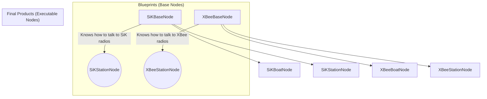
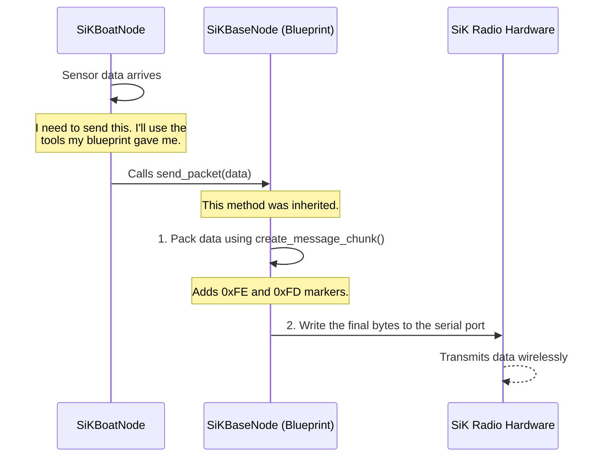

# Chapter 3: Radio-Specific Base Nodes

In the [previous chapter on Declarative Topic Configuration](02_declarative_topic_configuration_.md), we learned how a simple YAML file acts as a "packing list" for our data, telling the system what to send and receive. This is incredibly flexible, but it hides an important detail: what if we want to use different types of radio hardware?

Some projects might use simple, low-cost SiK radios, while others might use more advanced XBee radios. These devices speak slightly different "languages" and need to be handled differently. How can we support both without writing two completely separate programs or cluttering our code with `if/else` statements?

The answer lies in a powerful programming concept: **inheritance**, which we use to create **Radio-Specific Base Nodes**.

### The Blueprint and the Final Product

Imagine you're a car manufacturer. You don't design a completely new car from the ground up every time. Instead, you start with a standard **chassis**—a blueprint that includes the frame, engine, and wheels. From that single chassis blueprint, you can build many different models: a sedan, a pickup truck, or an SUV.

In `usv_comms`, our "chassis blueprints" are special classes called **Base Nodes**. We have a blueprint for SiK radios and another for XBee radios:

*   `SiKBaseNode`: The chassis blueprint for all SiK radio communications.
*   `XBeeBaseNode`: The chassis blueprint for all XBee radio communications.

These base nodes contain all the generic logic for handling a specific type of radio. They know how to:
1.  Initialize the physical radio hardware (e.g., open the correct serial port).
2.  Package and unpackage data in the specific format that radio expects.

The final nodes we actually run—like `SiKBoatNode` or `XBeeStationNode`—are like the sedan or the pickup truck. They are built *on top of* the appropriate blueprint and inherit all of its capabilities for free.



### How It Looks in the Code

This powerful relationship is established with a single line of code. When we define our `SiKBoatNode`, we simply tell Python that it inherits from `SiKBaseNode`.

**File:** `scripts/sik_boat_node.py`
```python
# The SiKBoatNode is a type of SiKBaseNode
class SiKBoatNode(SiKBaseNode):
    def __init__(self):
        # ... setup specific to the boat's role ...
```
That's it! By putting `SiKBaseNode` in the parentheses, the `SiKBoatNode` automatically gets all the code for handling SiK radios. It doesn't need to know the details; it just knows how to use them. The same is true for the station:

**File:** `scripts/sik_station_node.py`
```python
# The SiKStationNode also inherits from SiKBaseNode
class SiKStationNode(SiKBaseNode):
    def __init__(self):
        # ... setup specific to the station's role ...
```

This clean separation means the `SiKBoatNode`'s code can focus *only* on its role as a "boat," while the `SiKBaseNode` handles the messy details of the hardware.

### What's in a Blueprint?

Let's look at two key jobs that these base nodes handle, and how they differ for SiK and XBee radios.

#### 1. Initializing the Radio

Different hardware requires different software libraries to communicate. The base node hides this complexity.

The `SiKBaseNode` uses a standard Python library called `pyserial` to open the port.

**File:** `scripts/sik_base_node.py` (Simplified)
```python
def _init_radio(self, port, baud_rate):
    # Use the standard 'serial' library
    radio = serial.Serial(
        port=port,
        baudrate=baud_rate
    )
    return radio
```
This is the standard way to talk to many simple devices.

However, XBee radios have a special, dedicated library. The `XBeeBaseNode` handles this.

**File:** `scripts/xbee_base_node.py` (Simplified)
```python
def _init_xbee_device(self, port, baud_rate):
    # Use the special 'digi-xbee' library
    device = XBeeDevice(port, baud_rate)
    device.open()
    return device
```
The final nodes (`SiKBoatNode`, `XBeeBoatNode`) don't need to know which of these functions to call. They just inherit the correct one from their blueprint.

#### 2. Packing Data for Transmission

This is where the benefit is most clear. Simple SiK radios just transmit raw bytes, so it's our job to make sure the receiver knows where a message begins and ends. The `SiKBaseNode` does this by adding special "marker" bytes to the data.

Think of it like putting a letter in a specially marked envelope.

**File:** `scripts/sik_base_node.py`
```python
def create_message_chunk(self, msg_id, data):
    # ... pack the data into data_bytes ...
    
    # Add a start byte (0xFE) and an end byte (0xFD)
    return b'\xFE' + header + data_bytes + b'\xFD'
```
The `0xFE` acts as a "start of message" flag, and `0xFD` acts as the "end of message" flag.

XBee radios are more advanced. Their own internal firmware handles message framing, so we don't need to add our own markers. The `XBeeBaseNode` blueprint knows this and creates a simpler packet.

**File:** `scripts/xbee_base_node.py`
```python
def create_message_chunk(self, msg_id, data):
    # ... pack the data into data_bytes ...
    
    # No start/end bytes needed! The XBee handles it.
    return header + data_bytes
```
This is a perfect example of hardware-specific logic being contained entirely within the base node. The boat and station nodes just say "send this data," and the blueprint takes care of putting it in the right "envelope" for the mail service (the radio) being used.

### Under the Hood: The Flow of a Command

Let's trace what happens when the `SiKBoatNode` receives a command to send some data.



1.  The `SiKBoatNode` decides it's time to send data.
2.  It calls a method like `send_packet()`, which it didn't write itself—it inherited this method from `SiKBaseNode`.
3.  The code inside `SiKBaseNode` takes over. It calls its own `create_message_chunk` function, which adds the SiK-specific start and end bytes.
4.  Finally, the `SiKBaseNode` uses the `pyserial` library to write the fully-formed packet to the physical radio hardware.

The `SiKBoatNode` only had to trigger the process; the base node handled all the hardware-specific steps automatically.

### Conclusion

You've just learned about the "chassis blueprint" model used in `usv_comms`.

*   **Base Nodes** (`SiKBaseNode`, `XBeeBaseNode`) act as blueprints that contain all the code for a specific type of radio hardware.
*   **Final Nodes** (`SiKBoatNode`, etc.) **inherit** from a base node to gain all its capabilities without needing to know the low-level details.
*   This design cleanly **separates application logic** (the boat/station roles) from **hardware logic** (talking to the radio).
*   It makes the system easy to maintain and extend. Adding support for a new radio would just mean creating a new "blueprint"—no changes to the existing boat or station logic would be needed!

The base nodes are responsible for wrapping our data in a radio-specific "envelope". But what's the format of the "letter" inside? How do we efficiently pack different data types like numbers and text into a single, compact message? That's the job of our custom protocol.

Next up: [Chapter 4: Custom Packetization Protocol](04_custom_packetization_protocol_.md)

---

Generated by [AI Codebase Knowledge Builder](https://github.com/The-Pocket/Tutorial-Codebase-Knowledge)