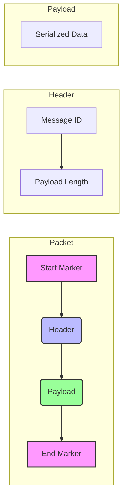
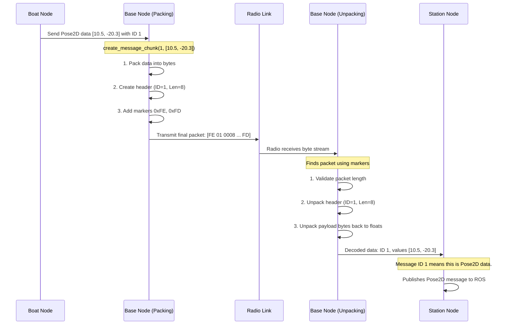

# Chapter 4: Custom Packetization Protocol

In the [previous chapter](03_radio_specific_base_nodes_.md), we learned how **Radio-Specific Base Nodes** act like different postal services (e.g., FedEx vs. UPS), each knowing how to handle their specific type of delivery truck (the radio hardware). They create the right "envelope" for our data.

But what do we write on the envelope, and how do we fold the letter to fit inside? Radios can't send complex ROS 2 messages directly; they can only send a simple stream of raw bytes. We need a standardized way to convert our rich data into a compact, reliable format that any radio can transmit. This standardized format is our **Custom Packetization Protocol**.

### The Problem: Sending a Letter with No Envelope

Imagine you write down your boat's GPS coordinates on a piece of paper: `x=10.5, y=-20.3`. Now, you need to send this to your friend across a field. If you just crumple it up and throw it, several things could go wrong:
*   Your friend might not even see it land.
*   They might find it but not know who it's from or what it's about.
*   The paper could get torn, and they'd only see `x=10.5, y=-...`—an incomplete message.

This is exactly the problem we face with radios. Sending raw ROS 2 message data is like throwing crumpled paper. We need a better system.

### The Solution: A Standardized Envelope

Our custom protocol is like putting your letter into a standardized, pre-formatted envelope. This "envelope" is called a **packet** or a **chunk**.

Here's the analogy:
*   **The Letter:** The actual data you want to send (e.g., the `x`, `y`, and `theta` values).
*   **The Envelope:** The packet structure that wraps your data.
*   **The Address:** A unique number (Message ID) that says "This is a position update."
*   **The "Contents" Label:** The packet length, which tells the receiver how big the letter inside is.
*   **Special Seals:** Start and End markers that clearly show where the envelope begins and ends.

This ensures that when the receiver gets the packet, they know exactly what it is, how to open it, and how to read the contents reliably.

### Anatomy of a Packet

Every piece of data sent by `usv_comms` (using SiK radios) is formatted into a packet that looks like this:



Let's break down each part:

1.  **Start Marker (1 byte):** A special, constant byte (`0xFE`) that shouts, "Hey! A new message starts right now!" This helps the receiver sync up if it's listening to a noisy radio stream.
2.  **Header (3 bytes):**
    *   **Message ID (1 byte):** A simple number that identifies the type of message. For example, `1` might mean `Pose2D` data, and `2` might mean `Waypoint` data. This is much smaller than sending the full topic name like `/usv/state/pose`.
    *   **Payload Length (2 bytes):** An integer that tells the receiver exactly how many bytes of data are in the payload. This is crucial for knowing if the full message was received.
3.  **Payload (Variable size):** This is the "letter" itself—the actual data from our ROS 2 message, converted into a compact binary format.
4.  **End Marker (1 byte):** Another special, constant byte (`0xFD`) that says, "This is the end of the message."

This simple, rigid structure makes our communication robust and efficient.

### Packing the Data: From Numbers to Bytes

So how do we get our `Pose2D` message, which has three floating-point numbers, into the binary "Payload" section? This process is called **serialization**.

We use a standard Python tool called `struct` to "pack" numbers into bytes. Think of it as a machine that takes a number and spits out a specific sequence of bytes that represents it.

Let's look at a simplified version of the code that does this.

**File:** `scripts/sik_base_node.py`
```python
import struct

def pack_data(self, data: list[float]) -> bytes:
    """Pack a list of floats into bytes."""
    result = bytearray()
    
    # For each number in our data...
    for item in data:
        # '!' means standard size, 'f' means float
        result.extend(struct.pack('!f', item))
        
    return result
```
This function takes a list of numbers (like `[10.5, -20.3, 1.57]`) and converts each one into a 4-byte representation. The final `result` is a compact sequence of bytes—our payload.

### Assembling the Packet: Creating the "Envelope"

Once we have the payload, the [Radio-Specific Base Node](03_radio_specific_base_nodes_.md) wraps it in the full packet structure.

Here's the simplified code that builds the final packet for a SiK radio.

**File:** `scripts/sik_base_node.py`
```python
def create_message_chunk(self, msg_id: int, data: list) -> bytes:
    # 1. Serialize the data into the payload
    data_bytes = self.pack_data(data)
    
    # 2. Create the header with message ID and length
    packet_length = len(data_bytes)
    header = struct.pack('!BH', msg_id, packet_length)
    
    # 3. Assemble the full packet with markers
    return b'\xFE' + header + data_bytes + b'\xFD'
```
This function follows our packet anatomy perfectly:
1.  It first calls `pack_data` to create the payload.
2.  It then creates the header, packing the `msg_id` (as a Byte) and `packet_length` (as a short integer).
3.  Finally, it combines the start marker (`\xFE`), header, payload, and end marker (`\xFD`) into a single sequence of bytes, ready to be sent to the radio hardware.

### Under the Hood: The Full Journey of a Packet

Let's trace the entire lifecycle of a `Pose2D` message, from the boat's sensor to the station's map.



1.  **Sending (Boat):** The `Boat Node` gets a `Pose2D` message. It tells its `SiKBaseNode` to send this data, providing the data fields and a pre-configured Message ID.
2.  **Packing (Boat):** The `SiKBaseNode`'s `create_message_chunk` function runs, serializing the floats and wrapping them in the header and markers to create the final byte packet.
3.  **Transmission:** The raw bytes are sent to the radio hardware and transmitted wirelessly.
4.  **Receiving (Station):** The `Station Node`'s radio receives a stream of bytes. Its `SiKBaseNode` is constantly scanning this stream for our `0xFE` start marker.
5.  **Parsing (Station):** When a potential packet is found, it's validated using the end marker and the length in the header. If it's a valid packet, the `parse_message_chunk` function extracts the Message ID and the payload.
6.  **Unpacking (Station):** The `unpack_data` function (the reverse of `pack_data`) is used to convert the payload bytes back into floating-point numbers.
7.  **Publishing (Station):** The `Station Node` uses the Message ID to look up which ROS 2 topic this data belongs to (`/usv/state/pose`). It then creates a `Pose2D` message with the unpacked data and publishes it for other tools, like a map, to use.

### Conclusion

You've just learned about the heart of `usv_comms`: the **Custom Packetization Protocol**. This protocol is the universal language that both the boat and station speak, allowing them to communicate efficiently and reliably over a simple radio link.

*   We convert complex ROS 2 messages into a simple, robust format called a **packet**.
*   A packet consists of **Start/End Markers**, a **Header** (with Message ID and length), and a **Payload**.
*   **Serialization** (`pack_data`) is the process of converting data like numbers into compact bytes for the payload.
*   This entire structure ensures that data can be sent and received correctly, even over a potentially noisy connection.

We now know *how* to construct a single, perfect data packet. But how often should we send them? If we send GPS data 100 times a second, we'll clog our radio link. If we send it once a minute, our map will be terribly out of date. We need a balanced approach.

Next up, we'll explore how the system sends data at a regular, configurable rate.

Next up: [Chapter 5: Periodic Data Transmission](05_periodic_data_transmission_.md)

---

Generated by [AI Codebase Knowledge Builder](https://github.com/The-Pocket/Tutorial-Codebase-Knowledge)