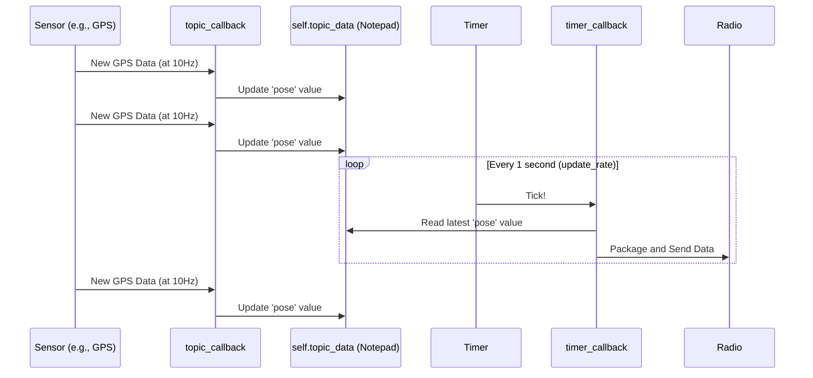

# Chapter 5: Periodic Data Transmission

In the [previous chapter on the Custom Packetization Protocol](04_custom_packetization_protocol_.md), we learned how to fold our data into a perfect, standardized "envelope" called a packet. We know *how* to create a message, but this raises an equally important question: *when* should we send it?

Imagine our boat's GPS sensor is updating its position 10 times every second. If we send a radio packet for every single update, we could easily overwhelm our radio link, like trying to shout every word of a conversation instead of speaking in sentences. On the other hand, if we only send an update once a minute, the map at the ground station will be hopelessly out of date.

We need a balanced, predictable rhythm. This is where **Periodic Data Transmission** comes in.

### The Lighthouse: A Predictable Signal

To ensure a consistent and reliable flow of information, the "sending" nodes (like the `BoatNode`) don't just forward data as soon as it arrives. Instead, they use a timer to transmit a bundle of the latest data at a fixed rate.

This is like a lighthouse. A lighthouse doesn't just turn on its light whenever it feels like it. It flashes at a regular, predictable interval—say, once every five seconds. Ships at sea know exactly when to look for the signal. They can rely on its timing. If they don't see the flash when expected, they know something might be wrong.

Our communication system works the same way. The boat sends a "flash" of data at a steady rate, making the whole system predictable and robust.

### A Two-Step Process: Collect, then Send

To achieve this steady rhythm, the node's logic is split into two separate, independent jobs:

1.  **Job 1: Always Be Collecting.** The node is constantly listening to the local ROS 2 sensor topics. Whenever a new piece of data comes in (like a new GPS coordinate), it doesn't send it right away. It simply updates its internal "notepad" with the very latest value.
2.  **Job 2: Send on a Schedule.** A timer, like a metronome, "ticks" at a fixed interval (e.g., once per second). Every time it ticks, a special function is called. This function grabs all the latest values from the "notepad," packages them up, and sends them over the radio.

This decoupling is the key. The frantic, unpredictable arrival of sensor data is separated from the calm, predictable rhythm of radio transmission.

### Setting the Rhythm: `update_rate`

How do we set the flash rate for our lighthouse? We do this declaratively, just like we did for topics in [Chapter 2: Declarative Topic Configuration](02_declarative_topic_configuration_.md). In our configuration file, we can set a single parameter: `update_rate`.

**File:** `config/topics_config.yaml` (Simplified Snippet)
```yaml
radio_config:
  # ... other radio settings ...

  # The time in seconds between each data transmission.
  # 1.0 means "send data once every second".
  update_rate: 1.0 
```
By changing this one number, you can control the "heartbeat" of your entire communication system without touching any code. A value of `0.5` would send data twice per second, while a value of `2.0` would send it every two seconds.

### Under the Hood: The Callbacks

Let's see how this two-step process looks in the code. It's managed by two different types of functions called "callbacks."

#### Step 1: Storing Data with `topic_callback`

When a new message arrives from a sensor, a subscriber's callback function is triggered. Its only job is to store the latest data.

**File:** `scripts/sik_boat_node.py` (Simplified)
```python
def topic_callback(self, msg, topic_name: str):
    """Callback for topics we send: process and store data."""
    # Process the message to get a simple list of numbers
    processed_data = self.process_standard_message(msg, topic_name)
    
    # Store the result in our 'notepad' (a dictionary)
    self.topic_data[topic_name] = processed_data
```
Notice this function **does not** call `radio.write()`. It just updates the `self.topic_data` variable. This might be called 10 times a second for GPS, and only once a second for the battery, but that's okay. It's just keeping the notepad up to date.

#### Step 2: Sending Data with `timer_callback`

When the node starts, it creates a timer. This timer is what calls our "sending" function on a schedule.

**File:** `scripts/sik_boat_node.py` (Simplified)
```python
def setup_timer(self):
    """Setup timer for periodic transmissions."""
    # Read the rate from our config file
    timer_period = self.config['radio_config']['update_rate']
    
    # Create a timer that calls self.timer_callback every 'timer_period' seconds
    self.timer = self.create_timer(timer_period, self.timer_callback)
```
This `setup_timer` function, called once at startup, creates the heartbeat. Now, let's look at the `timer_callback` function that gets called by this timer.

**File:** `scripts/sik_boat_node.py` (Simplified)
```python
def timer_callback(self):
    """Periodic transmission of all stored data."""
    # Go through every topic in our 'notepad'
    for topic_name, data in self.topic_data.items():
        if data is not None:
            # Create the packet using our protocol
            chunk = self.create_message_chunk(msg_id, data)
            
            # Send it over the radio!
            self.radio.write(chunk)
```
This is the function that does the actual sending. It runs on a clean, predictable schedule, grabs the latest data available, and sends it out.

### Visualizing the Flow

This diagram shows the two processes running in parallel. Data collection is fast and frequent, while data transmission is slow and steady.



As you can see, the sensor can publish data as fast as it wants. The `topic_callback` just keeps the `self.topic_data` notepad fresh. Independently, the timer ticks along, ensuring a packet is sent out reliably every second.

### Conclusion

You've just learned about the simple but powerful concept of **Periodic Data Transmission**. This is the heartbeat of `usv_comms`.

*   We use a **timer** to send data at a regular, predictable interval.
*   This rate is easily configured with the `update_rate` parameter, requiring no code changes.
*   The system uses a two-step process: a `topic_callback` **collects** the latest data, and a `timer_callback` **sends** it on schedule.
*   This decoupling prevents us from flooding our radio link and makes the communication stream reliable, just like a lighthouse.

We now have a complete picture of how the sending node (like the boat) gathers, packages, and transmits data in a steady stream. But what happens on the other side? How does the station listen for this stream of radio data and process it without getting blocked or missing messages?

Next up, we'll explore the other side of the conversation.

Next up: [Chapter 6: Asynchronous Radio Reception](06_asynchronous_radio_reception_.md)

---

Generated by [AI Codebase Knowledge Builder](https://github.com/The-Pocket/Tutorial-Codebase-Knowledge)