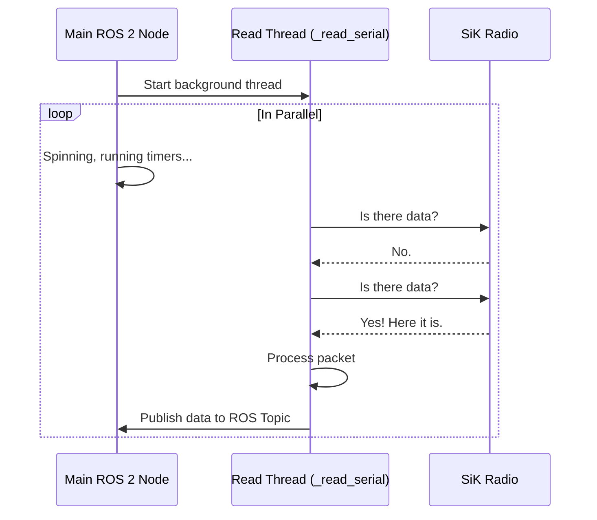
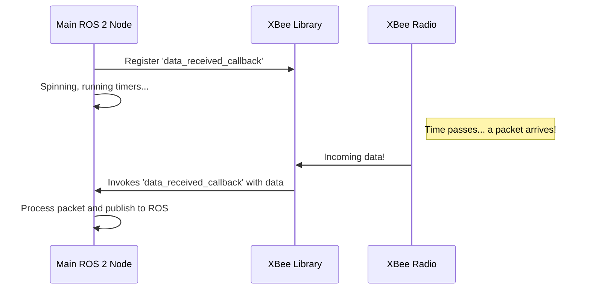

# Chapter 6: Asynchronous Radio Reception

In the [previous chapter on Periodic Data Transmission](05_periodic_data_transmission_.md), we learned how the sending node acts like a lighthouse, transmitting data at a calm, predictable rate. This creates a steady stream of information heading towards our receiving node.

But this raises a new challenge: how does the receiving node listen for this data? The simplest way would be to just sit and wait: "Is there data yet? ... How about now? ... Now?" This is called **blocking**, and it's a terrible idea. If our entire program stops to wait for the radio, it can't do anything else, like update a user interface or process other tasks.

To solve this, `usv_comms` uses a much smarter approach: **Asynchronous Radio Reception**.

### The Problem: Stopping the Whole Office for a Phone Call

Imagine a busy office. The main job of the office staff is to process paperwork. Now, imagine if there's only one phone, and any employee who needs to wait for a call has to sit by the phone, doing nothing else until it rings. The moment they start waiting, all paperwork processing stops. This would be incredibly inefficient.

This is exactly what happens if we write our code like this:

```python
# The BAD way: Blocking the program
def main_loop():
    while True:
        # The program STOPS HERE until data arrives
        data = radio.read()
        
        # No other work can be done while waiting
        process_data(data)
```

For a ROS 2 node, this is a disaster. The node needs to be constantly "spinning" to handle timers, respond to other topics, and stay connected to the ROS 2 network. Blocking it on a radio call would freeze the entire application.

### The Solution: Hire a Receptionist

The smart solution in an office is to hire a dedicated receptionist. The receptionist's only job is to wait for phone calls. When a call comes in, they take a message and pass it to the right person. Meanwhile, the rest of the office staff can continue their work, uninterrupted.

This is precisely how asynchronous reception works. We create a dedicated "receptionist" to handle incoming radio data, allowing our main ROS 2 node (the "office staff") to keep running smoothly.

The `usv_comms` project uses two different "receptionist" strategies, depending on the radio hardware.

1.  **For SiK Radios:** We create a dedicated background helper (a `thread`) whose only job is to watch the radio port.
2.  **For XBee Radios:** We use the radio's built-in "caller ID" feature. We tell the XBee library, "When a message arrives, automatically call this specific function for me." This is known as a `callback`.

Both methods achieve the same goal: the main program is never blocked, and data is handled the moment it arrives.

### How It Works: The SiK Radio's Dedicated Listener

For SiK radios, which are quite simple, we start a separate, lightweight process called a **thread**. This thread runs in the background, completely parallel to our main ROS 2 node.

Let's look at how this is set up in the `SiKStationNode`.

**File:** `scripts/sik_station_node.py`
```python
class SiKStationNode(SiKBaseNode):
    def __init__(self):
        super().__init__('sik_station_node', 'station')
        
        # ... other setup ...
        
        self._running = True
        # Create the receptionist thread and tell it which function to run
        self._read_thread = threading.Thread(target=self._read_serial)
        # Start the receptionist's job!
        self._read_thread.start()
```
When the node is created, it kicks off a new thread that immediately starts running the `_read_serial` function in the background.

The `_read_serial` function is a simple loop that acts as our patient receptionist.

**File:** `scripts/sik_station_node.py`
```python
def _read_serial(self):
    """Read thread for incoming messages (our receptionist)."""
    while self._running:
        # Is the phone ringing? (Is there data waiting?)
        if self.radio.in_waiting:
            # Answer the phone and read the data
            chunk = self.radio.read(self.radio.in_waiting)
            # ... process the data and deliver the message ...
        
        # Take a tiny break to not overuse CPU
        time.sleep(0.001)
```
This loop runs continuously, but because it's in a separate thread, it **does not block** the main ROS 2 `spin()` loop. Our "office" keeps running at full speed, while our "receptionist" handles all incoming calls.

### How It Works: The XBee Radio's Smart Callback

XBee radios are more advanced. Their software library provides an event-driven way to handle data. Instead of us constantly checking for data, the library notifies us when data arrives.

We simply register a "receptionist" function (a callback) with the library one time during setup.

**File:** `scripts/xbee_station_node.py` (Simplified)
```python
def setup_xbee(self):
    # ... code to find the remote radio ...
    
    # Tell the XBee library: "When data arrives,
    # please call my 'data_received_callback' function."
    self.device.add_data_received_callback(self.data_received_callback)
```
After this line runs, our job is done. The XBee library will now automatically call `data_received_callback` in the background whenever a packet arrives from the other radio.

Our callback function is very direct—its only job is to process the message it's given.

**File:** `scripts/xbee_station_node.py`
```python
def data_received_callback(self, xbee_message):
    """This function is called automatically by the XBee library."""
    try:
        # The message is delivered directly to us
        raw_bytes = xbee_message.data
        
        # Unpack the message and publish it to ROS
        msg_id, data = self.parse_message_chunk(raw_bytes)
        # ... process and publish ...
        
    except Exception as e:
        self.get_logger().error(f"Error processing message: {e}")
```
This approach is very efficient. We don't have a loop constantly checking for data. The function only runs when there is actual work to do.

### Under the Hood: A Tale of Two Receptionists

Let's visualize the difference in how these two asynchronous methods work.

Here is the flow for the **SiK Radio's background thread**:


The `Main` node and the `Read` thread work at the same time. The main node is never interrupted by the constant checking that the read thread is doing.

Now, here is the flow for the **XBee Radio's callback**:


In this model, the `Main` node doesn't have to manage a separate loop. The `XBee Library` does the background work and directly calls our function when a message arrives, interrupting the main flow just long enough to handle the data.

### Conclusion

You've just learned about the critical concept of **Asynchronous Radio Reception**, which keeps our application responsive and efficient.

*   Waiting for data directly (**blocking**) would freeze our entire ROS 2 node.
*   We solve this by using an **asynchronous** approach, like hiring a "receptionist" to handle incoming data.
*   The **SiK nodes** use a dedicated **background thread** that runs a loop to check for data, preventing the main thread from blocking.
*   The **XBee nodes** use a more modern **callback** system, where the radio library automatically calls our function when a message arrives.

Both methods ensure that our main node can continue its important work without being interrupted by the unpredictable arrival of radio messages.

But what if we're using the simpler SiK radios? They just transmit data blindly. How does the station know which topics the boat is even sending? And how does the boat know what the station might send back? We need a way for them to discover each other's topics.

Next up: [Chapter 7: Directional Topic Discovery (SiK Nodes)](07_directional_topic_discovery__sik_nodes__.md)

---

Generated by [AI Codebase Knowledge Builder](https://github.com/The-Pocket/Tutorial-Codebase-Knowledge)