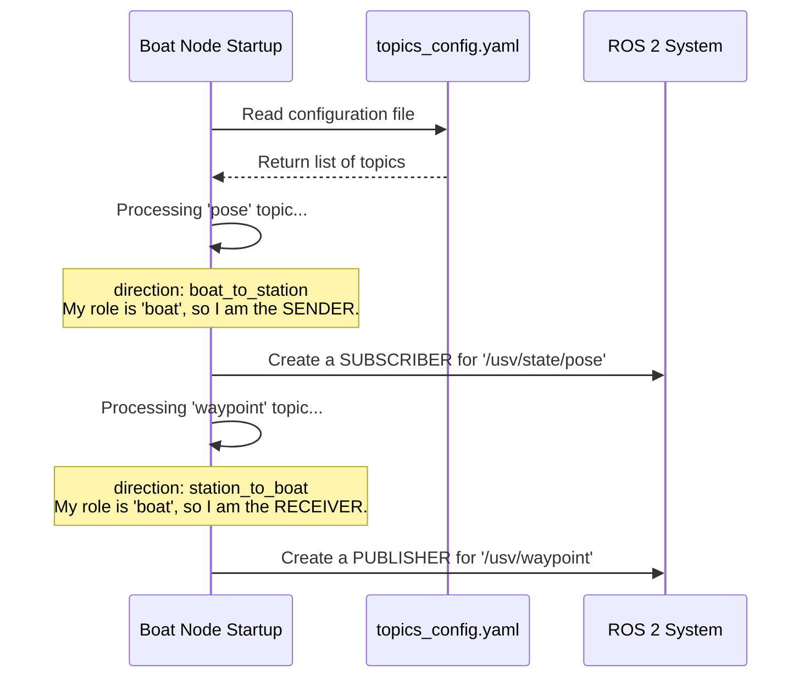

# Chapter 7: Directional Topic Discovery (SiK Nodes)

In the [previous chapter on Asynchronous Radio Reception](06_asynchronous_radio_reception_.md), we learned how the station node efficiently listens for incoming data without freezing the entire program. We have a steady stream of data coming from the boat, and a "receptionist" at the station ready to receive it.

But this brings up a subtle but important question: how does the station know *what* it's even listening for? And how does the boat know *what* it's supposed to send? Both the boat and the station use the exact same `topics_config.yaml` file. How can they use one file to set up two completely different, mirror-image communication roles?

This is solved by a clever, automatic setup mechanism we call **Directional Topic Discovery**.

### The Mail Sorting Problem

Imagine you work at a post office. You are given a set of rules for all mail that passes through your building. One rule says: "Letters from Alice to Bob." Another says: "Packages from Bob to Alice."

Your job depends on where you are.
*   If you are the clerk working at **Alice's local post office**, you know that "Letters from Alice to Bob" are **outgoing**. You need to collect them from Alice and put them on the truck. You also know that "Packages from Bob to Alice" are **incoming**. You need to take them off the truck and deliver them to Alice.
*   If you work at **Bob's local post office**, your role is the exact opposite.

The `usv_comms` nodes face the same problem. They both read the same rulebook (`topics_config.yaml`), but they need to interpret the rules based on their own identity (`"boat"` or `"station"`).

### The Solution: The `direction` Key

The magic lies in a single line in our configuration file that we've seen before: the `direction` key. This key acts as the "From" and "To" address on our data packages.

Let's look at our configuration file again.

**File:** `config/topics_config.yaml`
```yaml
topics:
  pose:
    # ... other settings ...
    direction: "boat_to_station"
    
  waypoint:
    # ... other settings ...
    direction: "station_to_boat"
```

This is our rulebook. The first rule says data for `pose` flows *from* the boat *to* the station. The second rule says data for `waypoint` flows *from* the station *to* the boat.

When a node starts up, it reads these rules and makes a decision based on its own role, which we learned about in [Chapter 1: Node Roles (Boat & Station)](01_node_roles__boat___station__.md).

#### The Boat's Perspective 🚤

The `SiKBoatNode` starts and says, "My role is `boat`." It then reads the config file:

1.  **It sees the `pose` topic:** `direction: "boat_to_station"`.
    *   **Decision:** "My role `boat` is the *sender* in this rule. To send this data, I must first get it from the rest of the boat's software."
    *   **Action:** It creates a ROS 2 **subscriber** to listen to the local `/usv/state/pose` topic.

2.  **It sees the `waypoint` topic:** `direction: "station_to_boat"`.
    *   **Decision:** "My role `boat` is the *receiver* in this rule. When I get this data from the radio, I need to share it with the boat's navigation system."
    *   **Action:** It creates a ROS 2 **publisher** to broadcast the `/usv/waypoint` topic locally.

#### The Station's Perspective 💻

The `SiKStationNode` starts and says, "My role is `station`." It reads the same config file and makes the opposite decisions:

1.  **It sees the `pose` topic:** `direction: "boat_to_station"`.
    *   **Decision:** "My role `station` is the *receiver* in this rule. When I get this data, I need to share it with my mapping tools."
    *   **Action:** It creates a ROS 2 **publisher** for `/usv/state/pose`.

2.  **It sees the `waypoint` topic:** `direction: "station_to_boat"`.
    *   **Decision:** "My role `station` is the *sender* in this rule. I need to get this data from the user interface to send it."
    *   **Action:** It creates a ROS 2 **subscriber** for `/usv/waypoint`.

This automatic configuration means we never have to write separate logic for the boat and station. We just declare the intended flow of data, and each node correctly figures out its part in that flow.

### Under the Hood: The Startup Logic

So how does the code actually perform this "mail sorting"? It happens right when the node is created, inside the `SiKBaseNode`. The logic is surprisingly simple.

Here is a diagram showing what the `Boat Node` does when it starts up.



The code that performs this is in the `SiKBaseNode`, which both our boat and station nodes inherit from, as we learned in [Chapter 3: Radio-Specific Base Nodes](03_radio_specific_base_nodes_.md).

Let's look at a simplified version of the initialization code.

**File:** `scripts/sik_base_node.py` (Simplified `__init__`)
```python
class SiKBaseNode(Node):
    def __init__(self, node_name: str, node_type: str):
        super().__init__(node_name)
        
        # Store my role, e.g., "boat" or "station"
        self.node_type = node_type 
        
        # Find topics I need to send
        self.sending_topics = self.get_topics_by_direction(
            f"{node_type}_to_", use_startswith=True
        )
        
        # Find topics I need to receive
        self.receiving_topics = self.get_topics_by_direction(
            f"_to_{node_type}", use_startswith=False
        )
        
        # ... now create subscribers for sending_topics
        # and publishers for receiving_topics ...
```
This code does two main things:
1.  It calls a helper function `get_topics_by_direction` to build a list of topics it is responsible for sending. If its `node_type` is `"boat"`, it looks for directions that start with `"boat_to_"`.
2.  It calls the same helper to build a list of topics it will receive. If its `node_type` is `"boat"`, it looks for directions that end with `"_to_boat"`.

The `get_topics_by_direction` function simply loops through the configuration and does this string matching.

**File:** `scripts/sik_base_node.py` (Simplified `get_topics_by_direction`)
```python
def get_topics_by_direction(self, pattern: str, use_startswith: bool):
    """Find topics that match a direction pattern."""
    matching_topics = []
    
    # Go through every topic in the config file
    for topic_name, config in self.config['topics'].items():
        direction = config['direction']
        
        # Check if the direction string matches our pattern
        if use_startswith and direction.startswith(pattern):
            matching_topics.append(config)
        elif not use_startswith and direction.endswith(pattern):
            matching_topics.append(config)
            
    return matching_topics
```
This elegant logic means the base node can programmatically sort all topics into two simple lists: "things I send" and "things I receive." From there, it's a simple matter of creating the right ROS 2 publishers and subscribers for each.

### Conclusion

You've just learned about the automatic setup process that makes `usv_comms` so flexible: **Directional Topic Discovery**.

*   By using a simple `direction` key (e.g., `"boat_to_station"`) in a central configuration file, we can define the flow of data for the entire system.
*   Each node uses its own `role` (`"boat"` or `"station"`) to interpret these directions.
*   This allows each node to **automatically discover** which topics it should send (and create subscribers for) and which topics it should receive (and create publishers for).
*   This design completely separates the configuration from the code, allowing you to add, remove, or reverse communication paths just by editing a text file.

You have now completed the core tutorial for `usv_comms`! You've journeyed from high-level [Node Roles](01_node_roles__boat___station__.md) all the way down to the bits and bytes of our [Custom Packetization Protocol](04_custom_packetization_protocol_.md), and have now seen how it all comes together. With these concepts in hand, you are ready to start building, configuring, and extending your own robust radio communication links for your robotics projects.

---

Generated by [AI Codebase Knowledge Builder](https://github.com/The-Pocket/Tutorial-Codebase-Knowledge)