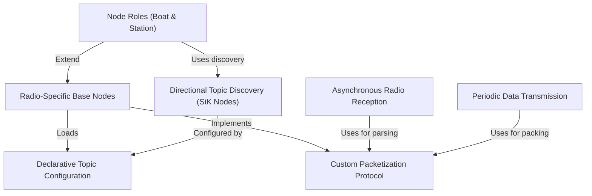

# Tutorial: usv_comms

This project creates a **robust communication bridge** for a ROS 2-based unmanned boat. It allows a *boat* node to send sensor data, like its position, to a ground *station* node, which in turn can send commands back. The system is highly flexible, using configuration files to let users decide exactly which data to transmit over different types of radios without changing the underlying code.

**Source Repository:** [None](None)

## Chapters

1. [Node Roles (Boat & Station)
](01_node_roles__boat___station__.md)
2. [Declarative Topic Configuration
](02_declarative_topic_configuration_.md)
3. [Radio-Specific Base Nodes
](03_radio_specific_base_nodes_.md)
4. [Custom Packetization Protocol
](04_custom_packetization_protocol_.md)
5. [Periodic Data Transmission
](05_periodic_data_transmission_.md)
6. [Asynchronous Radio Reception
](06_asynchronous_radio_reception_.md)
7. [Directional Topic Discovery (SiK Nodes)
](07_directional_topic_discovery__sik_nodes__.md)

---

Generated by [AI Codebase Knowledge Builder](https://github.com/The-Pocket/Tutorial-Codebase-Knowledge)