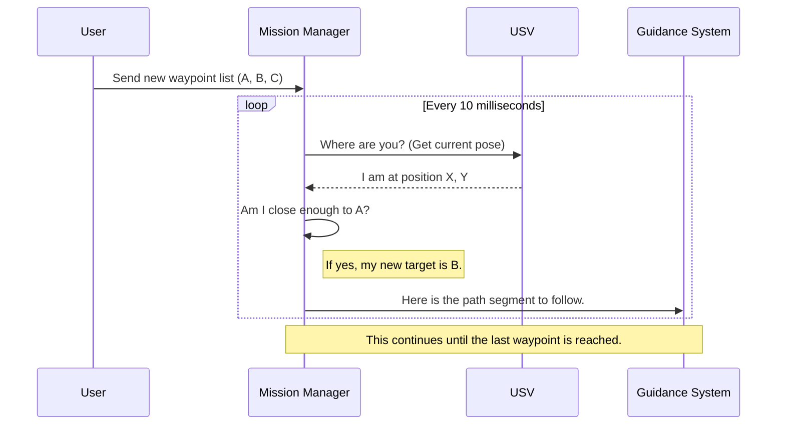

# Chapter 1: Mission & Waypoint Management

Welcome to the first chapter of our tutorial! We're about to dive into the brains of our Unmanned Surface Vehicle (USV) project. Before we can make our boat dodge obstacles or follow a complex path, we need to answer a fundamental question: "How does the boat know *where* it's supposed to go in the first place?"

This is where **Mission & Waypoint Management** comes in. It's the high-level commander of our USV.

### The Tour Guide Analogy

Imagine you're a tour guide with a group. Your job isn't to tell people "take one step to the left, now one step forward." Instead, you have an itinerary—a list of sights to see. You manage this list, lead the group from one sight to the next, and once you've visited one, you check it off and announce, "Alright everyone, on to the next stop!"

Our Mission & Waypoint Management module does exactly this for the USV.
*   **The Itinerary:** A list of geographic coordinates called **waypoints**.
*   **The Sights:** The individual waypoints in that list.
*   **The Tour Guide:** This software module, which processes the list and directs the USV from one waypoint to the next until the mission is complete.

## What is a Mission?

In our project, a "mission" is simply a sequence of waypoints that we want the USV to visit. A waypoint is a specific point on the water, defined by its coordinates (x, y) and the orientation (theta) the boat should have when it arrives.

The manager's job is to:
1.  **Receive a mission** (a list of waypoints).
2.  **Track the boat's progress** towards the *current* waypoint.
3.  **Decide when a waypoint is "reached."**
4.  **Signal the system** to move on to the *next* waypoint.

## How We Give the USV a Mission

This module acts like a central hub, listening for instructions and publishing status updates. In ROS 2 (the framework we use), these communication channels are called "topics."

### 1. Sending Waypoints

To start a mission, we send a list of waypoints to the `/usv/goals` topic. The Mission Manager is always listening to this topic.

When it receives a new list, it adds the waypoints to its internal "itinerary." Let's look at the code that sets up this listener.

```cpp
// File: src/waypoint_handler_node.cpp

// Listens for a new list of goals (waypoints)
goals_sub_ = this->create_subscription<usv_interfaces::msg::WaypointList>(
    "/usv/goals", 10,
    [this](const usv_interfaces::msg::WaypointList &msg)
    {
        // When a message arrives, loop through each waypoint...
        for (int i = 0; i < msg.waypoint_list.size(); i++)
        {
            // ...and add it to our internal list.
            register_wp(msg.waypoint_list[i].x, msg.waypoint_list[i].y, msg.waypoint_list[i].theta);
        }
    });
```
This snippet tells our program: "Hey, pay attention to the `/usv/goals` topic. Whenever a list of waypoints shows up, run this code to save them."

### 2. Changing Mission Behavior

Sometimes, we want the boat to be more cautious or more aggressive depending on the task. We can send a simple number (an ID) to the `/usv/mission/id` topic to change the boat's behavior.

For example, a "dynamic avoidance" mission might require the boat to look further ahead than a simple path-following mission.

```cpp
// File: src/waypoint_handler_node.cpp

// Listens for a mission ID to change behavior
mission_id_sub_ = this->create_subscription<std_msgs::msg::Int8>(
    "/usv/mission/id", 10,
    [this](const std_msgs::msg::Int8 &msg){
    switch(msg.data){
        case 3: lookahead_distance = 1.; break; // Cautious behavior
        case 4: lookahead_distance = 2.; break; // Standard behavior
        default: lookahead_distance = 2.; break;
    }
});
```
Here, `lookahead_distance` is a setting that tells other parts of the system, like the [Guidance System](05_guidance_system_.md), how far along the path to "look" for its immediate target. A smaller distance means more careful, tight maneuvering.

## Under the Hood: The Manager's Logic

So what happens after the manager gets a list of waypoints? How does it actually guide the boat? Let's follow the process step-by-step.

### The High-Level Flow

Here's a simplified diagram of how the Mission Manager interacts with other parts of the system.



The core of this logic happens in an `update()` function that runs every 10 milliseconds. This high frequency ensures the boat is always reacting to the latest information.

### Checking Off a Waypoint

A clever trick is used to decide when to move to the next waypoint. Instead of just checking if we've arrived at the *current* target, the code checks if we've gotten close to the *next* target. Once we are near waypoint `B`, we can safely assume we've passed waypoint `A` and can remove it from our list.

```cpp
// File: src/waypoint_handler_node.cpp

// In the main update loop...
if(wp_vec.size() > 2){
    // Calculate distance to the *second* waypoint in our list (e.g., waypoint B)
    double second_wp_dist = computeDistance(pose[0], pose[1], wp_vec[1].x, wp_vec[1].y);

    // If we've been close to it before, and are now moving away...
    if(has_been_in_second_wp && second_wp_dist > 0.8){
        // ...it means we've officially passed the first one. Remove it!
        wp_vec.erase(wp_vec.begin());
    }
}
```
This prevents the boat from getting "stuck" trying to hit an exact point. It encourages smooth, forward progress through the mission.

### Generating a Smooth Path

The boat doesn't just travel in a straight line between waypoints. That would result in jerky, sharp turns. Instead, the Mission Manager uses a function to generate a smooth, curved path between each pair of waypoints. This process is called **interpolation**.

```cpp
// File: src/waypoint_handler_node.cpp

// For each pair of waypoints (e.g., from A to B)
for (int i = 0; i < wp_vec.size() - 1; ++i) {
    Wp start_wp = wp_vec[i];
    Wp end_wp = wp_vec[i + 1];
    
    // Create a smooth, curved path between them
    interpolateWaypoints(start_wp, end_wp, 100, 0.9);
}
```
This generated path is then published on the `/usv/path_to_follow` topic, where other modules can use it. We'll learn more about the details of this in the [Path Generation & Management](03_path_generation___management_.md) chapter. For now, just know that our Tour Guide is responsible for creating the beautiful, scenic route, not just a series of straight lines.

## Conclusion

You now understand the highest-level component in our autonomous system! The **Mission & Waypoint Management** module acts as the USV's tour guide. It takes a list of destinations (waypoints), creates a navigable path, and manages the mission's progress from start to finish.

But for our tour guide to know if the group has arrived at a sight, it first needs a reliable map and a "You Are Here" pin. How does our USV know its precise position and orientation at any given moment? We'll explore this in our next chapter.

Next up: [USV State & Simulation](02_usv_state___simulation_.md)

---

Generated by [AI Codebase Knowledge Builder](https://github.com/The-Pocket/Tutorial-Codebase-Knowledge)